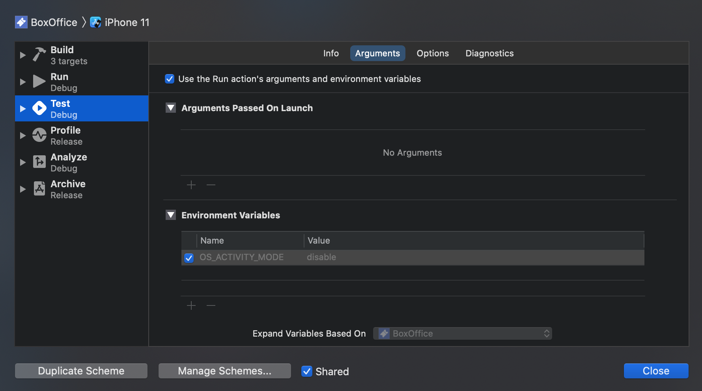

## iOS 개발 팁

### gitignore

[https://gitignore.io](https://gitignore.io/)

> 키워드 : swift, xcode, cocoapods, macOS

### 지저분한 디버깅 로그 없애기

- xcode메뉴 - Product - Scheme - editScheme
- 왼쪽 Run에서 - Argument - Enviroment Variables에서 변수 추가하기

- name : OS_ACTIVITY_MODE , Value : disable

