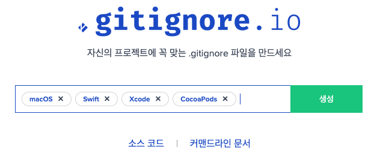

## iOS 개발 팁

### gitignore



[https://gitignore.io](https://gitignore.io/)

> 키워드 : swift, xcode, cocoapods, macOS


### 지저분한 디버깅 로그 없애기

- xcode메뉴 - Product - Scheme - editScheme
- 왼쪽 Run에서 - Argument - Enviroment Variables에서 변수 추가하기

- name : OS_ACTIVITY_MODE , Value : disable


## Preview UI

```swift
#if DEBUG
import SwiftUI

struct ViewControllerRepresentable: UIViewControllerRepresentable {
    
    // update
    func updateUIViewController(_ uiViewController: UIViewController, context: Context) {
        
    }
    
    // makeUI
    @available(iOS 14.0, *) // 버전에 맞게 설정
    func makeUIViewController(context: Context) -> UIViewController {
        ViewController() // 내가 보고자하는 뷰컨트롤러 이름
    }
    
    
}

#endif

struct ViewController_Previews: PreviewProvider {
    static var previews: some View {
        ViewControllerRepresentable()
        .previewDisplayName("아이폰 12") // 프리뷰 밑에 이름
    }
}
```

##### 

#### 단축키

- 미리보기(Preview)창 띄우기 : OPT + CMD + Enter
- 미리보기 실행하기 : OPT + CMD + p

