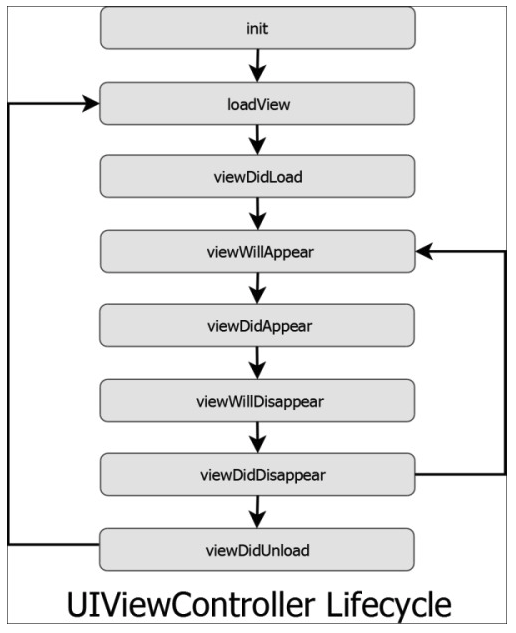
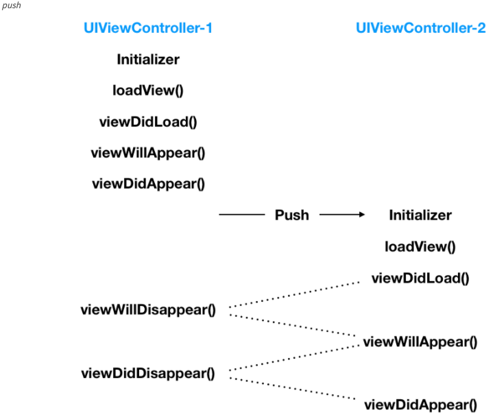
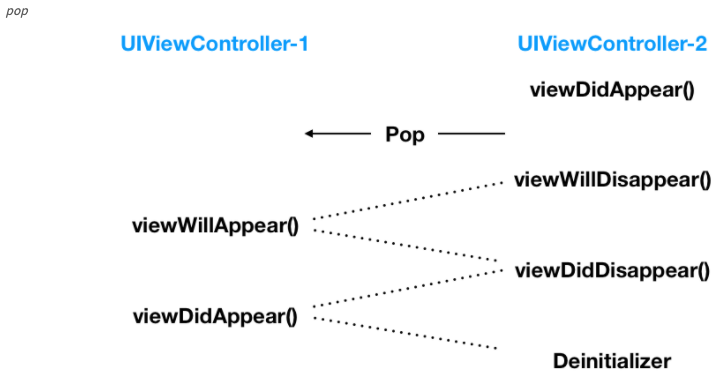

## View Life Cycle

#### 1. init(coder:)

`storyboard` 를 통해 View Controller들을 만들 경우 View Controller의 객체가 생성될 때 초기화 작업을 하는 메소드가 바로 `init(coder:)`메소드 입니다. 객체를 Byte Stream으로 바꾸어 디스크에 저장하거나 네트워크를 통해 전송하는 직렬화 작업을 하지 않는 이상 매개변수로 넘어오는 `NSCoder` 는 무시하셔도 무방합니다.

이 메소드에서 초기화 작업을 할 때 View Controller들은 그들의 lifetime동안 필요한 자원들을 할당받게 됩니다.

아직 이 시점에서는 View Controller의 View가 생성된 것이 아니기 때문에 View의 요소들에 대한 접근을 시도한다면 에러를 발생시킬 것입니다.

------

#### 2. init(nibName:bundle:)

`storyboard`가 아닌 분뢰된 `.nib`파일로 관리될 경우 `init(coder:)`대신 이 메소드를 초기화의 용도로 사용할 수 있습니다.

------

#### 3. loadView()

이 메소드는 본격적으로 화면에 띄어질 View를 만드는 메소드입니다. `storyboard` 나 `.nib`파일로 만들어지는 경우가 아닌 모두 직접적으로 코딩하여 만드는 경우를 제외하고서는 `override`하지 않는 것이 좋습니다. `outlet`들과 `action`들이 이 메소드에서 생성되고 연결됩니다.

------

#### 4. viewDidLoad()

이 메소드가 호출되는 시점에서는 이미 `outlet` 들이 모두 메모리에 위치하고 있습니다. 그러므로 사용자에게 화면이 보여지기 전 데이터를 뿌려주는 행위에 대한 코드를 작성할 수 있습니다. 또한 보통 화면이 로드되기 전 백그라운드에서 처리해주어야 하는 작업들이 위치하기 좋은데 그 예로는 네트워크 호출 등이 있습니다.

이 메소드는 View Controller의 생에 오로지 **한 번만 호출**이 됩니다. 그러므로 오로지 한 번만 일어날 행위들에 대해서는 이 메소드 안에서 정의를 해주어야 합니다. 주기적으로 데이터가 변경되거나 하는 행위는 다른 메소드에서 정의해주어야 합니다.

------

#### 5. viewWillAppear(_:)

이 메소드는 View Controller의 화면이 올라오고 난 이후에 호출되는 메소드입니다. 이 메소드에서는 UI내의 애니메이션을 실행시키거나, 비디오나 소리를 재생하는 행위, 그리고 뿌려지는 데이터의 업데이트를 수행할 수 있습니다.

처음 어플리케이션이 수행되고 첫 화면이 띄어질 때도 호출이 되는 것은 `viewDidLoad()`와 동일하지만 화면 전환을 통해 다시 현재의 화면으로 돌아올 때도 `viewWillAppeare(_:)`는 호출됩니다.

------

#### 6. viewDidAppear(_:)

View Controller의 뷰가 데이터와 함께 완전히 화면에 나타가고 호출되는 메소드입니다.

------

#### 7. didReceiveMemoryWarning()

iOS 기기들은 제한된 메모리 크기와 전원을 갖고 있습니다. 메모리가 채워지기 시작하면 일반적인 컴퓨터의 운영체제와는 다르게 메모리가 부족하면 메모리의 데이터를 하드디스크로 옮기는 작업을 하지 않습니다. 이러한 이유로 여러분은 어플리케이션의 메모리 사용량을 줄여야하는 책임이 있습니다. 만일 여러분의 어플리케이션이 너무 많은 메모리를 사용한다면 iOS는 이를 알릴 것입니다.

View Controller가 자원 관리를 하고 있는 동안 이러한 알람들은 이 메소드를 통해 그들에게 전달됩니다. 이러한 방식으로 여러분은 몇몇의 메모리를 해지하는 등의 행동을 취할 수 있습니다. 만일 여러분이 이러한 경고 알림을 무시하고 여러분의 어플리케이션의 메모리 사용량이 일정 한계치를 넘어가게 된다면 iOS는 여러분의 어플리케이션을 강제로 끝낼 것입니다. 이러한 현상은 사용자로 하여금 어플리케이션의 충돌로 보일 수 있으므로 반드시 피해야합니다.

------

#### 8. viewWillDisappear(_:)

다음 View Controller로 화면이 전환되기 전, Original View Controller가 화면에서 사라질 때 이 메소드가 호출됩니다. 여러분은 이 시점에서 해야할 일반적인 작업들은 거의 없기 때문에 굳이 `override` 할 필요는 없지만 몇몇 필요한 경우가 있기도 하지만 이번 포스팅에서는 기본적인 요소에 대해서만 다루기 때문에 언급하지 않도록 하겠습니다.

------

#### 9. viewDidDisappear(_:)

View Controller들이 화면에서 사라지고 나서 이 메소드가 호출됩니다. 여러분은 화면에서 View Controller가 사라진 이후에는 멈추어야할 작업들 이 메소드를 `override`하여 작성할 수 있습니다. 예를 들어 notification을 듣는 행위를 멈추기, 다른 객체의 속성을 observing하는것을 멈추기, 디바이스의 센서를 점검하거나 네트워크를 호출하는 행위들은 화면이 사라지고 나서는 필요 없는 작업들입니다.

------

#### 10. deinit()

다른 모든 객체와 마찬가지로 View Controller가 메모리에서 사라지기 전 이 메소드가 호출됩니다. 대개 여러분은 이 메소드를 할당 받은 자원 중 ARC에 의해 해지가 불가능한 자원들을 해제하기 위해 `override` 할 수 있습니다. 또한 백그라운드에서 돌리기 위해 이전의 메소드에서 멈추지 못하였던 행위들을 이 메소드 내에서 멈출 수 있습니다.

View Controller가 화면에서 사라지는 것이 메모리에서 해지된다는 것을 의미하지 않는다는 것을 명심하셔야 합니다. 즉 화면에서 사라진다고 메모리에서 해지되는 것은 아닙니다. 많은 Container View Controller들이 그들의 View Controller들을 메모리에서 유지하고 있기 때문입니다.

예를 들어 Navigation Controller를 더욱 깊숙히 들어가보면 이전에 보였던 모든 View Controller들은 여전히 메모리에 남아있습니다. `Navigation Controller`는 View Hierarchy 내에서 Back을 하는 경우에만 사라진 View Controller를 메모리에서 해지합니다.

이러한 이유로 여러분은 화면에서 사라진 View Controller들이 정상적으로 작동하고 여전히 notification 을 받을 수 있다는 것을 명심하셔야 합니다.

## 네비게이션바에서 뷰라이프사이클

> **여기서 주목해야할 것은 `UIViewController-1`의 `deinit` 메소드가 호출되지 않는다는 것입니다. 왜냐하면 단순히 가려진 것이지 메모리에서 사라진 것은 아니기 때문입니다.**

> 여기서 주목해야할 점은 **`UIViewController-2`는 `UINavigationController`의 스택 안에서 벗어나는 팝 연산이고 메모리에서 사라지기 때문에 `deinit` 메소드가 호출된다는 점입니다.**

