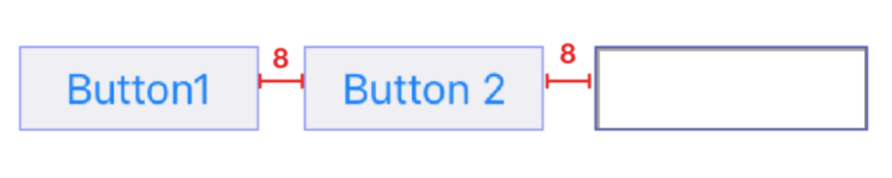

## 목차

- 애플 개발자 준비
  - QuickHelp 빠른 도움말 보기 
  - Jump To Definition (정의 보기)
  - [단축키](#단축키)
- UIKit 요소
  - UILabel
  - UIButton
  - UISlider
- 프레임워크
  - UIKit
  - AVFoundation
- 기술요소
  - Auto Layout
- Design Pattern
  - MVC(Model-View-Controller) Pattern
- 기타 개념
  - IBOutlet, IBAction
  - Assets
  - Bundle
- Timer


## QuickHelp 빠른 도움말 보기 

Xcode 에는 레퍼런스 문서의 요약된 내용을 보여주는 퀵헬프라는 기능이 있습니다.
코드작성중 레퍼런스 문서로 이동하지 않고 데이터타입이나 메서드 등의 간단한 정보를 확인할 수있는 아주 유용한 기능입니다.

- 객체요소를 선택하여 오른쪽 유틸리티 area에서 quick help보기
- 객체요소를 Options+클릭 하면 Qick help창을 팝업으로 볼수 있다.

> 내가 선언한 프로퍼티나 메서드라면 quickhelp의 정의를 직접 할 수도 있다.
>
> https://0urtrees.tistory.com/14

## Jump To Definition (정의 보기)

코드에서 내가 궁금한 객체요소(메서드,프로퍼티,라이브러리 등)를 선택하여 해당 객체의 정의를 볼수 있다. 혹은 내가 선언한 프로퍼티나 메서드라면 어디에 정의 되어있는지 위치를 확인하고 그곳으로 가서 정의를 확인할 수 있다.

- Ctrl + Command + J.
- Ctrl + Command + Left Click (One finger tap)
- Command + Right Click (Two fingers tap)

## 애플 개발자 문서 보기

> https://www.edwith.org/boostcourse-ios/lecture/20638/

## 단축키

command+shift+Y : 디버깅창 열고 닫기 (디버깅창에서는 여러가지 동작상태, 로그를 확인할수 있다.)

command+R : 시뮬레이터 실행

command+. : 시뮬레이터에서 앱 종료

command+optino+return : 어시스턴트 에디터 띄우기

command+return : 어시스턴트 에디터 내리기

command + shift + L : 라이브러리 실행

command + shift + O : 빠른 열기 메뉴 실행

command + 방향키 : 시뮬레이터에서 화면을 돌리고 눕힌다.

## 프로젝트에 이미지 추가하기

- 핵심키워드
  - 에셋 카탈로그
  - 앱 슬라이싱
  - 앱 시닝

### 에셋 카탈로그란?

Xcode에서 프로젝트를 처음 생성하면 **Asstes.xcassets** 이라는 폴더가 자동으로 생성되는데, 이 폴더에서 애플리케이션에 사용될 다양한 에셋을 관리하며, 이를 에셋 카탈로그라고 한다.

에셋 카탈로그는 에셋과 디바이스의 속성의 관한 파일들을 맵핑하여 쉽게 리소스를 접근할수 있게 도와준다. 리소스는 이미지, 음악 파일 등을 말하고 디바이스의 속성은 디바이스의 특징, 사이즈 클래스, 주문형 리소스, 특정 타입의 정보를 포함하여 말한다.

### 앱 시닝이란?

앱 시닝이란 애플리케이션이 디바이스에 설치될 때 앱 스토어와 운영체제가 그 디바이스의 특성에 맞게 설치하도록 하는 설치 최적화 기술을 의미한다. 이를 통해 애플리케이션의 설치용량을 최소화하고 다운로드의 속도를 향상시킬 수 있다. 앱 시닝의 기술 구성요소는 슬라이싱, 비트코드, 주문형 리소스가 있다.

### 슬라이싱이란?

슬라이싱은 애플리케이션이 지원하는 다양한 디바이스에 대한 여러 조각의 애플리케이션 번들(app bundle)을 생성하고 디바이스에 알맞은 조각을 전달하는 기술이다. 개발자가 애플리케이션의 전체 버전을 iTunes Connect에 업로드하게 되면, 앱 스토어에는 각 디바이스 특성에 다양한 버전의 조각들이 생성된다. 사용자가 애플리케이션을 설치할 때 전체 버전이 아닌 슬라이싱(slicing)된 조각들 중 사용자의 디바이스의 가장 적합한 조각이 다운로드되어 설치된다. 에셋 카탈로그에서 관리하는 이미지들은 자동으로 적용이 된다.

## 인터페이스 빌더의 객체를 코드와 연결

### IBOutlet

- 인터페이스 빌더의 객체를 코드의 변수로 연결한다.

### IBAction

- 인터페이스 빌더의 객체에서 발생한 액션과 코드의 메서드로 연결하여 발생한 액션에 따른 동작을 정의할 수 있다.

> UIKit에는 UIButton, UISwitch, UIStepper 등 UIControl을 상속받은 다양한 컨트롤 클래스가 있다. 이런 컨트롤 객체에서 발생한 다양한 이벤트 종류를 특정 액션 메서드에 연결할 수 있다. 즉, 컨트롤 객체에서 특정 이벤트가 발생하면 미리 지정해 둔 타겟의 액션을 호출 할 수 있다.

#### 컨트롤 이벤트의 종류

컨트롤 이벤트는 UIControl에 Event라는 타입으로 정의되어 있습니다. 아래는 컨트롤 객체에 발생할 수 있는 이벤트의 종류입니다.

- touchUpInside : 컨트롤 영역 안쪽에서 터치 후 뗐을때 발생하는 이벤트
  UIControl.Event.touchUpInside
- 특히 touchUpInside를 자주 사용하고 다양한 이벤트들이 있다.

## UIButton

### 버튼 생성 3단계

1. 버튼을 생성하고 버튼의 유형을 선택하세요.
2. 버튼을 나타내기 위한 문자(타이틀)를 입력하거나, 이미지를 설정한 뒤 크기를 조정하세요.
3. 버튼에 특정 이벤트가 발생할 때 작동할 하나 이상의 메서드를 연결하세요.

### 버튼과 메서드 연결하는 방법

1. `addTarget(_:action:for:)` 메서드 사용
2. 인터페이스 빌더에서 연결 (`@IBAction`)

### 버튼과 연결되는 메서드 형식

```swift
func doSomething()
func doSomething(sender: UIButton)
func doSomething(sender: UIButton, forEvent event: UIEvent)
```

### 버튼의 상태

- 버튼의 상태는 5가지이며 조합된 상태도 가능하다.
  - `default`, `highlighted`, `focused`, `selected`, `disabled`

- 버튼 생성 시 기본 상태 값은 `default`입니다.
- 사용자가 버튼과 상호작용을 하면 상태 값이 변하게 됩니다.
- 프로그래밍 방식 혹은 인터페이스 빌더를 이용해 버튼의 각 상태에 대한 속성을 별도로 지정할 수 있습니다.

### 버튼 주요 프로퍼티

버튼의 프로퍼티 값을 설정하는 방식은 아래 프로퍼티를 활용하여 코드를 작성하는 방법과 스토리보드에서 인스펙터를 이용하는 방법이 있다.

- `enum UIButtonType`: 버튼의 유형
  - 가장 많이 사용하는 유형은 `Custom`과 `System`이지만 필요에 따라 다른 유형(`Detail Disclosure`, `Info Light`, `Info Dark`, `Add Contact`)를 사용할 수 있습니다.
- `var titleLabel: UILabel?`: 버튼 타이틀 레이블
- `var imageView: UIImageView?`: 버튼의 이미지 뷰
- `var tintColor: UIColor!`: 버튼 타이틀과 이미지의 [틴트 컬러](https://developer.apple.com/documentation/uikit/uiview/1622467-tintcolor)

### 버튼의 주요 메서드

```swift
// 특정 상태의 버튼의 문자열 설정
func setTitle(String?, for: UIControlState)
// 특정 상태의 버튼의 문자열 반환
func title(for: UIControlState) -> String?
// 특정 상태의 버튼 이미지 설정
func setImage(UIImage?, for: UIControlState)
// 특정 상태의 버튼 이미지 반환
func image(for: UIControlState) -> UIImage?
// 특정 상태의 백그라운드 이미지 설정
func setBackgroundImage(UIImage?, for: UIControlState)
// 특정 상태의 백그라운드 이미지 반환
func backgroundImage(for: UIControlState) -> UIImage?
// 특정 상태의 문자열 색상 설정
func setTitleColor(UIColor?, for: UIControlState)
// 특정 상태의 attributed 문자열 설정
func setAttributedTitle(NSAttributedString?, for: UIControlState)
```

## UILabel

### 레이블 생성 3단계

1. 레이블을 생성하십시오.
2. 레이블이 표시할 문자열을 제공하십시오.
3. 레이블의 모양 및 특성을 설정하십시오.

### 레이브르 주요 프로퍼티

레이블의 프로퍼티에 접근해 나타내려는 문자의 내용, 색상, 폰트, 문자정렬방식, 라인 수 등을 조정할 수 있습니다.
레이블의 프로퍼티의 값을 설정하는 방식에는 프로그래밍 방식과 스토리보드의 인스펙터를 이용한 방법이 있습니다.

- ` var text: String?` : 레이블이 표시할 문자열
- var attributedText: NSAttributedString? : 레이블이 표시할 속성 문자열
- `var textColor: UIColor!` : 문자 색상
- `var font: UIFont!`: 문자 폰트
- `var textAlignment: NSTextAlignment`: 문자열의 가로 정렬 방식
  
- `left`, `right`, `center`, `justified`, `natural` 중 하나를 선택할 수 있습니다.
  
- `var numberOfLines: Int`: 문자를 나타내는 최대 라인 수

  - 기본값은 1, 문자열을 모두표시하려면 0

- `var baselineAdjustment: UIBaselineAdjustment`: 문자열이 Autoshrink 되었을 때의 수직 정렬 방식

- `var lineBreakMode: NSLineBreakMode`: 레이블의 경계선을 벗어나는 문자열에 대응하는 방식

   

## UISlider


### 슬라이더 생성 3단계

1. 슬라이더를 생성하고, 슬라이더가 나타내는 값의 범위를 지정하세요.
2. 적절한 색상과 이미지를 이용해 슬라이더의 모양을 구성하세요.
3. 하나 이상의 메서드를 슬라이더와 연결하세요.

### 사용자 상호작용에 반응하기

> 사용자가 슬라이더의 값을 변경하면 슬라이더에 연결된 메서드가 호출되어 원하는 작업이 실행됩니다. 기본적으로는 사용자가 슬라이더의 *Thumb*를 이동시키면 연속적으로 이벤트를 호출하지만, `isContinous` 프로퍼티값을 `false`로 설정하면 슬라이더의 *Thumb*에서 손을 떼는 동시에 이벤트를 호출합니다.

#### 슬라이더와 메서드 연결하는 방법

1. `addTarget(_:action:for:)` 메서드 사용
2. 인터페이스 빌더에서 연결 (`@IBAction`)

### 슬라이더 주요 프로퍼티

> 슬라이더의 프로퍼티 값을 설정하는 방식에는 프로그래밍 방식과, 스토리보드의 인스펙터를 이용한 방법이 있습니다.

- `var minimumValue: Float`, `var maximumValue: Float`: 슬라이더 양끝단의 값
- `var value: Float`: 슬라이더의 현재 값
- `var isContinuous: Bool`: 슬라이더의 연속적인 값 변화에 따라 이벤트 역시 연속적으로 호출할 것인지의 여부
- `var minimumValueImage: UIImage?`, `var maximumValueImage: UIImage?`: 슬라이더 양끝단의 이미지
- `var thumbTintColor: UIColor?`: thumb의 틴트 색상
- `var minimumTrackTintColor: UIColor?`, `var maximumTrackTintColor: UIColor?`: thumb를 기준으로 앞쪽 트랙과 뒤쪽 트랙의 틴트 색상

### 슬라이더 주요 메서드

```swift
//  슬라이더의 현재 값 설정
func setValue(Float, animated: Bool)

//  특정 상태의 minimumTrackImage 반환
func minimumTrackImage(for: UIControlState) -> UIImage?

// 특정 상태의 minimumTrackImage 설정
func setMinimumTrackImage(UIImage?, for: UIControlState)

// 특정 상태의 maximumTrackImage 반환
func maximumTrackImage(for: UIControlState) -> UIImage?

// 특정 상태의 minimumTrackImage 설정
func setMaximumTrackImage(UIImage?, for: UIControlState)

//  특정 상태의 thumbImage 반환
func thumbImage(for: UIControlState) -> UIImage?

//특정 상태의 thumbImage 설정
func setThumbImage(UIImage?, for: UIControlState)
```

## AVFoundation

AVFoundation은 다양한 Apple 플랫폼에서 사운드 및 영상 미디어의 처리, 제어, 가져오기 및 내보내기 등 광범위한 기능을 제공하는 프레임워크입니다..

### 주요 기능

- 미디어 재생 및 편집(QuickTime 동영상 및 MPEG-4 파일 재생/생성/편집, HLS 스트림 재생: [재생가능 파일 목록 링크](https://developer.apple.com/documentation/avfoundation/avfiletype))
- 디바이스 카메라와 마이크를 이용한 영상 녹화 및 사운드 녹음
- 시스템 사운드 제어
- 문자의 음성화

### AVAudioPlayer Class

> 이번 프로젝트에서 사용한 AVAudioPlayer 클래스에 대해 조금 더 알아봅시다.
> AVAudioPlayer 클래스는 파일 또는 메모리에 있는 사운드 데이터를 재생하는 기능을 제공합니다.

### AVAudioPlayer 주요기능

- 파일 또는 메모리에 있는 사운드 재생(네트워크에 있는 사운드 파일은 재생 불가)
- 파일 재생 시간 길이의 제한없이 사운드 재생
- 여러 개 사운드 파일 동시 재생
- 사운드의 재생 속도 제어 및 스테레오 포지셔닝
- 앞으로 감기와 뒤로 감기 등의 기능을 지원해 사운드 파일의 특정 지점 찾기
- 현재 재생 정보 데이터 얻기
- 사운드 반복재생 기능

### AVAudioPlayer 주요 프로퍼티

- `var isPlaying: Bool`: 사운드가 현재 재생되고 있는지 아닌지 여부

- `var volume: Float`: 사운드의 볼륨값, 최소 0.0 ~ 최대 1.0

- `var rate: Float`: 사운드의 재생 속도

- ```
  var numberOfLoops: Int
  ```

  : 사운드 재생 반복 횟수

  - 기본값은 0으로 사운드 1회 재생 후 자동 종료
  - 양수값으로 설정시 설정값+1회 재생(ex. 1로 설정시 2회 재생 후 종료)
  - 음수값으로 설정시 `stop` 메서드가 호출 될때까지 무한 재생

- `var dutation: TimeInterval`: 사운드의 총 재생 시간(초 단위)

- `var currentTime: TimeInterval`: 사운드의 현재 재생 시각(초 단위)

- `protocol AVAudioPlayerDelegate`: 사운드 재생 완료, 재생 중단 및 디코딩 오류에 응답할 수 있는 프로토콜

### AVAudioPlayer 주요 메서드

- AVAudioPlayer 초기화 메서드

```swift
// 특정 위치에 있는 사운드 파일로 초기화 
func init(contentOf: URL)
// 메모리에 올라와있는 데이터를 이용해 초기화
func init(data: Data)
```

- AVAudioPlayer 재생관련 메서드

```swift
// 사운드 재생
func play()
// 특정 시점에서 사운드 재생
func play(atTime: TimeInterval)

// 사운드 일시 정지
func pause()
// 사운드 재생 정지 
func stop()
```

## Timer

Timer 클래스는 일정한 시간 간격이 지나면 지정된 메시지를 특정 객체로 전달하는 기능 제공합니다.

### Timer 특징

- 타이머는 런 루프(run loops)에서 작동합니다.
- 타이머를 생성할 때 반복 여부를 지정합니다.
  - 비 반복 타이머: 한 번 실행된 다음 자동으로 무효화 됩니다.
  - 반복 타이머: 동일한 런 루프에서 특정 TimeInterval 간격으로 실행됩니다. 반복되는 타이머 기능을 정지하려면 `invalidate()` 메서드를 호출해 무효화합니다.

### Timer 주요 프로퍼티

- `var isValid: Bool`: 타이머가 현재 유효한지 아닌지 여부
- `var fireDate: Date`: 다음에 타이머가 실행될 시각
- `var timeInterval: TimeInterval`: 타이머의 실행 시간 간격(초 단위)

### Timer 생성 메서드

- 타이머 생성과 동시에 런 루프에 `default mode`로 등록하는 클래스 메서드

```swift
class func scheduledTimer(withTimeInterval: TimeInterval, repeats: Bool, block: (Timer) -> Void)
class func scheduledTimer(timeInterval: TimeInterval, target: Any, selector: Selector, userInfo: Any?, repeats: Bool)
class func scheduledTimer(timeInterval: TimeInterval, invocation: NSInvocation, repeats: Bool)
```

- 타이머 생성 후 수동으로 타이머 객체를 `add(_:forMode:)` 메서드를 이용해 런 루프에 추가해줘야 하는 메서드

```swift
func init(timeInterval: TimeInterval, invocation: NSInvocation, repeats: Bool)
func init(timeInterval: TimeInterval, target: Any, selector: Selector, userInfo: Any?, repeats: Bool)
func init(fireAt: Date, interval: TimeInterval, target: Any, selector: Selector, userInfo: Any?, repeats: Bool)
```

## Cocoa Touch란?

### 코코아 터치 계층(Cocoa Touch Layer)

코코아 터치 계층은 iOS 애플리케이션 개발에 주 축을 이루는 개발환경으로, 애플리케이션의 다양한 기능 구현에 필요한 여러 프레임워크를 포함하는 최상위 프레임워크 계층입니다. 참고로 코코아 계층은 macOS 애플리케이션 제작에 사용합니다.

- '코코아'라는 단어는 Objective-C 런타임을 기반으로하고, NSObject를 상속받는 모든 클래스 또는 객체를 가리킬 때 사용합니다.
- '코코아 터치' 또는 '코코아'는 iOS 또는 macOS의 전반적인 기능을 활용해 애플리케이션을 제작할 때 사용하는 프레임워크 계층입니다.
- '코코아 터치'는 핵심 프레임워크인 UIKit과 Foundation을 포함합니다.

## UIKit 프레임워크

UIKit은 iOS 애플리케이션 개발시 사용자에게 보여질 **화면**을 구성하고 사용자 **액션**에 대응에 관련된 다양한 요소를 포함합니다. 이는 애플리케이션을 구현할 때 필수적인 부분으로 꼭 이해하고 넘어가야합니다.

### UIKit 소개

UIKit은 iOS 애플리케이션의 사용자 인터페이스를 구현하고 이벤트를 관리하는 프레임워크입니다.

- UIKit 프레임워크는 제스처 처리, 애니메이션, 그림 그리기, 이미지 처리, 텍스트 처리 등 사용자 **이벤트 처리**를 위한 클래스를 포함합니다.
- 또한 테이블뷰, 슬라이더, 버튼, 텍스트 필드, 얼럿 창 등 애플리케이션의 **화면을 구성하는 요소**를 포함합니다.
- UIKit 클래스 중 UIResponder에서 파생된 클래스나 사용자 인터페이스에 관련된 클래스는 애플리케이션의 메인 스레드(혹은 메인 디스패치 큐)에서만 사용하세요.
- UIKit은 iOS와 tvOS 플랫폼에서 사용합니다.

### UIKit 기능별 요소

**사용자 인터페이스**

- View and Control : 화면에 콘텐츠 표시
- View Controller : 사용자 인터페이스 관리
- Animation and Haptics : 애니메이션과 햅틱을 통한 피드백 제공
- Window and Screen : 뷰 계층을 위한 윈도우 제공

**사용자 액션**

- Touch, Press, Gesture: 제스처 인식기를 통한 이벤트 처리 로직
- Drag and Drop: 화면 위에서 드래그 앤 드롭 기능
- Peek and Pop: 3D 터치에 대응한 미리 보기 기능
- Keyboard and Menu: 키보드 입력을 처리 및 사용자 정의 메뉴 표시

> **왜 ViewController와 UIKit는 단짝일까요?**
>
> ViewController는 UIViewController를 상속받습니다. UIViewController는 UIKit 프레임워크에 정의된 클래스이기 때문에, UIKit을 import 해주지 않으면 컴파일러는 UIViewController가 누군지 알 수 없습니다.

## Foundation 프레임워크란?

Foundation은 iOS 애플리케이션의 **운영체제 서비스**와 **기본 기능**을 포함하는 프레임워크입니다. 애플리케이션에 원하는 **기능**을 적절히 구현하기 위해서 Foundation 프레임워크를 이해하는 일을 매우 중요합니다.

## Foundation 소개

Foundation은 원시 데이터 타입(String, Int, Double), 컬렉션 타입(Array, Dictionary, Set) 및 **운영체제 서비스**를 사용해 **애플리케이션의 기본적인 기능**을 관리하는 프레임워크 입니다.

- Foundation 프레임워크는 데이터 타입, 날짜 및 시간 계산, 필터 및 정렬, 네트워킹 등의 기본 기능을 제공합니다.
- Foundation 프레임워크에서 정의한 클래스, 프로토콜 및 데이터 타입은 iOS뿐만 아니라 macOS, watchOS, tvOS 등 모든 애플 SDK에서 사용됩니다.

### Foundation 기능별 요소

**기본** 

- Number, Data, String: 원시 데이터 타입 사용
- Collection: Array, Dictionary, Set 등과 같은 컬렉션 타입 사용
- Date and Time: 날짜와 시간을 계산하거나 비교하는 작업
- Unit and Measurement: 물리적 차원을 숫자로 표현 및 관련 단위 간 변환 기능
- Data Formatting: 숫자, 날짜, 측정값 등을 문자열로 변환 또는 반대 작업
- Filter and Sorting: 컬렉션의 요소를 검사하거나 정렬하는 작업

**애플리케이션 지원**

- Resources: 애플리케이션의 에셋과 번들 데이터에 접근 지원
- Notification: 정보를 퍼뜨리거나 받아들이기는 기능 지원
- App Extension: 확장 애플리케이션과의 상호작용 지원
- Error and Exceptions: API와의 상호작용에서 발생할 수 있는 문제 상황에 대처할 수 있는 기능 지원

**파일 및 데이터 관리**

- File System: 파일 또는 폴더를 생성하고 읽고 쓰는 기능 관리
- Archives and Serialization: 속성 목록, JSON, 바이너리 파일들을 객체로 변환 또는 반대 작업 관리
- iCloud: 사용자의 iCloud 계정을 이용해 데이터를 동기화하는 작업 관리

**네트워킹**

- URL Loading System: 표준 인터넷 프로토콜을 통해 URL과 상호작용하고 서버와 통신하는 작업
- Bonjour: 로컬 네트워크를 위한 작업

> 새롭게 ViewController 파일을 생성하면 상단에 'import UIKit'이 기본적으로 명시되어있죠.그렇다면 어떤 파일을 생성하면 'import Foundation'이 기본적으로 명시되어있을까요?
>
> .swift 파일이다. 그렇다면 ViewController에서도 원시 데이터 타입이나 컬렉션 타입은 사용할텐데 왜 import Foundation이 되지 않을까? 왜냐면 import UIKit을 하는 순간 간접적으로 Foundation이 추가되기 때문이다. UIKit에서  Jump to Definition 누르면 UIKit 정의하는 파일이 나오는데, 거기에 보면 맨 위에 ‘import Foundation’로 Foundation 프레임워크를 import 했기 때문에 따로 import 하지 않아도 UIKit에 의해서 추가되는 것입니다.

## Auto Layout 이란?

iPhone4, iPhoneSE, iPhone8, iPhone8 Plus 그리고 iPhoneX등 다양한 사이즈와 화면 비율로 출시 되면서, 사이즈에 구애받지 않고 시각적으로 동일한 화면을 구현해야하는데 이를 위한 가장 편리하고 권장되는 방법이 바로 오토레이아웃입니다.

### 오토레이아웃

오토레이아웃은 **뷰의 제약 사항**을 바탕으로 뷰 체계 내의 모든 뷰의 크기와 위치를 동적으로 계산합니다. 

오토레이아웃은 애플리케이션을 사용할 때 발생하는 **외부 변경**과 **내부 변경**에 동적으로 반응하는 사용자 인터페이스를 가능하게 합니다. 오토레이아웃이 요구되는 외부 변경과 내부 변경에 대해 자세히 알아봅시다.

### 외부 변경(External Changes)

외부 변경은 **슈퍼뷰**의 크기나 모양이 변경될 때 발생합니다. 각각의 변화와 함께, 사용 가능한 공간을 가장 잘 사용할 수 있도록 뷰 체계의 레이아웃을 업데이트해줘야 합니다.

다음은 외부 변경이 발생하는 경우입니다.

- 사용자가 아이패드의 분할뷰(Split View)를 사용하거나 사용하지 않는 경우(iOS).

- 장치를 회전하는 경우(iOS).

- 활성화콜(active call)과 오디오 녹음 바가 보여지거나 사라지는 경우(iOS).

- 다른 크기의 클래스를 지원하기 원하는 경우

- 다른 크기의 스크린을 지원하기 원하는 경우

이러한 변경사항은 대부분은 실행 시간에 발생할 수 있으며 애플리케이션으로부터 동적인 응답을 요구합니다. 다른 스크린 크기를 지원하는 것과 같은 것은 애플리케이션이 다른 환경에 적응하는 것을 나타냅니다. 스크린 크기가 일반적으로 실행 시간에 변경되지 않는다고 하더라도, 적응형 인터페이스를 만들면 애플리케이션이 아이폰 4S, 아이폰 6 플러스, 또는 아이패드에서도 모두 동일하게 잘 작동할 수 있습니다. 오토레이아웃은 아이패드 내부 변경에서 슬라이드와 분할뷰를 지원하는 핵심 요소이기도 합니다.

**내부 변경(Internal Changes)**

내부 변경은 **사용자 인터페이스의 뷰**의 크기 또는 설정이 변경되었을 때 발생합니다.

다음은 내부 변경이 발생하는 경우입니다.

- 애플리케이션 변경에 의해 콘텐츠가 보여지는 경우

- 애플리케이션이 국제화를 지원하는 경우

- 애플리케이션이 동적 타입을 지원하는 경우

애플리케이션 콘텐츠가 변경됐을 때, 새로운 콘텐츠는 예전과 다른 레이아웃을 필요 할 수 있습니다. 새로운 애플리케이션이 각각의 신문 기사의 크기에 기반을 둔 레이아웃을 조정할 필요가 있는 경우와 같이, 텍스트 또는 이미지를 보여주는 애플리케이션에서 일반적으로 발생하는 일입니다. 이와 비슷하게, 사진 콜라주는 이미지 크기와 영상의 가로 세로의 비율을 다뤄야만 합니다.

### 오토레이아웃이 왜 필요할까?

오토레이아웃은 아래의 경우와 같이 인터페이스의 절대적인 좌표가 아닌 동적으로 상대적인 좌표가 필요한 경우에 유용합니다.

- 애플리케이션이 실행되는 iOS 기기의 스크린 화면의 크기가 다양한 경우.
- 애플리케이션이 실행되는 iOS 기기의 스크린이 회전할 수 있는 경우.
- 상태표시줄(Status Bar)에 전화 중임을 나타내는 액티브 콜(active call)과 오디오 녹음 중임을 나타내는 오디오 바가 보여지거나 사라지는 경우.
- 애플리케이션의 콘텐츠가 동적으로 보여지는 경우.
- 애플리케이션이 지역화(Localization)를 지원하는 경우.
- 애플리케이션이 동적 타입을 지원하는 경우.

### 오토레이아웃 속성

오토레이아웃의 속성은 정렬 사각형을 기반으로 합니다.


- Width : 정렬 사각형의 너비
- Height : 정렬 사각형의 높이
- Top : 정렬 사각형의 상단
- Bottom : 정렬 사각형의 하단
- Baseline : 텍스트의 하단
- Horizontal : 수평
- Vertical : 수직
- Leading : 리딩, 텍스트를 읽을 때 시작 방향
- Trailing : 트레일링, 텍스트를 읽을 때 끝 방향
- CenterX : 수평 중심
- CenterY : 수직 중심

**안전 영역(Safe Area)**

- 안전 영역은 콘텐츠가 상태바, 내비게이션바, 툴바, 탭바를 가리는 것을 방지하는 영역입니다. 표준 시스템이 제공하는 뷰들은 자동으로 안전 영역 레이아웃 가이드를 준수하게 되어있습니다.
- 기존의 상/하단 레이아웃 가이드(Top/Bottom Layout Guide)를 대체하며, 하위 버전에도 호환하여 작동합니다.
  - 안전 영역은 iOS 11부터 사용할 수 있습니다.
  - iOS 11 미만의 버전에서는 상/하단 레이아웃 가이드를 사용합니다.


안전 영역 레이아웃 가이드는 UIView클래스의 var safeAreaLayoutGuide: UILayoutGuide로 접근할 수 있습니다.

**제약(Constraint)**

제약은 뷰 스스로 또는 뷰 사이의 관계를 속성을 통하여 정의합니다. 제약은 방정식으로 나타낼 수 있습니다. 예제 방정식을 통해 자세히 알아봅시다.


- Item1 : 방정식에 있는 첫 번째 아이템(B View) 입니다. 첫 번째 아이템은 반드시 뷰 또는 레이아웃 가이드이어야 합니다.
- Attribute1 : 첫번째 아이템에 대한 속성입니다. 이 경우, B View의 리딩입니다.
- Multiplier : 속성 2에 곱해지는 값입니다. 이 경우 1.0 입니다.
- Item2 : 방정식에 있는 두 번째 아이템(A View) 입니다.
- Attribute2 : 두번째 아이템에 대한 속성입니다. 이 경우, A View의 트레일링입니다.
- Constant : 두번째 아이템의 속성에 더해지는 상수 값입니다.

위의 예제 방정식의 제약을 해석하면 'B View의 리딩은 A View의 트레일링의 1.0배에 8.0을 더한 위치'가 됩니다.

**고유 콘텐츠 크기(Intrinsic Content Size)**

뷰의 고유 콘텐츠 크기는 뷰가 갖는 원래의 크기로 생각할 수 있습니다. 예를 들어 레이블의 고유 콘텐츠 크기는 레이블의 텍스트의 크기고, 이미지의 고유 콘텐츠 크기는 이미지 자체의 크기입니다.

**제약 우선도(Constraint Priorities)**

오토레이아웃은 뷰의 고유 콘텐츠 크기를 각 크기에 대한 한 쌍의 제약을 사용하여 나타냅니다. 우선도가 높을수록 다른 제약보다 우선적으로 레이아웃에 적용하며, 같은 속성의 다른 제약과 경합하는 경우, 우선도가 낮은 제약은 무시됩니다.

1. 콘텐츠 허깅 우선도(Content hugging priority) : 콘텐츠 고유 사이즈보다 뷰가 커지지 않도록 제한합니다. 다른 제약사항보다 우선도가 높으면 뷰가 콘텐츠 사이즈보다 커지지 않습니다.
2. 콘텐츠 축소 방지 우선도(Content compression resistance priority) : 콘텐츠 고유 사이즈보다 뷰가 작아지지 않도록 제한합니다. 다른 제약사항보다 우선도가 높으면 뷰가 콘텐츠 사이즈보다 작아지지 않습니다.

**레이아웃 마진**

뷰에 콘텐츠 내용을 레이아웃할 때 사용하는 기본 간격(default spacing)입니다.

- 레이아웃 마진 가이드(Layout Margins Guide) : 레이아웃 마진에 따라 형성되는 사각의 프레임 영역

## 오토레이아웃 코드로 구현하기

1. **<u>Layout Anchor</u>**

2. **<u>NSLayoutConstraint</u>**
3. **<u>Visual Format Language</u>**


### 1.레이아웃 앵커

#### 앵커(Anchor)

오토레이아웃을 코딩으로 구현하여 제약(Constraint)을 만들기 위해 앵커(Anchor)를 사용할 수 있습니다. 예제를 통해 살펴볼까요?

**Layout Anchor 사용 예제**

중앙에 버튼을 배치하고 버튼의 top anchor를 사용하여 레이블을 버튼의 상단으로부터 10만큼 떨어지도록 배치해봅시다.

1. 객체 라이브러리에서 버튼과 레이블을 추가해줍니다. 이제 앵커를 활용하여 제약을 만들어봅시다.


2. @IBOutlet을 활용하여 인터페이스 빌더에서 ViewController.swift 파일로 버튼과 레이블을 연결해줍니다.


3. 버튼을 중앙에 배치하기 위해 버튼의 수평과 수직의 중앙 앵커를 뷰 컨트롤러의 뷰의 중앙에 기준을 잡아줍니다. 생성된 제약을 적용하기 위해선 isActive 프로퍼티의 값을 true로 설정해주면 됩니다.

`translatesAutoresizingMaskIntoConstraints` : 오토레이아웃이 도입되기 전 뷰를 유연하게 표현할 수 있도록 오토리사이징 마스크를 사용하였습니다. 오토레이아웃을 사용하게 되면 기존의 오토리사징 마스크가 가지고 있던 제약조건이 자동으로 추가되기 때문에 충돌하게 될 가능성이 발생합니다. 그래서 translatesAutoresizingMaskIntoConstraints의 값을 false로 지정한 뒤 오토레이아웃을 적용해줍니다. 참고로 인터페이스 빌더에서 오토레이아웃을 적용한 경우에는 자동으로 값이 false로 설정됩니다. (참조: [translatesAutoresizingMaskIntoConstraints](https://developer.apple.com/documentation/uikit/uiview/1622572-translatesautoresizingmaskintoco))


4. 레이블의 수평 중앙을 버튼의 수평 중앙 앵커를 기준으로 제약을 생성한 후, 레이블의 하단 앵커를 버튼의 상단 앵커로부터 10만큼의 거리를 두도록 합니다. (상단 앵커기준으로 위로의 거리는 부호가 - 라는 점을 주목하세요.) 생성된 제약을 적용하기 위해 isActive 프로퍼티를 true로 설정해줍니다. 그림과 같이 레이블이 버튼의 상단에 자리 잡고 있는 것을 볼 수 있습니다.

속성에 곱해지는 multiplier를 활용해 볼까요? 앵커를 활용하여 레이블의 너비가 버튼의 너비의 2배가 되도록 제약을 만들어봅시다.


5. 위의 코드를 추가하여 레이블의 너비가 버튼의 너비의 2배가 된 것을 확인할 수 있습니다.

   

**앵커와 관련된 프로퍼티**

```swift
var constraints: [NSLayoutConstraint]
// 뷰에 부여한 제약사항들은 담은 배열

var bottomAnchor: NSLayoutYAxisAnchor { get }
// 뷰 프레임의 하단부 레이아웃 앵커

var centerXAnchor: NSLayoutXAxisAnchor { get }
// 뷰 프레임의 수평 중심부 레이아웃 앵커

var centerYAnchor: NSLayoutYAxisAnchor { get }
// 뷰 프레임의 수직 중심부 레이아웃 앵커

var heightAnchor: NSLayoutDimension { get }
// 뷰 프레임의 높이를 가리키는 레이아웃 앵커

var leadingAnchor: NSLayoutXAxisAnchor { get }
// 뷰 프레임의 리딩을 가리키는 레이아웃 앵커

var topAnchor: NSLayoutYAxisAnchor { get }
// 뷰 프레임의 상단부 레이아웃 앵커

var trailingAnchor: NSLayoutXAxisAnchor { get }
// 뷰 프레임의 트레일링을 가리키는 레이아웃 앵커

var widthAnchor: NSLayoutDimension { get }
// 뷰 프레임의 넓이를 가리키는 레이아웃 앵커
```


### 2. NSLayoutConstraint

`코드로 오토레이아웃을 구현하는 다른 방법인 NSLayoutConstraint` 인스턴스 생성을 사용하여 제약조건을 지정하는 방법에 대해 알아봅시다.

`NSLayoutConstraint` 인스턴스 생성 제약조건의 설명입니다.

> 다음은 오토레이아웃 방정식입니다.
> **view1.attr1 = view2.attr2 \* multiplier + constant**
> **item.attribute = toItem.attribute \* multiplier + constant**


- button과 textField에 기본간격(Standard Space, iOS 11 현재 8포인트)에 제약을 주기 위해 `NSLayoutConstraint` 인스턴스를 생성하는 코드입니다.

```swift
 NSLayoutConstraint(item: button, 
 			  attribute: .right,
 			  relatedBy: .equal,
 			  toItem: textField,
 			  attribute: .left,
 			  multiplier: 1.0,
 			  constant: 8.0)
```


- button의 너비가 50보다 크거나 같도록 넓이 제약(Width Constraint)을 줄 수 있는 `NSLayoutConstraint` 인스턴스 생성 코드입니다.

```swift
 NSLayoutConstraint(item: button,
 			  attribute: .width,
 			  relatedBy: .greaterThanOrEqual,
 			  toItem: nil,
 			  attribute: .notAnAttribute,
 			  multiplier: 1.0,
 			  constant: 50.0)
```


- purpleBox가 superView를 기준으로 왼쪽(Leading) 간격은 50포인트, 오른쪽(Trailing) 간격은 50포인트로 설정합니다. (Connection to Superview)

```swift
 NSLayoutConstraint(item: purpleBox,
 			  attribute: .left,
 			  relatedBy: .equal,
 			  toItem: self.view,
 			  attribute: .left,
 			  multiplier: 1.0,
 			  constant: 50.0)
 
 NSLayoutConstraint(item: purpleBox,
 			  attribute: .right,
 			  relatedBy: .equal,
 			  toItem: self.view,
 			  attribute: .right,
 			  multiplier: 1.0,
 			  constant: -50.0)
```


- topField와 bottomField의 세로 사이의 간격을 10포인트로 설정합니다.(Vertical Layout)

```swift
NSLayoutConstraint(item: topField,
 			  attribute: .bottom,
 			  relatedBy: .equal,
 			  toItem: bottomField,
 			  attribute: .top,
 			  multiplier: 1.0,
 			  constant: -10.0)
```


- maroonView와 blueView의 간격이 없습니다. (Flush Views)

```swift
 NSLayoutConstraint(item: maroonView,
 			  attribute: .right,
 			  relatedBy: .equal,
 			  toItem: blueView,
 			  attribute: .left,
 			  multiplier: 1.0,
 			  constant: 0.0)
```


- button의 너비는 100포인트이고 우선도는 20으로 설정합니다. (Priority)

```swift
 NSLayoutConstraint(item: button,
 			  attribute: .width,
 			  relatedBy: .equal,
 			  toItem: nil,
 			  attribute: .notAnAttribute,
 			  multiplier: 1.0,
 			  constant: 100.0).priority = UILayoutPriority(rawValue: 20)
```

Tip: 오토레이아웃에서는 뷰에 제약을 적용할 때, 어떤 제약을 우선시해야 하는지를 우선도로 결정합니다. 만약, 하나의 속성(attribute)에 적용할 수 있는 두 개 이상의 제약이 있다면 그중 우선도가 높은 제약이 적용됩니다. 우선도는 1부터 1000까지의 정수로 표현할 수 있습니다

- button1과 button2의 너비 값이 같도록 제약을 생성합니다. (Equal Widths)

```swift
NSLayoutConstraint(item: button1,
 			  attribute: .width,
 			  relatedBy: .equal,
 			  toItem: button2,
 			  attribute: .width,
 			  multiplier: 1.0,
 			  constant: 0.0)
```


- flexibleButton의 너비 값이 70포인트보다 크거나 같고 100포인트보다 작거나 같도록 제약을 생성합니다. (Multiple Predicates)

```swift
NSLayoutConstraint(item: flexibleButton,
 			  attribute: .width,
 			  relatedBy: .greaterThanOrEqual,
 			  toItem: nil,
 			  attribute: .notAnAttribute,
 			  multiplier: 1.0,
 			  constant: 70.0)
 			  
 NSLayoutConstraint(item: flexibleButton,
 			  attribute: .width,
 			  relatedBy: .lessThanOrEqual,
 			  toItem: nil,
 			  attribute: .notAnAttribute,
 			  multiplier: 1.0,
 			  constant: 100.0)
```


- button1, button2, textField와 superView의 간격은 표준 간격(8포인트)이며 textField의 너비 값은 20포인트보다 크거나 같도록 제약을 생성합니다. (A Complete Line of Layout)

```swift
// button1
 NSLayoutConstraint(item: button1,
 			  attribute: .left,
 			  relatedBy: .equal,
 			  toItem: self.view,
 			  attribute: .left,
 			  multiplier: 1.0,
 			  constant: 8.0)
 			  
 // button2
 NSLayoutConstraint(item: button2,
 			  attribute: .left,
 			  relatedBy: .equal,
 			  toItem: button1,
 			  attribute: .right,
 			  multiplier: 1.0,
 			  constant: 8.0)
 			  
 // textField
 NSLayoutConstraint(item: textField,
 			  attribute: .left,
 			  relatedBy: .equal,
 			  toItem: button2,
 			  attribute: .right,
 			  multiplier: 1.0,
 			  constant: 8.0)
 
 NSLayoutConstraint(item: textField,
 			  attribute: .width,
 			  relatedBy: .greaterThanOrEqual,
 			  toItem: nil,
 			  attribute: .notAnAttribute,
 			  multiplier: 1.0,
 			  constant: 20.0)
 
 NSLayoutConstraint(item: textField,
 			  attribute: .right,
 			  relatedBy: .equal,
 			  toItem: self.view,
 			  attribute: .right,
 			  multiplier: 1.0,
 			  constant: -8.0)
```



### 3. Visual Format Language

기호와 문자열을 이용하여 제약조건을 코드로 작성하는방법.


- find, findNext, findField와 superView의 간격은 표준 간격(8포인트)이며 findField의 너비 값은 20포인트보다 크거나 같도록 제약을 생성합니다. (A Complete Line of Layout)

```swift
 H:|-[find]-[findNext]-[findField(>=20)]-|
```


## 오토레이아웃 인터페이스 빌더에서 구현하기

인터페이스 빌더에서 오토레이아웃 제약을 설정하는 방법에는 아래와 같이 크게 세가지가 있습니다.

1. 뷰와 뷰 사이에 ctr키 누르고 드래그하는 방식

2. 스택, 정렬, 핀 그리고 리졸브를 사용하는 방식

3. 인터페이스 빌더가 제약 설정하는 방식

**1. 컨트롤-드래그 제약(Control-Dragging Constraints)**

두 뷰 사이의 제약을 생성하기 위해, 뷰 중 하나를 클릭한 뒤 컨트롤(ctr) 키를 누른 상태에서 다른 뷰로 드래그합니다.


마우스를 원하는 뷰 위에서 놓을때, 인터페이스 빌더는 HUD 메뉴를 통해 생성 가능한 제약을 보여줍니다.


인터페이스 빌더는 오토레이아웃을 적용하려는 **아이템과 드래그 방향에 기반해 선택가능한 제약 조건을 지능적으로 제공**합니다. 만약 **수평으로 드래그했다면, 뷰 사이에 수평적인 공간을 설정할 선택권과 수직적으로 뷰를 정렬할 선택권**을 얻을 수 있습니다. 만약 **수직적으로 드래그 했다면, 수직적인 공간을 설정할 선택권과 수평적으로 뷰를 정렬한 선택권**을 얻게 됩니다. 두 제스처 모두 뷰의 상대적 크기와 같은 다른 옵션도 포함합니다.

**2. 스택, 정렬, 핀 그리고 리졸브 툴 사용(Using the Stack, Align, Pin and Resolve Tools)**

인터페이스 빌더는 에디터 윈도우 우츨 하단 모서리에 아래 그림과 같은 네개의 레이아웃 툴을 제공합니다.

각각의 기능에 대해 자세히 알아보도록 합시다.

> 현재는 Return(되돌리기), Align, Pin, Resolve, Embeded(스택뷰, 스크롤뷰,네비게이션/탭바 컨틀롤러 포함)으로 5가지가 있다.


### 스택 툴(Stack Tool)

스택툴은 스택뷰를 재빠르게 생성할 수 있게 해줍니다. 레이아웃에서 하나 혹은 그 이상의 아이템을 선택한 후, 스택툴을 클릭하면 됩니다. 인터페이스 빌더는 스택뷰에 선택된 아이템을 추가하고, 스택을 콘텐츠의 최근 피팅 사이즈에 맞게 크기를 재설정합니다.


### 정렬 툴(Align)

정렬하려는 뷰를 선택한 뒤, 정렬 툴을 선택하면 아래와 같은 팝오버 창이 뜹니다.


### 핀 툴(Pin Tool)

핀 툴은 뷰의 이웃과 연관된 뷰의 위치 또는 그 크기를 재빠르게 정의하도록 합니다. 고정되기 원하는 아이템의 위치나 크기를 선택하고 핀 툴을 클릭하세요. 인터페이스 빌더는 여러가지 옵션을 가진 팝오버뷰를 제공합니다.


### 리졸브 툴(Resolve Tool)

리졸브 툴은 오토레이아웃 문제 해결을 위한 도구로, 일반적인 오토레이아웃의 문제를 고치는 몇 가지 옵션을 제공합니다. 메뉴 절반 위의 옵션은 현재 선택된 뷰에 한해 영향을 줍니다. 절반 아래의 옵션은 씬(scene)에 있는 모든 뷰에 영향을 줍니다.


## 모든 제약 생성하기

1. 오토레이아웃 문제 해결 툴(Resolve Auto Layout Issues tool) > 추천 제약으로 재설정(Reset to Suggested Constraints )을 클릭하세요. 인터페이스 빌더는 선택된 뷰(또는 씬(scene)에 있는 모든 뷰)에서 요구되는 모든 제약을 생성합니다.
2. 몇 가지 제약은 직접 추가해준 다음 오토레이아웃 문제 해결 툴(Resolve Auto Layout Issues tool) > 빠진 제약 추가하기(Add Missing Constraints)을 클릭해주는 방법이 있습니다. 이 선택지는 모호하지 않은 레이아웃을 필요로 하는 제약을 추가해 줍니다. 또, 선택된 뷰나 씬(scene)에 있는 모든 뷰에 제약을 추가해줄 수도 있습니다. 이 방법은 점진적으로 모호하지 않은, 만족스러운 레이아웃을 빌드할 수 있도록 합니다. 하지만 사용자 인터페이스가 복잡하지 않는 한, 결과 레이아웃은 당신이 원하는 대로 동작하진 않을 것입니다. 의도된 결과를 얻을 수 있을 때까지 항상 사용자 인터페이스를 시험해보고 제약을 수정해야 합니다.

## 생성된 제약 찾기

1. #### 캔버스에 있는 제약 보기(Viewing Constraints in the Canvas)

   **I-bars (양 끝에 T모양이 있는 선)** l-bars는 공간의 크기를 나타냅니다. 이 공간은 두 아이템 사이의 거리, 아이템의 높이와 너비를 나타낼 수 있습니다.

   **일반선(양 끝에 아무것도 없는 직선)** 일반 선은 엣지가 정렬된 부분을 나타냅니다. 인터페이스 빌더는 두 개 혹은 그 이상의 뷰의 리딩 엣지를 정렬하는 데 일반선을 사용합니다. 이 선은 아이템 사이에 0 포인트 공간을 갖는 두 아이템을 연결하는 데 사용하기도 합니다.

   **실선** 실선은 필수적 제약을 나타내는 데 사용합니다. (우선도=1000)

   **점선** 점선은 선택적 제약을 나타내는 데 사용합니다. (우선도 < 1000)

   **빨간 선** 오류가 있는 제약에 영향을 받은 아이템을 나타냅니다. 모호한 레이아웃을 갖거나 만족스럽지 않은 레이아웃을 갖는 아이템의 경우도 빨간 선으로 나타납니다. 더 많은 정보를 알고 싶다면, 인터페이스 빌더 아웃라인 뷰(Interface Builder’s outline view)에 있는 내비게이터 또는 더 보기 화살표 문제(the issues navigator or the disclosure arrow)를 살펴보세요.

   **주황선** 주황선은 제약의 영향을 받는 아이템 중 하나의 프레임이 현재 제약에 기반할 때 올바른 위치에 있지 않음을 나타냅니다. 인터페이스 빌더는 프레임의 계산된 위치를 점선으로 나타나는 윤곽선으로 나타내기도 합니다. 오토레이아웃 문제 해결 툴 > 프레임 명령 업데이트를 통해 계산된 위치로 아이템을 이동해줄 수도 있습니다.

   **파란선** 명확하고 만족스러운 레이아웃을 갖는 제약의 영향을 받는 아이템과 아이템 프레임이 오토레이아웃 엔진에 의해 계산된 올바른 위치에 있는 경우 파란선으로 나타납니다.

   **등호 뱃지** 인터페이스 빌더는 두 아이템에게 같은 너비 또는 같은 높이를 주는 제약을 각 아이템에 분리된 막대로 보여줍니다. 두 막대에는 등호 표시가 있는 파란색 뱃지가 있습니다.

   **더 크거나 같은 뱃지 그리고 더 작거나 같은 뱃지** 인터페이스 빌더는 모든 제약을 그 안에 >= 또는 <= 표기가 있는 작은 파란 뱃지를 통해 더 크거나 같은 또는 더 작거나 같은 관계를 나타내는 모든 제약을 표기합니다.

2. #### 도큐멘트 아웃라인 제약 목록(Listing Constraints in the Document Outline)

3. #### 사이즈 인스펙터에서 제약 찾기(Finding Constraints in the Size Inspector)


## 제약 편집하기

1. **사이즈 인스펙터**

   사이즈 인스펙터에서 생성된 제약을 확인하고, "Edit" 버튼을 눌러 제약을 바로 수정할 수 있습니다.

2. **속성 인스펙터**

   캔버스나 문서 아웃라인에서 제약(constraint)을 선택하는 경우, 속성 인스펙터를 통해 제약의 모든 속성을 살펴볼 수 있습니다.

## iOS 뷰의 체계

우리가 iOS 애플리케이션 화면에서 보는 콘텐츠는 윈도우와 뷰를 사용해 나타납니다.

원하는 모양으로 화면을 구성하고, 화면 위에서 일어나는 제스처를 관리하기 위해 뷰에 대해 이해하는 것은 매우 중요합니다. 

### 뷰체계 중첩 순서

(맨위에서부터 아래로 갈수록 바닥에서 뷰가 중첩되는 형태)

- UIWindow : 뷰컨트롤러를 받치고 있는 까만색 영영ㄱ
  - 뷰컨트롤러 : UIViewController는 스스로 화면에 표시되는 인스턴스가 아닌 자신이 운용할 View를 바로 아래 자동으로 생성한다.
    - 슈퍼뷰 
      - 서브뷰

**핵심 키워드**

- View hierarchy
- SuperView/SubView
- Interface Builder
- Frame/Bounds

**뷰의 기본적인 역할**

- iOS에서 화면에 애플리케이션의 콘텐츠를 나타내기 위해 윈도우와 뷰를 사용합니다.
- 윈도우는 그 자체로 콘텐츠를 표현할 수 없지만 애플리케이션의 뷰를 위한 컨테이너 역할을 합니다.
- 뷰는 UIView 클래스 또는 UIView 클래스의 하위클래스(Subclass)의 인스턴스로 윈도우의 한 영역에서 콘텐츠를 보여줍니다.
- 뷰가 나타낼 수 있는 콘텐츠는 이미지, 문자, 도형 등과 같이 다양합니다.
- 뷰는 또 다른 뷰를 관리하고 구성하기 위해 사용되기도 합니다.
- 뷰는 제스처 인식기(gesture recognizer)를 사용하거나 직접 터치 이벤트를 처리할 수 있습니다.
- 뷰 계층(view hierarchy)구조에서 부모뷰(parent view)는 자식뷰(child view)의 위치와 크기를 관리합니다.

나타내고자 하는 유형의 콘텐츠에 적합한 뷰를 여러 개 사용하여 뷰 계층(view hierarchy)구조를 구성하고 이를 통해 콘텐츠를 보여주는 것이 좋습니다. 예를 들어 UIKit에는 이미지, 텍스트 그리고 다른 유형의 콘텐츠를 나타내는 뷰가 포함되어 있습니다.

**뷰 계층(View hierarchy)**

### 뷰 계층구조와 서브뷰 관리

뷰는 자신의 콘텐츠를 보여주는 것과 더불어, 다른 뷰를 위한 컨테이너로써의 역할도 합니다. 하나의 뷰가 다른 뷰를 포함할 때, 두 뷰 사이에 부모-자식 관계가 생성됩니다. 해당 관계에서는 자식뷰는 서브뷰(subview)로, 부모뷰는 슈퍼뷰(superview)로 불려집니다.

### 뷰 계층의 생성과 관리

1. 코드를 통한 생성 관리
   - 서브뷰를 부모뷰에 추가하기 : 부모뷰의 **addSubView(_:)** 메서드를 호출 (이 메서드는 해당 서브뷰를 서브뷰 목록의 마지막에 추가합니다.)
   - 부모뷰의 서브뷰를 제거하기 : 서브뷰의 **removeFromSuperView()** 메서드를 호출
   - 서브뷰를 부모뷰 목록의 중간에 삽입하기 :  **insertSubview(_:at:)**
   - 부모뷰 내에 이미존재하는 서브뷰를 정렬하기 : **bringSubView(toFront:)**, **sendSubview(toBack:)**

2. 인터페이스 빌더를 통한 생성 관리

## 뷰의 좌표계

UIKit에서 기본이 되는 좌표계는 좌측 상단 모서리를 원점으로 하며, 원점으로부터 아래쪽, 오른쪽 방향으로 확장됩니다. 좌표값은 해상도와 상관없이 콘텐츠의 위치를 잡는 부동소수점을 사용하여 나타냅니다.

### 프레임과 바운드

- 프레임(frame)은 뷰의 크기와 위치를 슈퍼뷰의 좌표계를 기준으로 나타냅니다. 
- 바운드(bounds)는 뷰의 크기와 위치를 해당 뷰 자신의 좌표계를 기준으로 나타냅니다.


### CGRect

뷰의 사각형을 정의하기 위해선 무엇이 필요할까요? 

- 첫번째로 뷰는 어디에 그려져야 할지 위치를 알아야 합니다. 
- 두번째로는 위치로부터 어떤 크기로 그려져야할지를 알아야합니다.


## 프로그래밍 디자인 패턴

- 디자인 패턴은 전체 구조를 손상시키지 않으면서, 주어진 상황에서 일반적으로 발생하는 문제에 대한 일반적인 재사용 가능한 솔루션입니다.

- 디자인 패턴은 프로그래머가 프로그램을 설계할 때, 공통적인 문제를 해결하는 데 사용할 수 있는 형식화된 best practices입니다.

### 대표적인 예

MVC, MVT, 싱글턴 등등...

## MVC 디자인 패턴

애플리케이션의 **객체**를 **모델, 뷰, 컨트롤러**의 세 가지 역할로 나눈 프로그래밍 디자인 패턴

### 모델 객체 (Model Objects)

예) 데이터에셋, 모델.swift

- 애플리케이션과 관련된 데이터를 캡슐화
- 해당 데이터를 조작하고 처리하는 로직과 계산을 정의

모델 클래스, 즉 모델 객체를 생성하는 클래스는 **Core Data technology**를 사용하고 있는 경우 **NSManagerdObject** 서브 클래스를 많이 사용합니다.

#### 모델 서브클래스를 구현할 때, 클래스 디자인에서 다음 사항을 고려하세요.

- 인스턴스 변수
- 접근자 메서드와 프로퍼티
- 키-값 코딩
- 초기화 및 할당 해제
- 객체 인코딩
- 객체 복제

### 뷰 객체 (View Objects)

예) ios의 뷰체계

- 애플리케이션 내에서 사용자가 볼 수 있는 객체
- 자신이 보이는 방법을 알고 있고 사용자 동작에 응답할 수 있습니다.
- 모델 객체의 **데이터를 보여주고** 해당 **데이터를 편집**할 수 있도록 하는 것

### 컨트롤러 객체 (Controller Objects)

- 뷰 객체와 모델 객체 사이의 **중개자 역할**을 합니다.
- 뷰 객체에서 이루어진 사용자 동작 및 의도를 해석
- 신규 혹은 변경된 데이터를 모델 객체에 전달
- 뷰 객체로 하여금 모델 객체의 변경사항을 인지하거나, 그 반대의 경우가 가능하도록 하는 매개체

### ios환경(Cocoa Touch 프레임워크)에서 컨트롤러의 종류

- 코디네이팅 컨트롤러

  -  애플리케이션 전체 혹은 일부 기능을 감독하고 관리 합니다.
  - 델리게이션(delegation) 메시지에 응답하고 알림(notifications)을 관리.
  - 사용자가 버튼과 같은 컨트롤을 탭 하거나 클릭함에 따라 전송되는 동작 메시지(action message)에 응답.
  - 객체 간의 연결을 확립하거나 기타 설정 작업을 수행. (예: 애플리케이션을 시작하는 경우)
  - 소유한(owned) 객체의 생명 주기 관리.
  - 뷰 컨트롤러가 코디네이팅 컨트롤러의 역할을 겸하는 경우가 많습니다.

- 뷰 컨트롤러(UIVeiwController)

  - UIKit에서 뷰 컨트롤러는 콘텐츠를 화면에 표시하는 뷰를 관리
  - 뷰에 대한 참조(reference)를 유지
  - 뷰의 프레젠테이션(presentation) 및 후속 뷰로의 전환(transition)을 관리
  - 모든 프레젠테이션 동작 관리
  - 모달뷰를 표시하고 메모리 부족 경고에 응답하며 기기의 방향(orientation)이 바뀔 때 뷰를 회전시킵니다.

  iOS의 뷰 컨트롤러는 UIViewController 서브클래스의 인스턴스입니다. UIKit은 UITableViewController와 같은, UIViewController의 여러 특수 목적 서브클래스를 제공합니다. 컨트롤러가 모델과 뷰 간에 데이터를 중개하도록 반드시 프레임워크의 뷰-컨트롤러 클래스(예 : UIViewController, UITableViewController 등)를 확장하십시오. 뷰 컨트롤러는 여러 가지 프레임워크 객체에 대한 델리게이트 혹은 데이터 소스 객체인 경우가 많습니다.