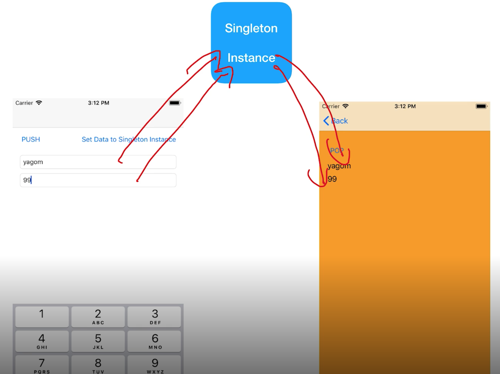
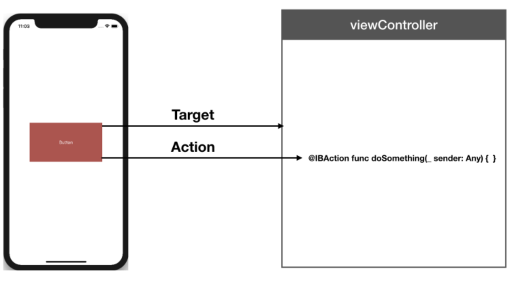

## 목차

- iOS 화면 전환
  - 내비게이션
  - 모달
- 뷰 라이프 사이크
  - 뷰 상태변화 메서드
  - 뷰 레이아웃 변화 메서드
- 델리게이트 (디자인 패턴)
- 싱글턴 (디자인 패턴)
- UIImagePicker
- Date
  - UIDatePicker
  - DateFormatter
  - UIImagePickerController
- 스택뷰
- 타겟-액션 (디자인 패턴)
- 제스처 인식기 (GestureRecognizer)
- UITextField

## iOS 화면 전환

### 화면 전환 방법 종류

> 1. 내비게이션
>
> 2. 모달

## 1. 내비게이션

계층적 구조의 화면전환을 위해 사용되는 드릴 다운 인터페이스입니다. 드릴 다운 인터페이스란 항목에 대한 세부항목이 존재하는 인터페이스입니다. 내비게이션 인터페이스는 내비게이션 컨트롤러를 통해 구현합니다. 

### 내비게이션 컨트롤러

- 내비게이션 컨트롤러는 컨테이너 뷰 컨트롤러로써 내비게이션 스택을 사용하여  다른 뷰 컨트롤러를 관리합니다.
- 여기서 내비게이션 스택에 담겨서 콘텐츠를 보여주게 되는 뷰 컨트롤러들을 컨텐트 뷰 컨트롤러라고 합니다.

**내비게이션 컨트롤러는 두 개의 뷰를 화면에 표시합니다.** 

1. 내비게이션 스택뷰에 포함된 최상위 컨텐트 뷰 컨트롤러의 **콘텐츠를 나타내는 뷰**
2. 내비게이션 컨트롤러가 직접 관리하는 뷰(**내비게이션바 또는 툴바**)가 있습니다. 

- 내비게이션 인터페이스의 변화에 따라 특정 액션을 동작하도록 하기 위해 **내비게이션 델리게이트** 객체를 사용할 수 있습니다.

### 내비게이션 스택이란?

- 내비게이션 컨트롤러에 의해 관리되는 내비게이션 스택은 뷰 컨트롤러를 담을 수 있는 배열과도 같습니다. 
- 내비게이션 스택에 가장 하위에 있는(가장 먼저 스택에 추가된) 뷰 컨트롤러는 내비게이션 컨트롤러의 루트 뷰 컨트롤러(root view controller)가 됩니다. 
- 루트 뷰 컨트롤러는 내비게이션 스택에서 팝(pop)되지 않습니다. 내비게이션 스택의 가장 상위에 있는(가장 마지막에 푸시(push) 된) 뷰 컨트롤러는 최상위 뷰 컨트롤러로 화면에 보이게 됩니다. 

- 내비게이션 스택은 푸시(push)/팝(pop)을 통하여 아이템(**뷰 컨트롤러**)을 관리합니다
- 푸시(push) 된 각 **뷰 컨트롤러들**은 애플리케이션에 자신이 가지고 있는 뷰 계층 구조를 통해 콘텐츠를 표시하게 됩니다.

### 내비게이션 스택에서의 화면이동

1. UINavigationController 클래스의 메서드 
2. 세그(segue)

 위 두가지를 이용하여 내비게이션 스택의 뷰 컨트롤러를 추가/삭제할 수 있습니다.

>#### 내비게이션 스택의 푸시(push)
>
>- 내비게이션 스택에 새로운 뷰 컨트롤러가 푸시 될 때 UIViewController 인스턴스가 생성되고 내비게이션 스택에 추가됩니다.
>
>#### 내비게이션 스택의 팝(pop)
>
>- 내비게이션 스택에 존재하는 뷰 컨트롤러가 팝 될 때 생성되었던 UIViewController의 인스턴스는 다른 곳에서 참조되고 있지 않다면 메모리에서 해제되고, 내비게이션 스택에서 삭제됩니다.

### UINavigationController 클래스

- 내비게이션 컨트롤러의 생성

  ```swift
  // 내비게이션 컨트롤러의 인스턴스를 생성하는 메서드입니다.
  // 매개변수로 내비게이션 스택의 가장 아래에 있는 루트 뷰 컨트롤러가 될 뷰 컨트롤러를 넘겨줍니다.
  init(rootViewController: UIViewController)
  ```

- 내비게이션 스택의 뷰 컨트롤러에 대한 접근

  ```swift
  // 내비게이션 스택에 있는 최상위 뷰 컨트롤러에 접근하기 위한 프로퍼티입니다.
  var topViewController: UIViewController?
  
  // 현재 내비게이션 인터페이스에서 보이는 뷰와 관련된 뷰 컨트롤러에 접근하기 위한 프로퍼티입니다.
  var visibleViewController: UIViewController?
  
  // 내비게이션 스택에 특정 뷰 컨트롤러에 접근하기 위한 프로퍼티입니다.(루트 뷰 컨트롤러의 인덱스는 0 입니다.)
  var viewController: [UIViewController]
  ```

- 내비게이션 스택의 푸시와 팝에 관한 메서드

  ```swift
  // 내비게이션 스택에 뷰 컨트롤러를 푸시합니다.
  // 푸시 된 뷰 컨트롤러는 최상위 뷰 컨트롤러로 화면에 표시됩니다.
  func pushViewController(UIViewController, animated: Bool)
  
  // 내비게이션 스택에 있는 최상위 뷰 컨트롤러를 팝합니다.
  // 최상위 뷰 컨트롤러 아래에 있던 뷰 컨트롤러의 콘텐츠가 화면에 표시됩니다.
  func popViewController(animated: Bool) -> UIViewController?
  //예제. (in팝하고싶은 뷰컨트롤러) 버튼을 누르면 해당 뷰컨트롤러 팝!
   @IBAction func popToPrev() {
          self.navigationController?.popViewController(animated: true)
      }
  
  // 내비게이션 스택에서 루트 뷰 컨트롤러를 제외한 모든 뷰 컨트롤러를 팝합니다.
  // 루트 뷰 컨트롤러가 최상위 뷰 컨트롤러가 됩니다.
  // 삭제된 모든 뷰 컨트롤러의 배열이 반환됩니다.
  func popToRootViewController(animated: Bool) -> [UIViewController]?
  
  // 특정 뷰 컨트롤러가 내비게이션 스택에 최상위 뷰 컨트롤러가 되기 전까지 상위에 있는 뷰 컨트롤러들을 팝합니다.
  func popToViewController(_ viewController: UIViewController, 
  		animated: Bool) -> [UIViewController]?
  ```

### 내비게이션 인터페이스를 구성하는 두 가지 방법

##### 스토리보드를 사용하여 내비게이션 인터페이스 구성하기

1. 스토리보드에서 내비게이션 컨트롤러에 포함할 뷰 컨트롤러를 선택합니다.
2. 메뉴에서 [Editor] - [Embed In] - [Navigation Controller]를 차례로 선택합니다.
3. 선택한 뷰 컨트롤러가 내비게이션 컨트롤러의 루트 뷰 컨트롤러가 되면서 내비게이션 컨트롤러가 생성됩니다.
4. 위의 방법 외에도 객체 라이브러리에서 내비게이션 컨트롤러를 드로그 앤 드롭해서 캔버스에 올릴 경우 테이블 뷰를 포함한 루트 뷰 컨트롤러가 생성되면서 내비게이션 컨트롤러가 만들어집니다.

**코드작성을 통해 내비게이션 인터페이스 구성하기**

코드로 내비게이션 컨트롤러를 생성할 경우, 내비게이션 컨트롤러가 생성되기 원하는 적절한 지점에 내비게이션 컨트롤러를 생성할 수 있습니다. 예를 들어 내비게이션 컨트롤러가 애플리케이션 윈도우(window)의 루트 뷰로서 역할을 한다면, 내비게이션 컨트롤러를 `applicationDidFinishLaunching:` 메서드에 구현할 수 있습니다.

1. 루트 뷰 컨트롤러가 될 뷰 컨트롤러를 생성합니다. 이 객체는 처음에 내비게이션 스택의 최상위 뷰 컨트롤러가 화면에 보이게 되고 내비게이션 바에 뒤로가기 버튼이 생성되지 않습니다.
2. `init(rootViewController: UIViewController)` 메서드를 통해 내비게이션 컨트롤러를 초기화하고 생성합니다.
3. 내비게이션 컨트롤러를 윈도우의 루트 뷰 컨트롤러로 설정합니다. 아래의 예시 코드를 살펴봅시다.

```swift
func application(_ application: UIApplication, didFinishLaunchingWithOptions launchOptions: [UIApplicationLaunchOptionsKey: Any]?) -> Bool {
        // Override point for customization after application launch.
        
        // 루트 뷰 컨트롤러가 될 뷰 컨트롤러를 생성합니다.
        let rootViewController = UIViewController()
        // 위에서 생성한 뷰 컨트롤러로 내비게이션 컨트롤러를 생성합니다.
        let navigationController = UINavigationController(rootViewController: rootViewController)
        
        self.window = UIWindow(frame: UIScreen.main.bounds)
        // 윈도우의 루트 뷰 컨트롤러로 내비게이션 컨트롤러를 설정합니다.
        self.window?.rootViewController = navigationController
        self.window?.makeKeyAndVisible()
        
        return true
    }
```

### 내비게이션바의 구성

- 내비게이션바는 내비게이션 컨트롤러에 의해 생성됩니다. 
- 내비게이션바는 내비게이션 컨트롤러의 관리를 받는 모든 뷰 컨트롤러의 상단에 표시됩니다. 
- 최상위 뷰 컨트롤러가 변경될 때마다 내비게이션 컨트롤러는 내비게이션바를 업데이트 합니다.

##### UINavigationBar 의 구조

- Items : 내비게이션 아이템들 스택
- backItem : 이전 내비게이션 아이템
- topItem : 현재 내비게이션 아이템

##### 정리

- 내비게이션바는 내비게이션 인터페이스에서 상단에 표시됩니다.
- 내비게이션바는 내비게이션 아이템을 가질 수 있습니다.
- 뷰 컨트롤러가 전환될 때마다 내비게이션바의 콘텐츠들이(내비게이션 아이템) 바뀌지만 내비게이션바 자체는 내비게이션 컨트롤러가 관리하는 하나의 공통 객체입니다.
- 내비게이션바의 타이틀을 통해 현재의 위치(최상위 뷰컨트롤러)를 알 수 있습니다.

## 2. 모달

### 모달이란?

- 모달(Modal)은 사용자의 이목을 끌기 위해 사용하는 화면전환 기법입니다. 사실, 화면을 전환한다기 보다는 이목을 집중해야 하는 화면을 다른 화면 위로 띄워(Presenting) 표현하는 방식입니다. 
- 모달로 보이는 화면을 사라지게 하려면 반드시 특정 선택을 해야한다는 특징이 있습니다. 예를 들어 얼럿을 통해 확인/취소 중 하나를 선택해야 한다거나 액션시트에서 무엇인가 선택을 해야하죠. 또는 이메일이나 문자를 작성하는 화면에서는 전송완료 또는 취소 버튼을 통해서만 모달로 보이는 화면을 사라지게 만들 수 있죠. 
- 모달은 내비게이션 인터페이스와는 달리 정보의 흐름을 가지고 화면을 이동한다기 보다는 꼭 이목을 끌어야하는 화면에서 사용합니다. 내비게이션 인터페이스를 통해 화면을 표현하는 것과는 용도가 완전히 다르다고 볼 수 있습니다. 그래서 모달로 보이는 화면은 되도록 단순하고 사용자가 빠르게 처리할 수 있는 내용을 표현하는 것이 좋습니다. 

### Presenting a View Controller

뷰 컨트롤러를 화면상에 나타내는 방법은 두 가지입니다. 

1. 컨테이너뷰 컨트롤러에 임베드하거나, 
2. 프레젠테이션을 통해서 나타낼 수 있습니다. 

- 뷰 컨트롤러의 나타내기(present) 지원 기능은 `UIViewController` 클래스에 내장되어 있으며 모든 뷰 컨트롤러 객체에서 사용할 수 있습니다. 

- 뷰 컨트롤러를 나타내면 원래 뷰 컨트롤러(나타내는 뷰 컨트롤러 - presenting view controller)와 새롭게 나타나는 뷰 컨트롤러(나타나는 뷰 컨트롤러 - presented view controller) 간의 관계가 생성됩니다. 이 관계를 뷰 컨트롤러 계층의 일부를 형성하며, 나타나는 뷰 컨트롤러(presented view controller)가 사라질(dismissed) 때까지 그대로 유지됩니다.

### 프레젠테이션 및 전환 프로세스(The Presentation and Transition Process)

- 뷰 컨트롤러의 프레젠테이션은 새로운 콘텐츠를 화면에 애니메이션으로 표시할 수 있는 쉽고 빠른 방법입니다. 
- `UIKit`에 내장된 프레젠테이션 기능은 내장 혹은 커스텀 애니메이션을 사용하여 새로운 뷰 컨트롤러를 표시할 수 있도록 합니다. 
- 내장 프레젠테이션과 애니메이션은 `UIKit`이 모든 작업을 처리하기 때문에 아주 적은 코드로도 가능합니다. 또한, 약간의 추가 코드를 이용해 커스텀 프레젠테이션 및 애니메이션을 사용할 수 있습니다. 
- <u>뷰 컨트롤러 프레젠테이션은 **프로그래밍 방식** 또는 **세그(segues)**를 사용하여 구현할 수 있습니다.</u>

### 프레젠테이션 스타일 (Presentation Style)

- 뷰 컨트롤러의 프레젠테이션 스타일에 따라 뷰 컨트롤러가 화면에 나타나는 모양이 달라집니다. 

- 뷰 컨트롤러의 `modalPresentationStyle` 프로퍼티에 적절한 상수를 할당하면 됩니다.

> ### 프레젠테이션 스타일 종류
>
> 프레젠테이션 스타일은 기본적으로 `UIModalPresentationOverFullScreen`입니다. 
>
> - 전체화면 프레젠테이션 스타일 (Full-Screen Presentation Style)
>   - 화면 전체를 덮으며, 아래의(underlying) 기본 콘텐츠와 상호작용을 방지합니다.
>   - UIModalPresentationFullScreen
> - 팝오버 스타일 (The Popover Style)
>   - 뷰 컨트롤러를 팝오버뷰로 나타냅니다. 팝오버는 추가 정보, 포커스, 선택한 객체와 관련된 항목 목록을 표시하는 데 유용합니다.
>   - UIModalPresentationPopover
> - 현재 컨텍스트 스타일 (The Current Context Styles)
>   - 아래 뷰 컨트롤러의 콘텐츠 영역에 콘텐츠를 올리는 형태입니다. 
>   - UIModalPresentationCurrentContext
> - 커스텀 프레젠테이션 스타일 (Custom Presentation Styles)
>   - 정의한 커스텀 스타일을 사용하여 뷰 컨트롤러를 표시할 수 있습니다.
>   - UIModalPresentationCustom

> ### 전환 스타일 (Transition Styles)
>
> 프렌젠테이션을 할 때 전화되는 애니메이션 효과

### 뷰 컨트롤러를 나타내기 VS 보여주기(Presenting VS Showing a View Controller)

`UIViewController` 클래스는 뷰 컨트롤러를 표시하는 두가지 방법을 제공합니다.

**1. 보여주기 (show)**

- `showViewController:sender:`와 `showDetailViewController:sender:`메서드는 뷰 컨트롤러를 표시하는 데에 가장 적응성이 우수하고 유연한 방법을 제공합니다. 
- 이러한 메서드를 사용하면 나타내는 뷰 컨트롤러(presenting view controller)가 프레젠테이션을 가장 잘 처리할 방법을 결정할 수 있습니다. **(알아서결정?)**
- 예를 들어, 컨테이너뷰 컨트롤러는 뷰 컨트롤러를 모달 방식으로 표시하는 대신, 이를 서브뷰로 통합할 수 있습니다. 기본 동작은 뷰 컨트롤러를 모달 방식으로 표시합니다.

**2. 나타내기(present)**

- `presentViewController:animated:completion:`메서드는 뷰 컨트롤러를 **항상 모달 방식으로 표시**합니다. 
- 이 메서드를 호출하는 뷰 컨트롤러는 궁극적으로 프레젠테이션을 처리하지 못할 수도 있으나, 프레젠테이션은 항상 모달 방식을 채택하고 있습니다.

### 뷰 컨트롤러 표시하기(Presenting a View Controller)

- 뷰 컨트롤러의 프레젠테이션을 시작하는 방법은 여러 가지 입니다.
  - 뷰 컨트롤러를 자동으로 표시하려면 세그(segue)를 사용하세요. 
  - 세그는 인터페이스 빌더에서 지정한 정보를 사용하여 뷰 컨트롤러를 인스턴스화 하여 표시합니다. 
  - `showViewController:sender:` 또는 `showDetailViewController:sender:`메서드를 사용하여 뷰 컨트롤러를 나타낼 수 있습니다. 
  - `presentViewController:animated:completion:`메서드를 호출하여 뷰 컨트롤러를 모달로 나타낼 수 있습니다.

### 뷰 컨트롤러 보여주기(Showing View Controllers)

`show(_:sender:)` 와 `showDetailViewController(_:sender:)` 메서드를 사용할 때, 새로운 뷰 컨트롤러를 화면에 띄우는 과정은 간단합니다.

1. 나타나는 뷰 컨트롤러 객체를 만듭니다. 뷰 컨트롤러를 생성할 때, 작업을 수행하는데 필요한 모든 데이터의 초기화는 여러분의 책임입니다.
2. 새로운 뷰 컨트롤러의 `modalPresentationStyle` 프로퍼티를 선호하는 프레젠테이션 스타일로 설정합니다.
3. 뷰 컨트롤러의 `modalTransitionStyle` 프로퍼티를 원하는 전환 애니메이션 스타일로 설정합니다.
4. 현재 뷰 컨트롤러의 `showViewController:sender:` 와 `showDetailViewController:sender:` 메서드를 호출하세요.

- `UIKit`은 `showViewController:sender:` 와 `showDetailViewController:sender:` 메서드에 대한 호출을 나타내는 뷰 컨트롤러(presenting view controller)에 전달합니다. 
- 그런 다음, 해당 뷰 컨트롤러는 프레젠테이션을 가장 효과적으로 수행할 방법을 결정하고, 필요할 경우 프레젠테이션 및 전환 스타일을 변경할 수 있습니다. 
- 예를 들면, 내비게이션 컨트롤러가 뷰 컨트롤러를 내비게이션 스택(navigation stack)에 푸시(push)할 수 있습니다.

### 뷰 컨트롤러를 모달로 표시하기(Presenting View Controllers Modally)

뷰 컨트롤러를 직접 나타내는 경우, `UIKit`에 새 뷰 컨트롤러를 표시하는 방법과 화면상에 애니메이션을 적용하는 방법을 알려 줍니다.

1. 나타나는 뷰 컨트롤러 객체를 만듭니다. 뷰 컨트롤러를 생성할 때, 작업을 수행하는데 필요한 모든 데이터의 초기화는 여러분의 책임입니다.
2. 새로운 뷰 컨트롤러의 `modalPresentationStyle` 프로퍼티를 선호하는 스타일로 설정합니다.
3. 뷰 컨트롤러의 `modalTransitionStyle` 프로퍼티를 원하는 전환 애니메이션 스타일로 설정합니다.
4. 현재 뷰 컨트롤러의 `presentViewController:animated:completion:` 메서드를 호출합니다.

- present(_:animated:completion:) 메서드를 호출하는 뷰 컨트롤러는 모달 프레젠테이션 (modal presentation)을 실제로 수행하는 뷰 컨트롤러가 아닐 수도 있습니다. 
- 프레젠테이션 스타일은 나타내는 뷰 컨트롤러에 필요한 특성을 포함하여, 뷰 컨트롤러가 나타나는 방식을 결정합니다. 예를 들어, 전체화면 프레젠테이션은 전체화면 뷰 컨트롤러에서 시작해야 합니다. 
- 현재 표시된 뷰 컨트롤러가 적합하지 않은 경우에 `UIKit`은 적합한 뷰 컨트롤러를 찾을 때까지 뷰 컨트롤러 계층을 탐색합니다. 
- 모달 프레젠테이션이 완료되면 `UIKit`은 이에 영향을 받은 뷰 컨트롤러의 `presentingViewController` 및 `presentViewController` 프로퍼티를 업데이트합니다.

### 팝오버에 뷰 컨트롤러 나타내기(Presenting a View Controller in a Popover)

팝오버를 나타내려면 추가적인 구성이 필요합니다. 모달 프레젠테이션 스타일을 `UIModalPresentationPopover`로 설정한 후, 다음과 같은 팝오버 관련 속성을 구성할 수 있습니다.

- 뷰 컨트롤러의 `preferredContentSize` 프로퍼티를 이용해 원하는 크기로 설정할 수 있습니다.
- 뷰 컨트롤러의 `popoverPresentationController` 프로퍼티에서 접근할 수 있는 연관된 `UIPopoverPresentationController` 객체를 사용하여 팝오버 고정 점(popover anchor point)을 설정할 수 있습니다.

- `UIPopoverPresentationController` 객체를 사용하여 필요에 따라 팝오버의 모양을 다른 방식으로 조정할 수 있습니다. 
- 팝오버 프레젠테이션 컨트롤러는 프레젠테이션 프로세스 중 발생하는 변경에 응답하는 데에 사용할 수 있는 델리게이트 객체도 지원합니다. 
- 예를 들어, 팝오버가 나타나거나, 사라지거나, 화면 상에서 위치가 변경될 때, 델리게이를 사용하여 이에 응답할 수 있습니다.

### 나타난 뷰 컨트롤러 닫기(Dismissing a Presented View Controller)

- 나타난 뷰 컨트롤러를 닫으려면 프레젠테이션 뷰 컨트롤러의 `dismiss(animated:completion:)` 메서드를 호출하십시오. 
- 또한, 제공된 뷰 컨트롤러 자체에서 이 메서드를 호출할 수도 있습니다. 표시된 뷰 컨트롤러에서 이 메서드를 호출하면 `UIKit`은 자동으로 이 요청을 나타내는 뷰 컨트롤러(presenting view controller)로 전달합니다. 
- 뷰 컨트롤러를 닫기 전에 항상 중요한 정보를 저장하세요. 뷰 컨트롤러를 닫으면 뷰 컨트롤러는 뷰 컨트롤러 계층에서 제거되며, 화면에서도 해당하는 뷰가 제거됩니다. 별도로 저장된 강한 참조가 없는 경우, 뷰 컨트롤러를 닫으면 이와 연결된 뷰 컨트롤러가 메모리에서 해제(releases)됩니다.

### 다른 스토리보드에서 정의된 뷰 컨트롤러 나타내기(Presenting a View Controller Defined in a Different Storyboard)

하나의 프로젝트 안에는 main.storyboard 라는 파일로 1개의 스토리보드를 갖고 있다. 하지만 이 스토리보드 파일을 여러개로 만들어서 여러개의 스토리보드를 운영할 수 있다.

- 하나의 스토리보드에 있는 뷰 컨트롤러 사이에는 세그를 생성할 수는 있으나, 스토리보드 간의 세그를 생성할 수 없습니다. 
- 다른 스토리보드에 저장된 뷰 컨트롤러를 나타내고자 할 경우 다음과 같이 뷰 컨트롤러를 명시적으로 표시하기 전에 먼저 인스턴스화 해야합니다. 
- 예시에서는 뷰 컨트롤러를 모달로 나타내(presents)지만, 뷰 컨트롤러를 내비게이션 컨트롤러에 푸시하거나 다른 방법으로도 나타낼(display) 수 있습니다.

```swift
let storyboard: UIStoryboard = UIStoryboard(name: "SecondStoryboard", bundle: nil)
if let myViewController: MyViewController = storyboard.instantiateViewController(withIdentifier: "MyViewController") as? MyViewController {
	// 뷰 컨트롤러를 구성 합니다.
	
	// 뷰 컨트롤러를 나타냅니다.
	self.present(myViewController, animated: true, completion: nil)
}
```

> Tip : 애플리케이션 내에 스토리보드를 여러 개 만들 필요는 없습니다. 다만, 스토리보드가 다수 존재할 때 유용할 수 있는 몇 가지 사례를 제시해 보겠습니다.

> 1. 대규모 프로그래밍 팀이 있으며, 팀의 각기 다른 부분에 사용자 인터페이스의 서로 다른 부분이 할당된 경우. 이때, 팀은 경합(contention)을 최소화하기 위해 서로 다른 스토리보드 파일 내 사용자 인터페이스를 부분적으로 소유하게 됩니다.
> 2. 뷰 컨트롤러 유형 컬렉션을 사전 정의하는 라이브러리를 사용하거나 생성하는 경우. 이때, 뷰 컨트롤러의 콘텐츠는 라이브러리에서 제공하는 스토리보드가 정의하게 됩니다.
> 3. 외부 화면에서 나타내야 하는 콘텐츠의 경우. 이러면, 외부 화면과 연관된 모든 뷰 컨트롤러를 서로 다른 스토리보드에 보관해야 합니다. 이와 목적은 같지만 다른 방법으로는, 커스텀 세그를 작성하는 방식이 있습니다.

## iOS 화면 전환 요약 정리

- 내비게이션

  1. 인터페이스빌더에서 내비게이션 컨트롤러를 생성하고 루트뷰컨트롤러를 지정한다.
  2. **PUSH** : 버튼을 클릭하여 다른 뷰컨트롤러를 스택하고 화면을 전환 방법

  > 1. 인터페이스 빌더에서 '버튼'을 만들어서 **'세그'**로 연결한다.
  >
  > 2.  코드로 구현하려면 아래 액션메서드를 구현하여 버튼에 연결한다.
  >
  >    ```swift
  >    @IBAction func pushView() {
  >      self.navigationController.pushViewController(UIViewController, animated: true)//navigationController: UINavigationController으로 정의되어있음
  >    }
  >    ```

  3. POP : 버튼을 클릭하여 다른 뷰컨트롤러를 스택하고 화면을 전환 방법

     > 1. 아래 액션메서드를 구현하여 버튼에 연결한다.
     >
     >    (코드로만 구현이 가능하다.)
     >
     > ```swift
     > @IBAction func popToPrev() {
     >         self.navigationController?.popViewController(animated: true)
     >     }
     > ```

     

- 모달

  1. **show or present** : 버튼을 클릭하여 다른 뷰컨트롤러를 모달로 뛰우기

  > 1. 인터페이스 빌더에서 '버튼'을 만들어서 **'세그'**로 연결한다.
  >
  > 2.  코드로 구현하려면 아래 액션메서드를 구현하여 버튼에 연결한다.
  >
  >    ```swift
  >    - showViewController:sender:` 또는 `showDetailViewController:sender:`메서드를 사용하여 뷰 컨트롤러를 나타낼 수 있습니다. 
  >    - `presentViewController:animated:completion:`메서드를 호출하여 뷰 컨트롤러를 모달로 나타낼 수 있습니다.
  >    ```

  3. **Dismiss** : 버튼을 클릭하여 다른 뷰컨트롤러를 스택하고 화면을 전환 방법

     > 1. 아래 액션메서드를 구현하여 버튼에 연결한다.
     >
     >    (코드로만 구현이 가능하다.)
     >
     > ```swift
     > @IBAction func dissmissModal() {
     >         self.dismiss(animated: true, completion: nil)
     >     }
     > ```

## 뷰의 라이프 사이클

### 뷰의 상태 변화 메서드

뷰가 나타나거나 사라지는 등 뷰가 화면에 보이는 상태가 변화할때 호출되는 메서드입니다. 각 메서드가 호출 될때의 시점과 수행하면 좋은 작업을 확인해보세요.

- func viewDidLoad() - 딱 1번 실행됨

- - **뷰 계층이 메모리에 로드된 직후 호출되는 메서드**
  - 뷰의 추가적인 초기화 작업을 하기 좋은 시점
  - 메모리에 처음 로딩 될때 1회 호출되는 메서드로, 메모리 경고로 뷰가 사라지지 않는 이상 다시 호출되지 않음

- func viewWillAppear(_ animated: Bool) 

- - **뷰가 뷰 계층에 추가되고 화면이 표시되기 직전에 호출되는 메서드**
  - 뷰의 추가적인 초기화 작업을 하기 좋은 시점
  - 다른 뷰로 이동했다가 되돌아오면 재호출되는 메서드로, 화면이 나타날때마다 수행해야하는 작업을 하기 좋은 시점

- func viewDidAppear(_ animated: Bool) - viewDidLoad()와 달리 여러번 실행될수 있음

- - **뷰가 뷰 계층에 추가되어 화면이 표시되면 호출되는 메서드**
  - 뷰를 나타내는 것과 관련된 추가적인 작업을 하기 좋은 시점

- func viewWillDisappear(_ animated: Bool) 

- - **뷰가 뷰 계층에서 사라지기 직전에 호출되는 메서드**
  - 뷰가 생성된 뒤 발생한 변화를 이전상태로 되돌리기 좋은 시점

- func viewDidDisappear(_ animated: Bool)

  - **뷰가 뷰 계층에서 사라진 후 호출되는 메서드**
  - 뷰를 숨기는 것과 관련된 추가적인 작업을 하기 좋은 시점
  - 시간이 오래 걸리는 작업은 하지 않는 것이 좋음

### 뷰의 레이아웃 변화 메서드

뷰가 생성된 후 바운드 및 위치 등의 레이아웃에 변화가 발생했을 때 호출되는 메서드입니다. 

- func viewWillLayoutSubviews()

- - **뷰가 서브뷰의 레이아웃을 변경하기 직전에 호출되는 메서드**
  - 서브뷰의 레이아웃을 변경하기 전에 수행할 작업을 하기 좋은 시점

- func viewDidLayoutSubviews()

- - **서브뷰의 레이아웃이 변경된 후 호출되는 메서드**
  - 서브뷰의 레이아웃을 변경 한 후 추가적인 작업을 수행하기 좋은 시점

## 델리게이션 (Delegation)

추천하는 참고내용

- https://zeddios.tistory.com/8
- https://zeddios.tistory.com/8
- https://zeddios.tistory.com/169

### 델리게이션 디자인 패턴(Delegation Design Pattern)

Delegate라는 단어의 뜻에서 예측할 수 있듯이, 델리게이션 디자인 패턴은 하나의 객체가 다른 객체를 대신해 동작 또는 조정할 수 있는 기능을 제공합니다.

- 델리게이션 디자인 패턴은 Foundation, UIKit, AppKit 그리고 Cocoa Touch 등 애플의 프레임워크에서 광범위하게 활용하고 있습니다.
- 주로 프레임워크 객체가 위임을 요청하며, (주로 애플리케이션 프로그래머가 작성하는)커스텀 컨트롤러 객체가 위임을 받아 특정 이벤트에 대한 기능을 구현합니다.
- 델리게이션 디자인 패턴은 커스텀 컨트롤러에서 세부 동작을 구현함으로써 동일한 동작에 대해 다양한 대응을 할 수 있게 해줍니다.
- 예로 `UITextFieldDelegate`를 살펴봅시다.
  - `UITextFieldDelegate`는 UITextField의 객체의 문구를 편집하거나 관리하기 위해 아래와 같은 메서드를 정의해두었습니다

```swift
// 대리자에게 특정 텍스트 필드의 문구를 편집해도 되는지 묻는 메서드
func textFieldShouldBeginEditing(UITextField)
	
// 대리자에게 특정 텍스트 필드의 문구가 편집되고 있음을 알리는 메서드
func textFieldDidBeginEditing(UITextField)

// 특정 텍스트 필드의 문구를 삭제하려고 할 때 대리자를 호출하는 메서드
func textFieldShouldClear(UITextField)

// 특정 텍스트 필드의 `Return` 키가 눌렸을 때 대리자를 호출하는 메서드
func textFieldShouldReturn(UITextField)
```

위 메서드에서 알 수 있듯이, 델리게이트는 특정 상황에 대리자에게 메시지를 전달하고 그에 적절한 응답 받기 위한 목적으로 사용됩니다.

### 데이터소스(DataSource)

- 델리게이트와 매우 비슷한 역할을 하는 데이터소스가 있습니다.
- 델리게이트가 사용자 **인터페이스 제어**에 관련된 권한을 위임받고, 데이터소스는 **데이터를 제어**하는 기능을 위임받습니다.
- 많이 사용되는 데이터소스에는 `UITableViewDataSource`와 `UICollectionViewDataSource`가 있습니다.(다음 프로젝트에서 다시 만나게 될 거에요~)

### 프로토콜(Protocol) 

- 코코아터치에서 프로토콜을 사용해 델리게이션과 데이터소스를 구현할 수 있습니다.
- 객체간 소통을 위한 강력한 통신 규약으로 데이터나 메시지를 전달할 때 사용합니다.
- 프로토콜은 특별한 상황에 대한 역할을 정의하고 제시하지만, 세부기능은 미리 구현해두지 않습니다.
- 구조체, 클래스, 열거형에서 프로토콜을 채택하고 특정 기능을 수행하기 위한 요구사항을 구현할 수 있습니다.

## 델리게이트 요약 정리

- 델리게이트는 프로토콜이다.
- 액션메서드로 함수를 정의해서 상호작용하는 함수를 연결했지만 델리게이트를 사용하면 델리게이트에 미리 정의된 메서드를 불러와 그 메서드가 불러질때 어떤 역할을 수행할지 메서드 안에 정의를 하면 된다.
- 이렇게 델리게이트의 메서드를 불러와서 정의하면 델리게이트를 채택한 뷰컨트롤러에서 알아서 메서드가 어떤 객체에 사용될지 절해서 잘 실행시켜준다(적재적소에 메서드가 실행될수 있는것은 델리게이트 안에 프로토콜로 정의가 되어있기 때문)
- 델리게이트는 textField, button, 등이 있지만 대표적으로 listView와 collectionView에서 많이 사용한다.

## 이미지 피커 UIImagePickerController

델리게이트 디자인 패턴을 활용하중 클래스중 하나이다.

> 참고 : https://www.edwith.org/boostcourse-ios/lecture/16883/

### 예시

```swift
class ViewController: UIViewController {
  lazy var imagePicker: UIImagePickerController = {
          let picker: UIImagePickerController = UIImagePickerController()
          picker.sourceType = .photoLibrary
          picker.delegate = self //델리게이트 채용
          return picker
      }()

  // 버튼클릭시 이미지피커 프레젠트 
  @IBAction func touchUpSelectImageButton(_ sender: UIButton) {
          present(imagePicker, animated: true, completion: nil)
      }
}
// MARK:- ImagePicker Delegate
// 이미지 이미지 피커는 UIImagePickerControllerDelegate & UINavigationControllerDelegate
// 2개의 델리게이트를 반드시 채용해야한다.
extension ViewController: UIImagePickerControllerDelegate & UINavigationControllerDelegate {
    
  	// 취소 눌렀을때 메서드
    func imagePickerControllerDidCancel(_ picker: UIImagePickerController) {
        dismiss(animated: true, completion: nil)
    }
    
  	// 이미지를 선택했을때 
    func imagePickerController(
        _ picker: UIImagePickerController,
        didFinishPickingMediaWithInfo info: [UIImagePickerController.InfoKey : Any]) {
        
        if let originalImage:UIImage =  info[UIImagePickerController.InfoKey.originalImage] as? UIImage {
            self.imageView.image = originalImage
       }
 
        dismiss(animated: true, completion: nil)
    }
    
}
```

### 사용자 앨범 접근 동의

- 이미지 피커로 앨범에 접근할때 사용자에게 접근 동의를 얻어야한다.
- Info.plist에서 add row한다.

> Key : Privacy - Photo Library Usage Description 
>
> Value : ""앨범에 접근하는것을 동의하십니까?"

## 싱글턴

- 싱글턴은 '특정 클래스의 인스턴스가 오직 하나임을 보장하는 객체'를 의미합니다. 
- 싱글턴은 애플리케이션이 요청한 횟수와는 관계없이 이미 생성된 같은 인스턴스를 반환합니다. 
- 즉, 애플리케이션 내에서 특정 클래스의 인스턴스가 딱 하나만 있기 때문에 다른 인스턴스들이 공유해서 사용할 수 있습니다.

> 요청에 따라 인스턴스를 여러개 생성하게되면 메모리 효율이 안좋아진다. 하나의 인스턴스를 생성해놓고 저장해놓아 다른데서 요청이 들어오면 그것을 다시 꺼내어 쓰는 방식이다. 이는 인스턴스의 재사용을 하게 하여 효율적이다.

### 싱글턴 내가 생성하는 방법

- 새로운 싱글턴 타입을 만들기 위해서는 새로운 스위프트 파일을 생성한다.

- 새로 만든 스위프트 파일에서 저장할 데이터의 형태를 클래스로 선언한다.

  ```swift
  // 예시 in UserInformation.swift
  class UserInformation {
    // shared라는 타입프로퍼티를 선언한다.
    // 이 타입 프로퍼티로 인스턴스 1개를 생성해서 할당 하였기 때문에
    // shared라는 타입프로퍼티를 호출하면 항상 똑같은 인스턴스를 사용한다.
    // 보통 이 인스턴스 프로퍼티 명은 암묵적으로 shared, default를 많이 사용한다.
    // 하지만 누구나 shared, default 이걸로 싱글턴으로 데이터를 저장하는것을 알고 있기때문에
    // 보안에 약할수 있어서 프로퍼티명을 잘 정해주는것도 좋을것 같다.
    static let shared: UserInformation = UserInformation()
    
    var name: String?
    // age 프로퍼티는 숫자일텐데 String으로 한 이유는
    // 텍스트 필드로 숫자를 입력받아도 자동으로 Stringd으로 인식하기 때문이다.
    var age: String?
  }
  
  // in FirstViewController - 텍스트 필드에 유저정보를 입력받을 뷰컨
  // MARK:- 액션메서드
      @IBAction func touchUpSetUpButton(_ sender: UIButton) {
          UserInformation.shared.name = nameField.text
          UserInformation.shared.age = ageField.text
      }
  
  // in SecondViewController - 레이블을 통해 싱글턴 디자인패턴의 유저정보를 보여줄 뷰컨
      override func viewWillAppear(_ animated: Bool) {
          super.viewWillAppear(animated)
          
          self.nameLabel.text = UserInformation.shared.name
          self.ageLabel.text = UserInformation.shared.age
      }
  ```

  

### Cocoa 프레임워크에서의 싱글턴 디자인 패턴

Cocoa 프레임워크에서 싱글턴 디자인 패턴을 활용하는 대표적인 클래스를 소개합니다.
싱글턴 인스턴스를 반환하는 팩토리 메서드나 프로퍼티는 일반적으로 `shared`라는 이름을 사용합니다.

> - `FileManager`
>   - 애플리케이션 파일 시스템을 관리하는 클래스입니다.
>   - `FileManager.default`
> - `URLSession`
>   - URL 세션을 관리하는 클래스입니다.
>   - `URLSession.shared`
> - `NotificationCenter`
>   - 등록된 알림의 정보를 사용할 수 있게 해주는 클래스입니다.
>   - `NotificationCenter.default`
> - `UserDefaults`
>   - Key-Value 형태로 간단한 데이터를 저장하고 관리할 수 있는 인터페이스를 제공하는 데이터베이스 클래스입니다.
>   - `UserDefaults.standard`
> - `UIApplication`
>   - iOS에서 실행되는 중앙제어 애플리케이션 객체입니다.
>   - `UIApplication.shared`



### 주의할 점

- 싱글턴 디자인 패턴은 애플리케이션 내의 특정 클래스의 인스턴스가 하나만 존재하기 때문에 객체가 불필요하게 여러 개 만들어질 필요가 없는 경우에 많이 사용합니다. 
- 예를 들면 환경설정, 네트워크 연결처리, 데이터 관리 등등이 있습니다. 
- <u>하지만 멀티 스레드 환경에서 동시에 싱글턴 객체를 참조할 경우 원치 않은 결과를 가져올 수 있습니다.</u> 
- 어떤 디자인 패턴을 활용하더라도 항상 긍정적인 면과 위험성을 함께 고려하여 활용하세요.

## 스택뷰

- 스택뷰는 여러 뷰들의 수평 또는 수직 방향의 선형적인 레이아웃의 인터페이스를 사용할 수 있도록 해줍니다. 
- 스택뷰와 오토레이아웃 기능을 활용하여 디바이스의 방향과 화면크기에 따라 동적으로 적응할 수 있는 사용자 인터페이스를 만들 수 있습니다. 
- 스택뷰의 레이아웃은 스택뷰의 `axis`, `distribution`, `alignment`, `spacing`과 같은 프로퍼티를 통해 조정합니다.

### 스택뷰의 생성 방법

방법1. 객체라이브러리에서 스택뷰를 캔버스에 추가하고 아에 들어갈 서브뷰를 여러개 추가하는 방식

방법2. 기존의 합치고 싶은 여러개의 객체를 한번에 묶어서 임베디드인으로 스택뷰를 설정하는 방식

>  참고 : https://www.edwith.org/boostcourse-ios/lecture/16884/

### UIStackView클래스의 주요 프로퍼티

- `var arrangedSubviews: [UIView]`: 스택뷰의 정렬된 뷰의 배열입니다. 스택뷰에 포함된 뷰들을 이 프로퍼티에 저장하고 관리합니다.
- `var axis: UILayoutConstraintAxis`: 레이아웃의 방향을 결정합니다.(수직 vertical, 수평 horizontal)
- `var distribution: UIStackViewDistribution`: 스택뷰에 포함된 뷰가 스택뷰 내에서 어떻게 배치(분배)될지 결정합니다.
- `var spacing: CGFloat`: 스택뷰에 정렬된 뷰들 사이의 간격을 결정합니다. 기본 값은 0.0 입니다.

### UIStackView 클래스의 주요 메서드

- `func addArrangeSubview(UIView)`: `arrangedSubviews` 배열에 마지막 요소에 뷰를 추가합니다.
- `func insertArrangedSubview(UIView, at: Int)`: `arrangedSubviews` 배열의 특정 인덱스에 뷰를 추가합니다.
- `func removeArrangedSubview(UIView)`: 스택뷰의 `arrangedSubviews` 배열로부터 뷰를 제거합니다.

```swift
// 예시
// UIStackView in Swift 3.0
let stackView = UIStackView()

stackView.axis = .horizontal
stackView.distribution = .fillEqually
stackView.alignment = .fill
stackView.spacing = 8
stackView.translatesAutoresizingMaskIntoConstraints = false

// stackView에 View 추가
stackView.addArrangedSubview(view1)

// UIStackView Constraints
stackView.leadingAnchor.constraint(equalTo: view.leadingAnchor).isActive = true
stackView.trailingAnchor.constraint(equalTo: view.trailingAnchor).isActive = true
stackView.centerXAnchor.constraint(equalTo: view.centerXAnchor).isActive = true
stackView.centerYAnchor.constraint(equalTo: view.centerYAnchor).isActive = true
```

## 타겟-액션 디자인 패턴

### Target-Action 디자인 패턴

- Target-Action 디자인 패턴에서 객체는 이벤트가 발생할 때 다른 객체에 메시지를 보내는 데 필요한 정보를 포함합니다. 
- **액션**은 특정 이벤트가 발생했을 때 호출할 **메서드**를 의미합니다. 
- **타겟**은 액션이 **호출될 객체**를 의미합니다. 
- 이벤트 발생 시 전송된 메시지를 액션 메시지라고 하고, 타겟은 프레임워크 객체를 포함한 모든 객체가 될 수 있으나, 보통 컨트롤러가 되는 경우가 일반적입니다.

```swift
//예시
UI객체.addTarget(타겟뷰컨트롤러,action: #selector(실행시킬IBAction메서드), for: UIControlEvents.TouchUpInside)
```


> 직접 타겟이 될 객체에 액션에 해당하는 메서드를 호출하면 될 텐데 굳이 Target과 Action을 지정하고 디자인 패턴으로 활용하는 이유가 궁금하죠? 왜 그럴까요?
>
> 만약 특정 이벤트가 발생했을 때 *abc*라는 이름의 메서드를 호출해야 하는 상황이라고 생각해 봅시다. 그런데 이 *abc*라는 (액션)메서드는 *A*라는 클래스에도 정의되어 있고, *B*라는 클래스에도 정의되어 있는 경우가 있습니다. 이렇게 같은 메서드가 여러 클래스에 정의되어 있는 경우도 있고, 그런 클래스의 인스턴스가 여러개인 상황도 있습니다. 이런 여러 가지 상황에서 우리가 원하는 객체를 Target으로 지정하면 *abc*라는 액션을 실행할 객체를 상황에 따라서 선택할 수 있습니다.



### 액션 메서드

액션 메서드는 특정한 양식이 필요합니다. IBAction은 인터페이스 빌더가 메서드를 인지할 수 있도록 해줍니다. 스위프트 언어를 활용한 프로그래밍 방식에서 `@objc`는 Swift 클래스를 사용하는 `Objective-C` 코드가 있거나 `Objective-C`유형의 메서드를 사용하는 경우 필요합니다.

> 액션메서드는 `@IBAction func` 로 구현해야한다.

```swift
/ 프로그래밍 방식
@objc func doSomething(_ sender: Any) {

}

// 인터페이스 빌더
@IBAction func doSomething(_ sender: Any) { 

}
```

> **Tip!** 
>
> 아직까지 애플의 프레임워크는 Objective-C 언어로 작성된 코드가 많기 때문에 스위프트 언어로 작성한 코드에서는 Objective-C 코드와 호환하기 위해서 `@objc`라고 표시해주어야 합니다. 스위프트 언어 4버전 이전의 컴파일러는 `@objc`를 자동으로 만들어 주었습니다. 하지만 이러한 방식은 자원 비용이 많이 들어 스위프트 4에서는 명시적으로 작성해야 합니다.

### 컨트롤 이벤트와 액션과의 관계

- UIKit에는 `UIButton`, `UISwitch`, `UIStepper` 등 `UIControl`을 상속받은 다양한 컨트롤 클래스가 있습니다. 
- 그런 컨트롤 객체에 발생한 다양한 이벤트 종류를 **특정 액션 메서드**에 연결할 수 있습니다. 
- 즉, 컨트롤 객체에서 특정 이벤트가 발생하면, 미리 지정해 둔 타겟의 액션을 호출하게 됩니다.

## UIDatePicker (타겟-액션 디자인 패턴 채용)

- Date Picker는 날짜 및 시간을 입력하는 컨트롤입니다. 
- Date picker를 이용하여 특정 시점의 날짜와 시간 또는 시간 간격을 입력할 수 있습니다.

### Date picker를 인터페이스에 추가하기

- Date picker를 생성하고 모드를 설정합니다.
- 필요한 경우 최소 및 최대 날짜와 같은 추가 구성 옵션을 제공합니다.
- Date picker에 액션 메서드를 연결합니다.

### Date picker에 액션 메서드 연결하기

- Date picker는 사용자가 선택된 날짜를 바꿀 경우 애플리케이션에 알리기 위해 타겟-액션 디자인 패턴을 사용합니다. 
- Date picker의 값이 변경될 때 알림을 받기 위해 액션 메서드를 `valueChanged`로 설정합니다. 
- 실행시점에서 Date picker는 사용자의 날짜 및 시간 선택하게되면 설정된 액션 메서드를 호출합니다. 
- Date picker를 액션 메서드에 연결하기 위해 인터페이스 빌더를 이용하거나 코드로 `addTarget(_:action:for:)`메서드를 사용합니다.

#### Date Picker의 주요 인터페이스 빌더 속성 (코드상 프로퍼티로도 사용가능)

- `Mode`: Date picker의 모드를 설정합니다. 코드상으로 `datePickerMode` 프로퍼티를 사용하여 이 값에 접근할 수 있습니다.
- `Locale`: Date picker에 사용될 로케일입니다. 코드상으로 `locale` 프로퍼티를 통해 이 값에 접근할 수 있습니다.
- `Interval`: 현재 선택된 모드의 분 간격을 나타냅니다. 선택한 값은 60의 제수여야합니다. `minnuteInterval`프로퍼티를 통해 이 값에 접근할 수 있습니다.
- `Date`: Date picker가 처음 보여주게 될 날짜를 설정할 수 있습니다. 기본값은 현재 날짜로 설정되어 있습니다. `date`프로퍼티를 통해 접근할 수 있습니다.
- `Constraints`: Date 하단의 Minimum Date와 MaximumDate를 통해 Date picker가 보여줄 날짜의 범위를 설정할 수 있습니다. `minimumDate`, `maximumDate` 프로퍼티를 통해 설정할 수 있습니다.
- `Timer`: 카운트다운 타이머 모드에서 date picker의 표시되는 초기값입니다. 값은 초 단위로 계산되지만 보이는 것은 분 단위로 표시됩니다. `countDownDuration` 프로퍼티를 통해 이 값에 접근할 수 있습니다.

#### UIDatePicker 클래스의 주요 프로퍼티

- `var datePickerMode: UIDatePickerMode`: Date picker의 모드를 결정합니다.
  - 기본값은 `dateAndTime`입니다.
  - `time`, `date`, `dateAndTime`, `countDownTimer` 네가지 모드를 설정할 수 있습니다.
- `var date: Date`: date picker에 보여지게 될 날짜입니다.
- `var calendar: Calendar!`: date picker에 사용되는 캘린더입니다.
- `var locale: Locale?`: date picker에서 사용하는 로케일입니다.
- `var timeZone: TimeZone?`: date picker에서 표시된 날짜에 반영된 시간대입니다.
- `var maximumDate: Date?`: date picker에서 보여줄 수 있는 최대 날짜입니다.
- `var minimumDate: Date?`: date picker에서 보여줄 수 있는 최소 날짜입니다.
- `minuteInterval: Int`: date picker에서 분을 표시하는 간격입니다. 기본값과 최솟값은 1이고 최댓값은 30입니다.
- `var countDownDuration: TimeInterval`: date picker의 모드가 countDownTimer로 설정될 경우 date picker에 표시되는 초깃값입니다.

#### UIDatePicker 클래스의 주요 메서드

- `func setDate(Date, animated: Bool)`: date picker에 처음 표시할 날짜를 설정합니다.

## DateFormatter

- DateFormatter는 날짜와 텍스트 표현 간의 변환을 할 수 있게 해줍니다. 
- DateFormatter를 활용해 날짜와 시간을 다양한 방식으로 출력하거나 출력된 날짜 및 시간에 대한 문자열을 읽어올 수 있습니다.
- DateFormatter의 인스턴스는 [Date](https://developer.apple.com/documentation/foundation/date) 객체의 문자열 표현을 생성하고, 날짜 및 시간의 텍스트 표현을 Date 객체로 변환합니다.

### 사용자 날짜 및 시간 표현

- 사용자에게 날짜를 표시할 때 특정 요구 사항에 따라 date formatter의 `dateStyle`과 `timeStyle`프로퍼티를 설정합니다. 
- 예를 들어, 만약에 시간을 제외한 월, 일, 연도를 보여주고 싶다면, `dateStyle`프로퍼티를 `long`으로 설정하고 `timeStyle`을 none으로 설정합니다. 
- 반대로 시간만 보여주고 싶다면 `dateStyle`프로퍼티를 none으로 `timeStyle`프로퍼티를 short로 설정합니다. `dateStyle`과 `timeStyle` 프로퍼티의 값을 기반으로 DateFormatter는 지정된 로케일에 적합한 지정된 날짜의 표현을 제공합니다. 
- 미리 정의된 스타일을 통해 얻을 수 없는 형식을 지정해야 한다면 `setLocalizedDateFormatFromTemplate(_:)`을 사용하여 날짜 형식을 지정할 수 있습니다.

### 고정 형식 날짜 표현

RFC3339와 같은 고정 형식의 날짜로 사용해야 한다면, `dateFormat` 프로퍼티를 특정 포맷 문자열로 설정합니다. 대부분의 경우 고정된 형식의 경우 `locale` 프로퍼티를 POSIX locale("en_US_POSIX")로 설정하고, `timeZone`프로퍼티를 UTC로 설정합니다.

### DateFormatter의 주요 프로퍼티와 메서드

- `func date(from: String)`: 주어진 문자열을 Date 객체(날짜와 시간)로 변환하여 반환합니다.

- `func string(from: Date)`: 주어진 Date 객체를 문자열로 변환하여 반환합니다.

- `func setLocalizedDateFormatFromTemplate(String)`: 지정된 로케일을 사용하여 날짜 형식을 설정합니다.

- `var dateStyle: DateFormatter.Style`: DateFormatter의 날짜 형식입니다.

- `var timeStyle: DateFormatter.Style`: DateFormatter의 시간 형식입니다.

- `var dateFormat: String!`: 고정 형식 날짜 표현을 사용할 때의 날짜 형식입니다.

- `var locale: Locale!`: DateFormatter의 로케일입니다.

- `var timeZone: TimeZone!`: DateFormatter의 시간대입니다.

  

### 예제 코드

- 날짜 형식(Date 객체) -> 문자열 형식(textual representation)

```swift
import UIKit

let dateFormatter = DateFormatter()
dateFormatter.dateStyle = .full
dateFormatter.timeStyle = .none

let date = Date(timeIntervalSinceReferenceDate: 118800)

// US English Locale (en_US)
dateFormatter.locale = Locale(identifier: "en_US")
print(dateFormatter.string(from: date)) // Tuesday, January 2, 2001

// KOR Korean Locale (ko_KR)
dateFormatter.locale = Locale(identifier: "ko_KR")
print(dateFormatter.string(from: date)) // 2001년 1월 2일 화요일
```

- 문자열 형식 -> 날짜 형식

```swift
import UIKit

let dateFormatter = DateFormatter()

let dateString = "1970-01-01 08:03:30 +0000"
dateFormatter.dateFormat = "yyyy-MM-dd HH:mm:ss ZZZ"
print(dateFormatter.date(from: dateString)!) // 1970-01-01 08:03:30 +0000
```

- 부스트코스 동영상 강의 예시

```swift
import UIKit

class ViewController: UIViewController {
    
    // MARK:- Prroperties
    @IBOutlet weak var datePicker: UIDatePicker!
    @IBOutlet weak var dateLabel: UILabel!
    let dateFormatter: DateFormatter = {
        let formatter: DateFormatter = DateFormatter()
        //데이트포맷터가 기본적으로 제공하는 date스타일과, time스타일 형식
//        formatter.dateStyle = .medium
//        formatter.timeStyle = .medium
        // 데이트 포맷 형식 내가 지정하기
        formatter.dateFormat = "yyyy/MM/dd hh:mm:ss"
        return formatter
    }()
    
    // MARK:- View Life Cycle
    override func viewDidLoad() {
        super.viewDidLoad()
        self.datePicker.addTarget(self, action: #selector(self.didDatePickerValueChanged(_:)), for: UIControl.Event.valueChanged)
    }
    
    // MARK:- Method
    @IBAction func didDatePickerValueChanged(_ sender: UIDatePicker) {
        let date: Date = self.datePicker.date
        let dateString: String = self.dateFormatter.string(from: date)
        
        self.dateLabel.text = dateString
    }


}
```

## 제스처 인식기(Gesture Recognizer)

- 제스처 인식기는 여러 제스처 관련 이벤트를 인식할 수 있습니다. 
- 특정 제스처 이벤트가 일어날 때 마다 각 타깃에 맞는 액션 메시지를 보내어 제스처 관련 이벤트를 처리할 수 있습니다.

### 제스처 인식기 추가하는방법

1. 인터페이스 빌더

   - 인터페이스 빌더에서 Gesture Recognizer를 뷰에 추가한다.
   - 제스처가 발생할때 실행될 @IBAction 메서드를 생성한다.
   - 인터페이스빌더 위의 Gesture Recognizer 인스턴스와 @IBAction 메서드를 연결한다.

2. 코드

   ```swift
   // 일반적인 방법
   import UIKit
   
   class ViewController: UIViewController {
     
     override func viewDidLoad() {
       super.viewDidLoad()
       
       // 탭 제스쳐 인식기 생성 : 타겟-액션 연결하면서 생성하기
       // 주의! viewDidLoad()메서드 안에서 선언해야 작동한다.
       // 위에 프로퍼티로 선언하면 작동안한다.
       let tapRecognizer = UITapGestureRecognizer(target: self, action: #selector(tapView(gestureRecognizer:)))
       
       // 뷰에 제스처 인식기 연결하기
       self.view.addGestureRecognizer(tapRecognizer)
     }
     
     // MARK:- Method
     // @object func로 해도 되는듯!?
     // 생성된 제스쳐 인식기의 액션 메서드
     @IBAtion func tapView(gestureRecognizer: UIGestureRecognizer) {
       print("tapped")
     }
   }
   ```

   ```swift
   // UIGestureRecognizerDelegate 델리게이트를 활용하는 방법
   import UIKit
   
   class ViewController: UIViewController, UIGestureRecognizerDelegate {
       
       override func viewDidLoad() {
           super.viewDidLoad()
           
           let tapRecognizer: UITapGestureRecognizer = UITapGestureRecognizer()
           tapRecognizer.delegate = self //델리게이트 지정
           self.view.addGestureRecognizer(tapRecognizer)
       }
       
       func gestureRecognizer(_ gestureRecognizer: UIGestureRecognizer, shouldReceive touch: UITouch) -> Bool {
           self.view.endEditing(true)
           
           // 여기선 리턴값이 true이든 false 이든 상관은 없다.
           // 이미 이 메서드가 실행된건 사용자의 터치를 인식했기 때문이다.
           return true
       }
       
   }
   ```

   

### UIGestureRecognizer class

UIGestureRecognizer 클래스는 특정 제스처 인식기에 대한 동작을 정의합니다. 또한 델리게이트 객체를 활용하여 일부 동작을 더욱 세밀하게 사용자화 할 수 있습니다.

### UIGestureRecognizer의 하위 클래스 (UIGestureRecognizer의 종류)

아래의 7가지의 UIGestureRecognizer 하위 클래스를 통해 여러 제스처를 인식할 수 있습니다.

1. UITapGestureRecognizer : 싱글탭 또는 멀티탭 제스처
2. UIPinchGestureRecognizer : 핀치(Pinch) 제스처
3. UIRotationGestureRecognizer : 회전 제스처
4. UISwipeGestureRecognizer : 스와이프(swipe) 제스처
5. UIPanGestureRecognizer : 드래그(drag) 제스처
6. UIScreenEdgePanGestureRecognizer : 화면 가장자리 드래그 제스처
7. UILongPressGestureRecognizer : 롱프레스(long-press) 제스처

- 제스처 인식기를 사용하기 위해서 타깃-액션 연결을 설정한 후 UIView의 메서드인 `addGestureRecognizer(_:)` 메서드를 통해 뷰에 연결합니다. 
- 제스처가 인식되면 해당 제스처 이벤트에 연결된 타깃에 액션 메시지가 전달됩니다. 
- 호출되는 액션메서드는 아래의 메서드 구현 형식 중 하나와 같아야 합니다.

```swift
@IBAction func myActionMethod()
@IBAction func myActionMethod(_ sender: UIGestureRecognizer)
```

- 윈도우는 뷰에 터치 이벤트를 전달하기 전에 뷰에 추가된 제스처 인식기에 터치 이벤트를 전달합니다. 
- 제스처 인식기가 터치 이벤트를 인식했을 경우 뷰는 터치 이벤트를 받지 못하고, 제스처 인식기가 터치 이벤트를 인식하지 못했을 경우 터치 이벤트를 뷰가 받게 됩니다. 
- 일반적인 제스처 인식기의 동작의 흐름은 `cancelsTouchesInView`, `delaysTouchesBegan`, `delaysTouchesEnded` 프로퍼티의 값에 영향을 받습니다.

### UIGestureRecognizer의 주요 메서드

- `init(target: Any?, action: Selector?)` : 제스처 인식기를 타깃-액션의 연결을 통해 초기화 합니다.
- `func location(in: UIView?) -> CGPoint` : 제스처가 발생한 좌표를 반환합니다.
- `func addTarget(Any, action: Selector)` : 제스처 인식기 객체에 타깃과 액션을 추가합니다.
- `func removeTarget(Any?, action: Selector?)` : 제스처 인식기 객체로부터 타깃과 액션을 제거합니다.
- `func require(toFail: UIGestureRecognizer)` : 여러 개의 제스처 인식기를 가지고 있을 때, 제스처 인식기 사이의 의존성을 설정한다.

### UIGestureRecognizer의 주요 프로퍼티

- `var state: UIGestureRecognizerState` : 현재 제스처 인식기의 상태를 나타냅니다.
- `var view: UIView?` : 제스처 인식기가 연결된 뷰입니다.
- `var isEnabled: Bool` : 제스처 인식기가 사용 가능한 상태인지를 나타냅니다.
- `var cancelsTouchInView` : 제스처가 인식되었을 때 터치 이벤트가 뷰로 전달되는 여부에 영향을 미칩니다.
  - 이 프로퍼티가 true(기본값)이고 제스처 인식기가 제스처를 인식했다면, 해당 제스처의 터치는 뷰로 전달되지 않습니다. 
  - 이전에 전달된 터치들은 `touchesCancelled(_:with:)` 메시지를 통해 취소됩니다. 
  - 제스처 인식기가 제스처를 인식 못하거나 이 프로퍼티의 값이 false라면 뷰가 모든 터치를 전달받게 됩니다.
- `var delaysTouchesBegan` : began 단계에서 제스처 인식기가 추가된 뷰에 터치의 전달 지연 여부를 결정합니다.
- `var delaysTouchesEnded` : end 단계에서 제스처 인식기가 추가된 뷰에 터치의 전달 지연 여부를 결정합니다.


##  UITextField

- 텍스트 필드는 사용자 인터페이스에서 편집 가능한 텍스트 영역을 나타냅니다. 

- 사용자가 키보드를 통해 입력하는 문자열 데이터를 활용할 수 있습니다. 

- 텍스트 필드는 [Target-Action](https://developer.apple.com/library/content/documentation/General/Conceptual/Devpedia-CocoaApp/TargetAction.html) 디자인 패턴과 델리게이트 객체를 사용하여 텍스트 편집 이벤트에 관해 다룹니다.

  

**키보드 보여주기/숨기기**

- 사용자가 텍스트 필드를 탭 하게 되면 텍스트 필드는 자동으로 first responder 가 되면서 시스템은 키보드를 보여주고, 사용자가 키보드를 사용하여 입력을 하게되면 텍스트 필드에 텍스트가 입력됩니다. 
- 텍스트 필드를 자동으로 탭하는 방법 외에도 becomeFirstResponder() 메서드를 직접 호출해서 키보드를 나타나게 할 수 있습니다. 
- 반대로 키보드를 숨기기 위해 resignFirstResponder() 또는 endEditing(_:) 메서드를 호출할 수 있습니다.


**인터페이스 빌더에서 설정 가능한 속성**

- 텍스트 필드의 속성은 [텍스트 필드 속성 참조 링크](https://developer.apple.com/documentation/uikit/uitextfield#1653000)의 Table 1을 참조하세요.
- 키보드 속성은 [키보드 속성 참조 링크](https://developer.apple.com/documentation/uikit/uitextfield#1965766)의 Table 2를 참조하세요.

###  

**텍스트 필드 델리게이트**

- 텍스트 필드는 델리게이트 객체의 도움을 받아 텍스트 편집의 이벤트 등을 관리합니다. 
- 사용자가 텍스트필드를 통한 작업을 할 때 이와 관련된 이벤트들을 델리게이트 객체에게 알리고 이를 사용하여 여러 이벤트를 처리할 수 있습니다.


**UITextField 클래스의 주요 프로퍼티**

- `var delegate: UITextFieldDelegate?`: 텍스트 필드의 델리게이트 객체입니다.
- `var text: String?`: 텍스트 필드에 보여지는 문자열입니다.
- `var placeholder: String?`: 텍스트 필드에 아무것도 입력되어 있지 않을 때 기본으로 보이게 되는 문자열입니다. 텍스트 필드에 텍스트를 입력하게 되면 사라집니다.
- `var font: UIFont?`: 텍스트의 폰트를 설정합니다.
- `var textColor: UIColor?`: 텍스트의 색상을 설정합니다.
- `var textAlignment: NSTextAlignment`: 텍스트의 정렬을 설정합니다.
- `var isEditing: Bool`: 현재 텍스트 필드가 편집 모드에 있는지 나타냅니다.
- `var background: UIImage?`: 텍스트 필드가 enable 되어 있을 때의 배경 이미지를 나타냅니다.
- `var disabledBackground: UIImage?`: 텍스트 필드가 disabled 되어 있을 때의 배경 이미지를 나타냅니다.
- `var clearButtonMode: UITextFieldViewMode`: 텍스트 필드의 텍스트를 모두 지울 수 있는 컨트롤을 텍스트 필드에 나타나게 할 수 있습니다.


**UITextFieldDelegate 프로토콜의 주요 메서드**

- `func textFieldShouldBeginEditing(UITextField)`: 델리게이트 객체에게 텍스트 필드에서 텍스트 편집을 시작을 요청합니다.
- `func textFieldDidBeginEditing(UITextField)`: 델리게이트에게 텍스트 필드에서 텍스트 편집이 시작되었음을 델리게이트 객체에게 알립니다.
- `func textField(UITextField, shouldChangeCharactersIn: NSRange, replacementString: String)`: 델리게이트 객체에게 현재 텍스트의 수정을 요청합니다.
- `func textFieldShouldEndEditing(UITextField)`: 델리게이트 객체에게 텍스트 편집 중지를 요청합니다.