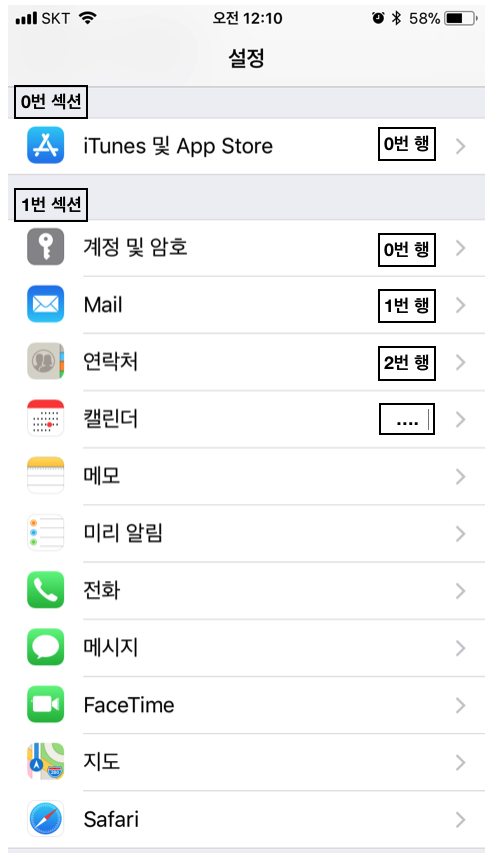
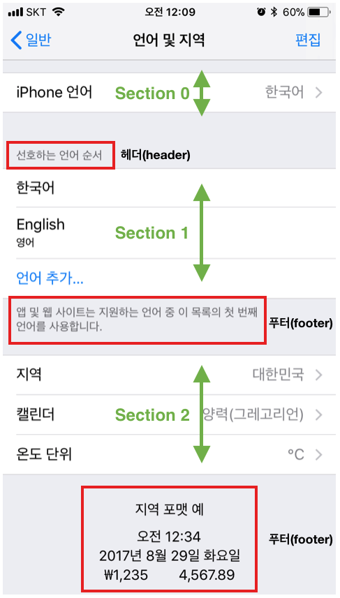
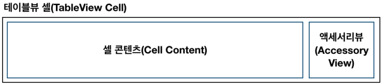
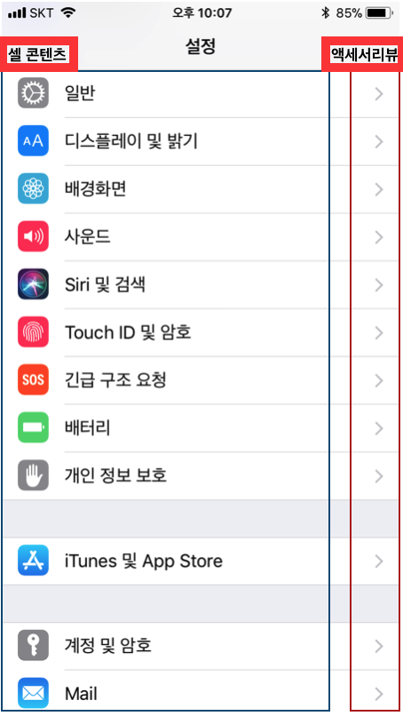
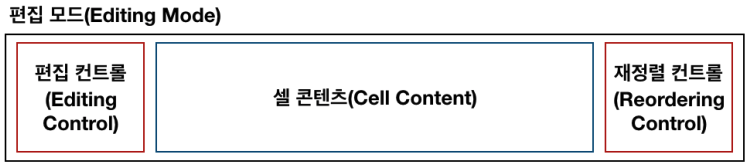
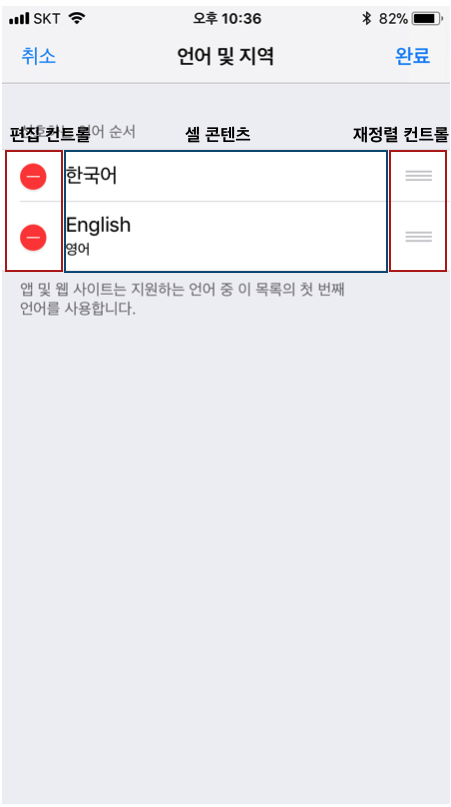
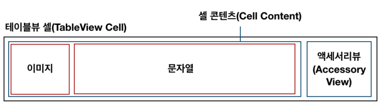
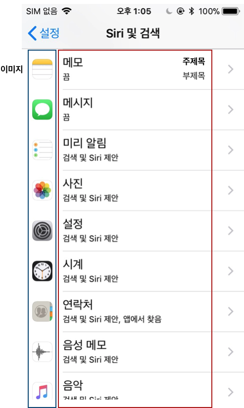
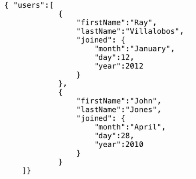

## 목차

- UIKit
  - UITableView
  - UITableViewCell
  - View Reuse
  - Table View Cell Customize
  - customcell xib
- 뷰의 재사용
- 스토리보드 세그
- JSON 다루기
  - Codable
  - JSONEncoder
  - JSONDecoder


## 테이블 뷰 UITableView

### 테이블뷰 기본 형태

- 테이블뷰는 하나의 열(column)과 여러 줄의 행(row)을 지니며, 수직으로만 스크롤 가능합니다.
- 각 행은 하나의 셀(cell)에 대응합니다.
- 섹션(section)을 이용해 행을 시각적으로 나눌 수 있습니다.
- 헤더(header)와 푸터(footer)에 이미지나 텍스트를 추가해 추가 정보를 보여줄 수 있습니다.





### 테이블뷰 스타일

테이블뷰는 크게 두 가지 스타일(일반, 그룹)로 나뉩니다. 각 테이블뷰의 특징에 대해 살펴봅시다.

- 일반 테이블뷰(Plain TableView)
  - 더 이상 나뉘지 않는 연속적인 행의 리스트 형태입니다.
  - 하나 이상의 섹션을 가질 수 있으며, 각 섹션은 여러 개의 행을 지닐 수 있습니다.
  - 각 섹션은 헤더 혹은 푸터를 옵션으로 지닐 수 있습니다.
  - 색인을 이용한 빠른 탐색을 하거나 옵션을 선택할 때 용이합니다.
- 그룹 테이블뷰(Grouped TableView):
  - **섹션을 기준으로 그룹화되어있는 리스트 형태**입니다.
  - 하나 이상의 섹션을 가질 수 있으며, 각 섹션은 여러 개의 행을 지닐 수 있습니다.
  - 각 섹션은 헤더 혹은 푸터를 옵션으로 지닐 수 있습니다.
  - 정보를 특정 기준에 따라 개념적으로 구분할 때 적합합니다.
  - 사용자가 정보를 빠르게 이해하는 데 도움이 됩니다.

### 테이블뷰 생성

- 테이블뷰를 생성하고 관리하는 좋은 방법은 스토리보드에서 커스텀 **UITableViewController** 클래스의 객체를 이용하는 것입니다(필요에 따라서 **소스코드**로 테이블뷰를 생성하는 것도 물론 가능합니다). 
- 스토리보드에서 테이블뷰의 특성을 지정할 때, 동적 프로토타입(dynamic prototypes) 혹은 정적 셀(static cells) 중 하나를 선택할 수 있습니다. 
- 새로운 테이블뷰를 생성할 때 기본 설정 값은 동적 프로토타입으로, 앞으로 진행할 프로젝트에서는 동적 프로토타입을 사용할 것입니다.


- **동적 프로토타입(Dynamic Prototypes)**
  - 셀 하나를 디자인해 이를 다른 셀의 템플릿으로 사용하는 방식
  - 같은 레이아웃의 셀을 여러 개 이용해 정보를 표시할 경우
  - 데이터 소스(UITableViewDataSource) 인스턴스에 의해 콘텐츠를 관리하며, 셀의 개수가 상황에 따라 변하는 경우에 사용
- 정적 셀(Static Cells)
  - 고유의 레이아웃과 고정된 수의 행을 가지는 테이블뷰에 사용
  - 테이블뷰를 디자인하는 시점에 테이블의 형태와 셀의 개수가 정해져 있는 경우 사용
  - 셀의 개수가 변하지 않음


## 테이블뷰 셀 UITableViewCell

- 테이블뷰 셀(TableView Cell)은 테이블뷰를 이루는 개별적인 행(row)으로, `UITableViewCell` 클래스를 상속받습니다. 
- `UITableViewCell` 클래스에 정의된 표준 스타일을 활용해 문자열 혹은 이미지를 제공하는 셀을 생성할 수 있으며, 
- 커스텀 서브뷰를 올려 다양한 시각적 모습을 나타낼 수 있습니다. 

### 테이블뷰 셀의 구조

기본적으로 테이블뷰 셀은 아래 이미지와 같이 크게 콘텐츠 영역과 액세서리뷰 영역으로 구조가 나뉩니다.

- 콘텐츠 영역: 셀의 왼쪽 부분에는 주로 문자열, 이미지 혹은 고유 식별자 등이 입력됩니다.
- 액세서리뷰 영역: 셀의 오른쪽 작은 부분은 액세서리뷰로 상세보기, 재정렬, 스위치 등과 같은 컨트롤 객체가 위치합니다. 






### 테이블뷰를 편집 모드(Editing Mode)

- 편집 컨트롤은 삭제 컨트롤(빨간 원 안의 마이너스 기호) 또는 추가 컨트롤(녹색 원 안의 플러스 기호) 중 하나가 될 수 있습니다.
- 재정렬이 가능한 경우, 재정렬 컨트롤이 액세서리뷰에 나타납니다. 재정렬 컨트롤을 눌러 셀을 드래그하면 위아래로 순서를 변경할 수 있습니다. 






### 테이블뷰 셀의 기본 기능

- `UITableViewCell` 클래스를 상속받는 기본 테이블뷰 셀은 표준 스타일을 이용할 수 있습니다. 표준 스타일의 콘텐츠 영역은 한 개 이상의 문자열 그리고 이미지를 지닐 수 있으며, 이미지가 오른쪽으로 확장됨에 따라 문자열이 오른쪽으로 밀려납니다.
- UITableViewCell 클래스는 셀 콘텐츠에 세 가지 프로퍼티가 정의되어 있습니다.
  - `textLabel: UILabel`: 주제목 레이블
  - `detailTextLabel: UILabel`: 추가 세부 사항 표시를 위한 부제목 레이블
  - `imageView: UIImageView`: 이미지 표시를 위한 이미지뷰 






**커스텀 테이블뷰 셀**

- `UITableViewCell` 클래스에서 제공하는 표준 스타일 셀을 이용해 이미지와 문자열을 표현하고 글꼴 및 색상 등을 수정할 수 있지만, 기본 형태를 벗어나 다양한 애플리케이션의 요구를 충족시키기 위해 셀을 커스텀 할 수 있습니다. 셀을 커스텀 하면 이미지를 텍스트 오른쪽에 위치시키는 등 원하는 시각적 형태를 만들 수 있습니다.

- 셀을 커스텀 하는 방법에는 크게 두 가지 방법이 있는데, 스토리보드를 이용하거나 코드로 구현할 수 있습니다.

  - 셀의 콘텐츠뷰에 서브뷰 추가하기
  - `UITableViewCell`의 커스텀 서브클래스 만들기

  > [참고] UITableViewCell의 서브클래스를 이용해 커스텀 이미지뷰를 생성하는 경우, 이미지뷰의 변수명을 `imageView`로 명명하면 기본 이미지뷰 프로퍼티와 변수명이 같아 원하는 대로 동작하지 않을 수 있으니 반드시 커스텀 이미지뷰의 변수명은 다르게 지어주세요(예. `detailImageView`, `thumbnailImageView`, `profileImageView`). `textLabel`, `detailLabel`, `accessoryView` 등의 기본 프로퍼티 이름 모두 마찬가지입니다.


## xib를 활용한 커스텀 테이블 뷰 셀

> 참고 : https://zeddios.tistory.com/297

**핵심**

- 따로따로 있는 TableView와 TableViewCell을 "**연결**"시켜줘야합니다.
- 테이블뷰가 있는 ViewController.swift의 viewDidLoad()로 가주고 아래 코드를 입력한다.

```swift
// xib와 연동되어있는 UITableViewCell의 이름을 입력한다. 
let nibName = UINib(nibName: "MyTableViewCell", bundle: nil)

// UITableView에 xib를 등록한다.
tableView.register(nibName, forCellReuseIdentifier: "cellIdentifier")
```


## 테이블뷰의 델리게이트와 데이터소스

- **데이터 소스**는 애플리케이션의 데이터 **모델(M)**과 관련되어 있으며, 
- **델리게이트**는 테이블뷰의 모양과 동작을 관리하기에 **컨트롤러(C)**의 역할에 가깝습니다. 
- **테이블뷰**는 **뷰(V)**의 역할을 합니다.


### 데이터 소스 (테이블뷰의 구조, 생성)

- 테이블뷰 데이터 소스 객체는 `UITableViewDataSource` 프로토콜을 채택합니다.
- 데이터 소스는 테이블 뷰를 생성하고 수정하는데 필요한 정보를 테이블뷰 객체에 제공합니다.
- 데이터 소스는 데이터 모델의 델리게이트로, 테이블뷰의 시각적 모양에 대한 최소한의 정보를 제공합니다.
- `UITableView` 객체에 섹션의 수와 행의 수를 알려주며, 행의 삽입, 삭제 및 재정렬하는 기능을 선택적으로 구현할 수 있습니다.
- `UITableViewDataSource` 프로토콜의 주요 메서드는 아래와 같습니다. 이 중 `@required`로 선언된 두 가지 메서드는 `UITableViewDataSource` 프로토콜을 채택한 타입에 필수로 구현해야 합니다.

```swift
@required 
 // 특정 위치에 표시할 셀을 요청하는 메서드
 func tableView(UITableView, cellForRowAt: IndexPath) 
 
 // 각 섹션에 표시할 행의 개수를 묻는 메서드
 func tableView(UITableView, numberOfRowsInSection: Int)
 
 @optional
 // 테이블뷰의 총 섹션 개수를 묻는 메서드
 func numberOfSections(in: UITableView)
 
 // 특정 섹션의 헤더 혹은 푸터 타이틀을 묻는 메서드
 func tableView(UITableView, titleForHeaderInSection: Int)
 func tableView(UITableView, titleForFooterInSection: Int)
 
 // 특정 위치의 행을 삭제 또는 추가 요청하는 메서드
 func tableView(UITableView, commit: UITableViewCellEditingStyle, forRowAt: IndexPath)
 
 // 특정 위치의 행이 편집 가능한지 묻는 메서드
 func tableView(UITableView, canEditRowAt: IndexPath)

 // 특정 위치의 행을 재정렬 할 수 있는지 묻는 메서드
 func tableView(UITableView, canMoveRowAt: IndexPath)
 
 // 특정 위치의 행을 다른 위치로 옮기는 메서드
 func tableView(UITableView, moveRowAt: IndexPath, to: IndexPath)
```


### 델리게이트 (테이블뷰의 동작)

- 테이블뷰 델리게이트 객체는 `UITableViewDelegate` 프로토콜을 채택합니다.
- 델리게이트는 테이블뷰의 시각적인 부분 수정, 행의 선택 관리, 액세서리뷰 지원 그리고 테이블뷰의 개별 행 편집을 도와줍니다.
- 델리게이트 메서드를 활용하면 테이블뷰의 세세한 부분을 조정할 수있습니다.
- `UITableViewDelegate` 프로토콜의 주요 메서드는 아래와 같습니다. 이 중 필수로 구현해야 하는 메서드는 없습니다.

```swift
// 특정 위치 행의 높이를 묻는 메서드
 func tableView(UITableView, heightForRowAt: IndexPath)

 // 특정 위치 행의 들여쓰기 수준을 묻는 메서드
 func tableView(UITableView, indentationLevelForRowAt: IndexPath)

 // 지정된 행이 선택되었음을 알리는 메서드
 func tableView(UITableView, didSelectRowAt: IndexPath)

 // 지정된 행의 선택이 해제되었음을 알리는 메서드
 func tableView(UITableView, didDeselectRowAt: IndexPath)

 // 특정 섹션의 헤더뷰 또는 푸터뷰를 요청하는 메서드
 func tableView(UITableView, viewForHeaderInSection: Int)
 func tableView(UITableView, viewForFooterInSection: Int)

 // 특정 섹션의 헤더뷰 또는 푸터뷰의 높이를 물어보는 메서드
 func tableView(UITableView, heightForHeaderInSection: Int)
 func tableView(UITableView, heightForFooterInSection: Int)

 // 테이블뷰가 편집모드에 들어갔음을 알리는 메서드
 func tableView(UITableView, willBeginEditingRowAt: IndexPath)

 // 테이블뷰가 편집모드에서 빠져나왔음을 알리는 메서드
 func tableView(UITableView, didEndEditingRowAt: IndexPath?)
```

#### UITableView의 필수 메서드 예시

```swift
// 섹셜별로 몇개의 행이 존재하는지 명시
func tableView(_ tableView: UITableView, numberOfRowsInSection section: Int) -> Int {
        // 섹션이 1개이거나 구분이 없을때 
  			// return arr.count
  
  			// 섹션이 여러개일때
  			switch section {
          case 0:
          	return arr1.count
          case 1:
          	return arr2.count
          default:
          	return 0
        }
    }

// indexPath.section을 돌면서 1개의 셀이 생성이 되는데 이때 이 메서드가 호출되어 셀을 정의하고 생성한다.
// indexPath.row는 행 (컬렉션뷰에서는 indexPath.item)
func tableView(_ tableView: UITableView, cellForRowAt indexPath: IndexPath) -> UITableViewCell {
        let cell = tableView.dequeueReusableCell(withIdentifier: "cellIdentifier", for: indexPath) as! MyTableViewCell
        return cell
    }

```


## 뷰의 재사용

- iOS 기기는 한정된 메모리를 가지고 애플리케이션을 구동합니다. 
- 만약 사용자에게 보여주고 싶은 데이터가 매우 많고, 데이터의 양만큼 많은 뷰가 필요하다면 어떻게 될까요? 
- 화면에 표시할 수 있는 뷰의 개수는 한정되어 있지만, 표현해야 하는 데이터가 많은 경우 반복된 뷰를 생성하기보다는 뷰를 재사용할 수 있습니다. 
- 사용할 수 있는 메모리가 작아서 데이터의 양만큼 많은 뷰를 생성하는 것은 메모리를 많이 낭비할 수밖에 없기 때문입니다. 
- 뷰를 재사용함으로써 메모리를 절약하고 성능 또한 향상할 수 있습니다.

**재사용의 대표적인 예**

- 테이블뷰 셀
- 컬렉션뷰 셀

### 재사용 원리

1. 테이블뷰 및 컬렉션뷰에서 셀을 표시하기 위해 데이터 소스에 뷰(셀) 인스턴스를 요청합니다.
2. 데이터 소스는 요청마다 새로운 셀을 만드는 대신 재사용 큐 (Reuse Queue)에 재사용을 위해 대기하고있는 셀이 있는지 확인 후 있으면 그 셀에 새로운 데이터를 설정하고, 없으면 새로운 셀을 생성합니다.
3. 테이블뷰 및 컬렉션뷰는 데이터 소스가 셀을 반환하면 화면에 표시합니다.
4. 사용자가 스크롤을 하게 되면 일부 셀들이 화면 밖으로 사라지면서 다시 재사용 큐에 들어갑니다.
5. 위의 1번부터 4번까지의 과정이 계속 반복됩니다.


## 세그 (Segue)

- 세그는 스토리보드에서 뷰 컨트롤러 사이의 화면전환을 위해 사용하는 객체입니다. 
- 별도의 코드 없이도 스토리보드에서 세그를 연결하여 뷰 컨트롤러 사이의 화면전환을 구현할 수 있습니다.

### UIStoryboardSegue 클래스

- UIStoryboardSegue 클래스는 UIKit에서 사용할 수 있는 표준 화면전환을 위한 프로퍼티와 메서드를 포함하고 있습니다. 
- 또 커스텀 전환을 정의하기 위해 서브클래스를 구현해서 사용할 수도 있습니다. 
- 필요에 따라서 UIViewController의 `performSegue(withIdentifier:sender:)`메서드를 사용하여 **세그 객체를 코드로 실행할 수 있습니다.**

- 세그(Segue) 객체는 뷰 컨트롤러의 뷰 전환과 관련된 정보를 가지고 있습니다. 
- 세그는 뷰 컨트롤러의 뷰를 다른 뷰 컨트롤러의 뷰로 전환할 때 뷰 컨트롤러의 `prepare(for:sender:)` 메서드를 사용하여 새로 보여지는 뷰 컨트롤러에 **데이터를 전달**할 수 있습니다.


### 주요 프로퍼티

- `var source: UIViewController` : 세그에 전환을 요청하는 뷰 컨트롤러입니다.
- `var destination: UIViewController` : 전환될 뷰 컨트롤러입니다.
- `var identifier: String?` : 세그 객체의 식별자입니다.


### 주요 메서드

- `func perform()` : 뷰 컨트롤러의 전환을 수행합니다.


### 세그를 통한 화면전환시 데이터 전달

#### **인터페이스 빌더에서 세그로 연결되어 있는경우**

```swift
// 현재 뷰컨트롤러
// 세그를 통한 화면전환시 다음화면으로 데이터 전달
    override func prepare(for segue: UIStoryboardSegue, sender: Any?) {
        guard let nextViewController : DetailViewController = segue.destination as? DetailViewController else {
            return
        }
        
      	// 세그 여러개 일때 세그를 구분해줄수도 있다.
        // segue.identifier
	      
        guard let cell: UITableViewCell = sender as? UITableViewCell else {
            return
        }
        
        // 다음 화면으로 데이터를 넘길때 다음 화면의 뷰컨트롤러의 변수에 담아서 보내줘야한다.
        nextViewController.textToSet = cell.textLabel?.text
        
        // 현재 다음화면의 뷰컨트롤러는 prepare(준비)상태 이므로
        // 아래처럼 다음화면의 뷰컨트롤러의 UILabel 같은 뷰요소는 아직 생성이 되지 않은 상태라 오류가난다.
        // nextViewController.textLabel.text = cell.text
    }
```

```swift
// 다음 뷰컨트롤러
import UIKit

class DetailViewController: UIViewController {
    
    // MARK:- Properties
    @IBOutlet weak var textLabel: UILabel!
    
  	// 이전 뷰컨에서 넘겨온 데이터를 담을 변수
    var textToSet: String?
    
    // MARK:- View Life Cycle
    override func viewDidLoad() {
        super.viewDidLoad()
    }
    
  	// 이전 뷰컨에서 넘겨온 데이터를 담은 변수로 세팅하기
    override func viewWillAppear(_ animated: Bool) {
        super.viewWillAppear(animated)
        
        self.textLabel.text = self.textToSet
    }

}
```


#### **인터페이스 빌더에서 세그로 연결이 안되어있는 경우**

>  참고 : https://etst.tistory.com/86

- 연결이 되어있지 않은 뷰컨트롤러끼리 연결하기 위해서는 스토리보드 ID를 이용해야한다.
- 연결할 스토리보드의 id를 작성하고 아래 코드를 이용해서 push를 한다.

```swift
@objc func pushToNextView() {
  let nextViewID = self.storyboard?.instantiativeConroller(withIdentifier: "다음뷰의스토리보드ID")
  nextViewID.textToSet = //전해질 데이터
  self.navigationsController?.pushViewController(nextViewID, animated: true)
}
```


## Json 다루기

### Json 형태



### 인코딩과 디코딩

- **인코딩(Encoding)**은 정보의 형태나 형식을 표준화, 보안, 처리 속도 향상, 저장 공간 절약 등을 위해서 다른 형태나 형식으로 변환하는 처리 혹은 그 처리 방식을 뜻합니다.

- **디코딩(Decoding)**은 인코딩의 반대 작업을 수행하는 것을 뜻합니다.

- **인코더(Encoder)**는 부호화를 수행하는 장치나 회로, 컴퓨터 소프트웨어, 알고리즘을 뜻합니다.


### codable

- 스위프트 4 버전에서는 스위프트의 인스턴스를 다른 데이터 형태로 변환하고 그 반대의 역할을 수행하는 방법을 제공합니다. 
- 스위프트의 인스턴스를 다른 데이터 형태로 변환할 수 있는 기능을 `Encodable` 프로토콜로 표현하였고, 
- 그 반대의 역할을 할 수 있는 기능을 `Decodable`로 표현해 두었습니다. 
- 그 둘을 합한 타입을 `Codable`로 정의해 두었습니다.

```swift
typealias Codable = Decodable & Encodable
```

- `Codable`은 스위프트 4 버전에서 처음 소개한 프로토콜입니다. 
- `Codable`은 다양한 상황에서 사용할 수 있습니다. 
- 예를 들어 JSON 형식으로 서버와 애플리케이션이 통신한다면 `Codable` 프로토콜을 이용해 편리하게 인코딩 및 디코딩할 수 있습니다.

> **Decodable**
>
> 스위프트 타입의 인스턴스로 디코딩할 수 있는 프로토콜입니다.
>
> **Encodable**
>
> 스위프트 타입의 인스턴스를 인코딩할 수 있는 프로토콜입니다.

### 선언 예제

#### Codable

- `Coordinate` 타입과 `Landmark` 타입의 인스턴스를 다른 데이터 형식으로 변환하고 싶은 경우에 `Codable` 프로토콜을 준수하도록 하면 됩니다.
- `Codable` 타입의 프로퍼티는 모두 `Codable` 프로토콜을 준수하는 타입이어야 합니다. 
- 스위프트의 기본 타입은 대부분 `Codable` 프로토콜을 준수합니다.

```swift
struct Coordinate: Codable {
	var latitude: Double
	var longitude: Double
}

struct Landmark: Codable {
    var name: String
    var foundingYear: Int
    var vantagePoints: [Coordinate]
    var metadata: [String: String]
    var website: URL?
}
```

#### CodingKey

- 자주 사용하게 될 JSON 형태의 데이터로 상호 변환하고자 할 때는 기본적으로 인코딩/디코딩할 JSON 타입의 키와 애플리케이션의 사용자정의 프로퍼티가 일치해야 합니다. 
- 만약 JSON의 키 이름을 구조체 프로퍼티의 이름과 다르게 표현하려면 타입 내부에 `String` 타입의 원시값을 갖는 `CodingKeys`라는 이름의 열거형을 선언하고 `CodingKey` 프로토콜을 준수하도록 하면 됩니다. 
- `CodingKeys` 열거형 케이스의 이름은 해당 프로퍼티의 이름과 일치해야 합니다. 
- 그리고 프로퍼티의 열거형 케이스의 값으로 매칭할 JSON 타입의 키를 할당하면 됩니다. 
- 만약, JSON 타입의 키와 프로퍼티 이름이 일치한다면 값을 할당하지 않아도 무방합니다.

```swift
struct Landmark: Codable {
    var name: String
    var foundingYear: Int
    var location: Coordinate
    var vantagePoints: [Coordinate]
    
    enum CodingKeys: String, CodingKey {
        case name = "title"
        case foundingYear = "founding_date"
        
        case location
        case vantagePoints
    }
}
```


## JSONEncoder / JSONDecoder

- 스위프트 4 버전부터 `JSONEncoder` / `JSONDecoder`가 `Codable` 프로토콜을 지원하기 때문에 `JSONEncoder` / `JSONDecoder`와 `Codable` 프로토콜을 이용해 손쉽게 JSON 형식으로 인코딩 및 디코딩할 수 있습니다. 
- 즉, `JSONEncoder` 및 `JSONDecoder`를 활용하여 스위프트 타입의 인스턴스를 JSON 데이터로 인코딩, JSON 데이터에서 스위프트 타입의 인스턴스로 디코딩할 수 있습니다.

###  JSONEncoder

`Codable` 프로토콜을 준수하는 `GroceryProduct` 구조체의 인스턴스를 JSON 데이터로 인코딩하는 방법입니다.

```swift
struct GroceryProduct: Codable {
    var name: String
    var points: Int
    var description: String?
}

let pear = GroceryProduct(name: "Pear", points: 250, description: "A ripe pear.")

let encoder = JSONEncoder()

// Tip : encoder.outputFormatting = .prettyPrinted 설정하면 들여쓰기를 통해 가독성이 좋게 출력해줍니다.
encoder.outputFormatting = .prettyPrinted

do {
	let data = try encoder.encode(pear)
	print(String(data: data, encoding: .utf8)!)
} catch {
	print(error)
}

// ----- 출력
 {
   "name" : "Pear",
   "points" : 250,
   "description" : "A ripe pear."
 }
```

### JSONDecoder

JSON 데이터를 `Codable` 프로토콜을 준수하는 `GroceryProduct` 구조체의 인스턴스로 디코딩하는 방법입니다.

```swift
struct GroceryProduct: Codable {
    var name: String
    var points: Int
    var description: String?
}

/// 스위프트 4 버전부터 """를 통해 여러 줄 문자열을 사용할 수 있습니다.
let json = """
{
    "name": "Durian",
    "points": 600,
    "description": "A fruit with a distinctive scent."
}
""".data(using: .utf8)!

let decoder = JSONDecoder()

do {
	let product = try decoder.decode(GroceryProduct.self, from: json)
	print(product.name)
} catch {
	print(error)
}
// ----- 출력 
"Durian"
```