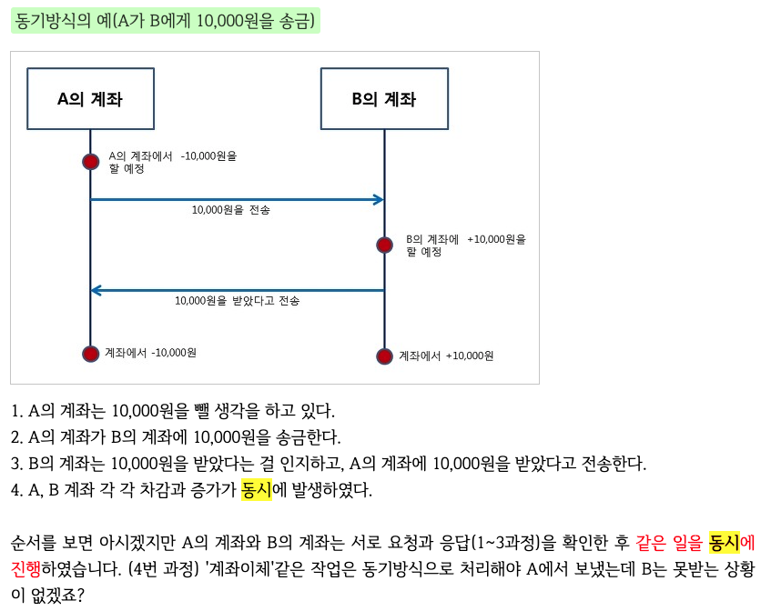
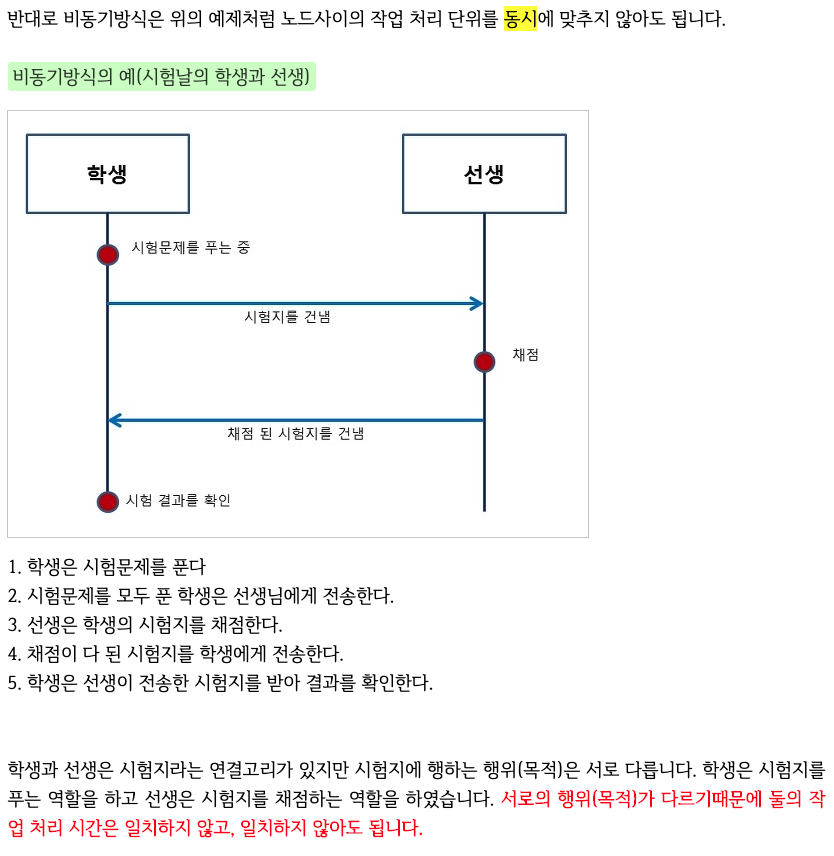
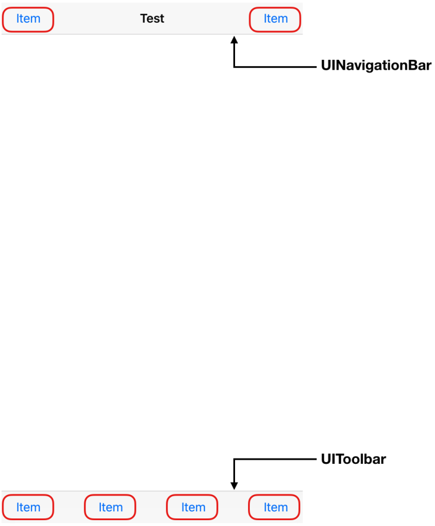

## 목차

- photos 프레임워크
  - 사진첩에서 사진 가져오기
  - 사진첩에서 사진 삭제하기
- 동시성 프로그래밍
  - operations queue
- 스크롤뷰
- 내비게이션 아이템
  - 내비게이션 아이템
  - 바 버튼 아이템
- 컬렉션 뷰
  - 컬렉션 뷰
  - 컬렉션 뷰 셀
  - 컬렉션 뷰에 데이터 동적으로 추가하기
  - 컬렉션 뷰 Flow Layout


## 찾아보기

- 포토스의 인스턴스에서 메타데이터란?


## Photos 프레임워크

> **PhotoKit, Photos 프레임워크 참고**
>
> https://zeddios.tistory.com/614
>
> https://zeddios.tistory.com/620


### 사진가져오기 프로세스 

- 권한설정 

  - info.plist 세팅 : `Privacy - Photos Library Usage Descriptions`

  - 접근요청 반응에 따른 케이스 나누기 : **PHPhotoLibrary.authorizationStatus()**

     ```swift
    // viewDidLoad
    let photoAuthorizationStatus = PHPhotoLibrary.authorizationStatus()
            switch photoAuthorizationStatus {
            case .authorized:
                print("authorized")
                requestCollection()
            case .denied:
                print("denied")
            case .notDetermined:
                PHPhotoLibrary.requestAuthorization { (status) in
                    switch status {
                    case .authorized:
                        print("user permiited")
                        self.requestCollection()
                    case .denied:
                        print("user denied")
                    default:
                        break
                    }
                }
            case .restricted:
                print("restricted")
            default:
                break
            }
    ```

- 앨범 메타데이터 갖고오기(패치) (패치옵션 줄수있다.) : **PHAssetCollection.fetchAssetCollections()**

  ```swift
  let cameraRoll: PHFetchResult<PHAssetCollection> =
              PHAssetCollection.fetchAssetCollections(
                  with: .smartAlbum,
                  subtype: .smartAlbumUserLibrary,
                  options: nil)
          
          guard let cameraRollCollection = cameraRoll.firstObject else{
              return
          }
  ```

- 앨범에서 사진(에셋) 메타데이터 페치하기 (페치옵션을 줄수있다.) : **PHAsset.fetchAssets()**

  ```swift
  let fetchOptions = PHFetchOptions()
          fetchOptions.sortDescriptors = [NSSortDescriptor(key: "creationDate", ascending: false)]
          self.fetchResult = PHAsset.fetchAssets(in: cameraRollCollection, options: fetchOptions)
  // 위의 변수 fetchResult를 fetchResult: PHFetchResult<PHAsset>!로 미리 선언했지만
  // PHAsset.fetchAssets()의 결과가 타입이 PHFetchResult<PHAsset> 이거이다.
  ```

- 이미지 불러오기 : **PHCachingImageManager.requestImage()**

```swift
let imageManager: PHCachingImageManager = PHCachingImageManager()

func tableView(_ tableView: UITableView, cellForRowAt indexPath: IndexPath) -> UITableViewCell {
        let cell: UITableViewCell = tableView.dequeueReusableCell(
            withIdentifier: self.cellIdentifier,
            for: indexPath)
        
        let asset: PHAsset = fetchResult.object(at: indexPath.row)
        
//        let options: PHImageRequestOptions = PHImageRequestOptions()

//        options.resizeMode = PHImageRequestOptionsResizeMode.exact
        
        imageManager.requestImage(
            for: asset,
            targetSize: CGSize(width: 30, height: 30),
            contentMode: .aspectFill,
            options: nil,
            resultHandler: { image, _ in cell.imageView?.image = image})
        
        return cell
    }
```


### iOS Photos 구조

- 에셋 - PHAsset
- 에셋 컬렉션 - (컬렉션) PHAssetCollection
- 컬렉션 리스트 - PHCollectionList


### Photos 프레임 워크 특징 개념 - (클래스 정리하기)

- 객체 가져오기 및 변경요청.
  - `Photos` 프레임워크 모델 클래스 (`PHAsset`, `PHAssetCollection`, `PHCollectionList`)의 인스턴스는 사진 애플리케이션에서 에셋(이미지, 비디오, 라이브 포토), 에셋 컬렉션(앨범, 특별한 순간) 및 사용자가 작업하는 항목을 나타냅니다. 그리고 컬렉션 리스트(앨범 폴더, 특별한 순간)입니다. **이 객체는 읽기 전용이며 변경할 수 없습니다**. 그리고 **메타 데이터만 포함**합니다.
  - 해당 **객체를 사용하여 작업해야 하는 데이터를 가져와서 에셋 및 컬렉션 작업**을 할 수 있습니다. **변경 요청을 하려면 변경 요청 객체를 만들고 이를 공유 `PHPhotoLibrary` 객체에 명시적으로 알려줍니다**. 이 아키텍처를 사용하면 다수의 스레드 혹은 다수의 애플리케이션과 동일한 에셋을 사용하여 쉽고 안전하며 효율적으로 작업할 수 있습니다.
- 변경을 관찰.
  - 가져온 **에셋 및 컬렉션에 대한 변경 핸들러를 등록하려면 공유 `PHPhotoLibrary` 객체를 사용하세요.** 다른 애플리케이션이나 기기가 에셋의 콘텐츠나 메타 데이터 또는 컬렉션의 리스트를 변경할 때마다 애플리케이션에 알려줍니다. **`PHChange` 객체는 변경 전후의 객체 상태에 대한 정보를 제공하여 쉽게 컬렉션뷰 또는 유사한 인터페이스를 업데이트할 수 있도록 합니다.**
- Photos 애플리케이션의 기능들을 지원.
  - `PHCollectionList` 클래스를 사용해 사진 애플리케이션의 특별한 순간 계층에 해당하는 에셋을 찾습니다. **버스트, 파노라마 사진 및 고프레임 비디오를 식별하려면 `PHAsset` 클래스를 사용하세요.** iCloud 사진 라이브러리가 활성화되면 `Photos` 프레임워크의 에셋과 컬렉션에는 동일한 iCloud 계정의 사용할 수 있는 내용이 반영됩니다.
- 에셋과 미리보기 로딩 및 캐싱.
  - `PHImageManager` 클래스를 사용해 지정된 크기로 에셋의 이미지를 요청하거나 비디오 에셋에 사용할 `AVFoundation` 객체를 요청합니다.
- 에셋 콘텐츠 편집.
  - `PHAsset` 및 `PHAssetChangeRequest` 클래스는 편집을 위해 사진 또는 비디오를 요청하여 사진 라이브러리에 편집한 내용을 반영하는 메서드를 정의합니다.

**Photos 라이브러리 상호작용**

`PHPhotoLibrary` 객체를 사용하여 사진 콘텐츠에 접근하고, 에셋 및 컬렉션을 변경할 수 있도록 애플리케이션의 사용자 권한을 얻습니다. 권한을 얻으면 사진 라이브러리가 변경될 때 변경사항을 전달받을 수도 있습니다.

- PHPhotoLibrary : 사용자의 사진 라이브러리에 대한 접근 및 변경을 관리하는 공유 객체입니다.


### 에셋 검색과 조사

이 모델 클래스는 사진 라이브러리의 콘텐츠(에셋, 컬렉션)을 나타냅니다. 읽기 전용이며 변경 불가능하며 메타 데이터만 포함합니다. 에셋과 컬렉션을 사용하려면 이 클래스를 사용하여 지정한 쿼리와 일치하는 객체를 가져옵니다.

- PHAsset

  > 사진 라이브러리의 이미지, 비디오, 라이브 포토를 나타냅니다.

- PHAssetCollection

  > 특별한 순간, 사용자정의 앨범 또는 스마트 앨범과 같은 사진, 에셋 그룹을 나타냅니다.

- PHCollectionList

  > 특별한 순간, 사용자정의 앨범, 특별한 순간들 연도와 같은 에셋 컬렉션이 포함된 그룹을 나타냅니다.

- PHCollection

  > 에셋 컬렉션 및 컬렉션 리스트의 추상 수퍼 클래스입니다.

- PHObject

  > 모델 객체(에셋 및 컬렉션)의 추상 수퍼 클래스입니다.

- PHFetchResult

  > 가져오기 메서드에서 반환된 에셋 또는 컬렉션의 정렬된 목록입니다.

- PHFetchOptions

  > 에셋 또는 컬렉션 객체를 가져올 때 `Photos`에서 반환하는 결과에 필터링, 정렬 등 영향을 주는 옵션입니다.


### 에셋 콘텐츠 로딩

이 클래스를 사용하여 이미지, 비디오, 라이브 포토 콘텐츠를 요청할 수 있습니다.

- PHImageManager - 하나만 갖고오기(?)

  > 미리보기 썸네일 및 에셋과 전체 크기의 이미지 또는 비디오 데이터를 검색하거나 생성하는 방법을 제공합니다.

- PHCachingImageManager - 배치(리스트,컬렉션)에서 여러개 갖고올때 쓰기(?)

  > 많은 에셋을 일괄적으로 미리 로딩하기 위해 최적화된 에셋과 관련된 섬네일 및 전체 크기의 이미지 또는 비디오 데이터를 검색하거나 생성하는 방법을 제공합니다.
  >
  > - PHImageManager의 하위클래스

- PHImageRequestOptions

  > 이미지 매니저로부터 요청한 에셋 이미지의 영향을 주는 옵션들입니다.

- PHVideoRequestOptions

  > 이미지 매니저로부터 요청한 비디오 에셋 데이터의 영향을 주는 옵션들입니다.

- PHLivePhotoRequestOptions

  > 이미지 매니저로부터 요청한 라이브 포토 에셋의 영향을 주는 옵션들입니다.

- PHLivePhoto

  > 캡처 직전과 직후 순간의 움직임 및 소리가 포함된 라이브 사진을 표현합니다.


### 변경 요청

에셋이나 컬렉션을 변경하려면 변경 요청 객체를 만들고 명시적으로 사진 라이브러리에 반영합니다. 이 방법을 사용하면 여러 스레드 또는 여러 애플리케이션 및 애플리케이션 확장에서 같은 에셋을 가지며 쉽고, 안전하며 효율적으로 작업할 수 있습니다.

- PHAssetChangeRequest

  > 사진 라이브러리 변경 블록(클로저)에서 사용하기 위해 에셋의 생성, 삭제, 메타 데이터 수정할 변경 요청 객체입니다.

- PHAssetCollectionChangeRequest

  > 사진 라이브러리 변경 블록(클로저)에서 사용하기 위해 에셋 컬렉션을 생성, 삭제, 수정할 변경 요청 객체입니다.

- PHCollectionListChangeRequest

  > 사진 라이브러리 변경 블록(클로저)에서 사용하기 위해 컬렉션 리스트 생성, 삭제, 수정할 변경 요청 객체입니다.


### 에셋 콘텐츠 수정

애플리케이션 또는 확장 프로그램에서 이 클래스들을 사용하여 사진 라이브러리의 편집 및 반영을 위해 에셋 데이터에 접근합니다. 사진들은 각 수정 사항을 버전별로 에셋 및 보정 데이터를 관리 하므로 애플리케이션 또는 확장 프로그램을 사용하여 다른 기기에서도 이전에 수정한 내용을 되돌리거나 계속 사용할 수 있습니다. 사진 편집 확장기능을 만들려면 이 클래스들과 `PhotosUI` 프레임워크와 같이 사용하세요.

- PHContentEditingInput

  > 편집할 에셋의 이미지, 비디오, 라이브 포토의 콘텐츠에 대한 정보와 접근 권한을 제공하는 컨테이너입니다.

- PHContentEditingOutput

  > 에셋의 사진, 비디오, 라이브 포토의 콘텐츠를 편집한 결과를 제공하는 컨테이너입니다.

- PHAdjustmentData

  > 편집 효과를 재구성하거나 되돌릴 수 있는 에셋의 사진, 비디오, 라이브 포토 콘텐츠의 수정사항에 대한 설명입니다.


### Adjustment Data

- PHContentEditingInputRequestOptions

  > 에셋의 콘텐츠를 수정하도록 요청할 때 이미지, 비디오 데이터전송에 영향을 주는 옵션입니다.

- PHLivePhotoEditingContext

  > 라이브 포토의 사진, 비디오, 오디오 콘텐츠를 수정하기 위한 편집 세션입니다.

- PHLivePhotoFrame

  > 편집 컨텍스트에서 라이브 포토의 단일 프레임에 대한 이미지 콘텐츠를 제공하는 컨테이너입니다.


### 변경사항 관찰

`Photos` 프레임워크는 다른 애플리케이션이나 다른 기기에서 사진의 정보를 변경할 때마다 애플리케이션에 알려줍니다. 이러한 객체는 변경 전후의 객체 상태에 대한 정보를 제공하므로 사용자 인터페이스를 쉽게 업데이트하여 일치시킬 수 있습니다.

- PHPhotoLibraryChangeObserver

  > 사진 라이브러리에서 발생한 변경사항을 알리기 위해 구현할 수 있는 **프로토콜**입니다.

- PHChange

  > 사진 라이브러리에서 발생한 변경사항에 대한 설명입니다.

- PHObjectChangeDetails

  > 에셋 또는 컬렉션 객체에서 발생한 변경사항에 대한 설명입니다.

- PHFetchResultChangeDetails

  > 가져오기 결과에 나열된 에셋 또는 컬렉션 객체에서 발생한 변경사항에 대한 설명입니다.


### 에셋 리소스로 작업하기

에셋 리소스 객체는 각 에셋의 데이터 저장소를 나타냅니다. 이러한 객체를 사용해 에셋을 직접 백업하고 복원할 수 있습니다.

- PHAssetResource

  > 사진 라이브러리의 사진, 비디오, 라이브 포토 에셋과 관련된 기본 데이터 리소스입니다.

- PHAssetCreationRequest

  > 사진 라이브러리 변경 블록(클로저)에서 사용하기 위해 기본 데이터 리소스에서 새로운 에셋을 생성하라는 요청.

- PHAssetResourceCreationOptions

  > 기본 리소스에서 새로운 에셋을 만드는데 영향을 주는 옵션들입니다.

- PHAssetResourceManager

  > 애샛과 관련된 리소스에 대한 기본 데이터 저장소에 접근하는 방법을 제공합니다.

- PHAssetResourceRequestOptions

  > 에셋 리소스 관리자가 요청한 기본 에셋 데이터 전달에 영향을 주는 옵션입니다.


## 동시성 프로그래밍과 비동기 프로그래밍

- 프로세서

> 프로그램을 수행하는 하드웨어 유닛 (ex. CPU)
>
> 멀티프로세서는 여러개의 프로세서를 갖는다는 뜻

- 코어

> 프로세서에서 주요 연산회로 
>
> 싱글코어는 하나의 연산회로가 내장되어있는 것이고
>
> 듀얼코어는 두개의 연산회로가 내장되어있다.
>
> 여러개의 코어를 가진 프로세서 멀티코어 프로세서라고한다.

- 프로그램 vs 프로세스

> **프로그램**
>
> - 보조기억장치에 저장된 실행코드, 생명이 없는 상태
>
> **프로세스**
>
> - 프로그램이 메모리에 올라가 실행되고 있는 상태, 작업단위

- 멀티 태스킹

> 동시에 여러 개의 프로세스를 시분할로 운용하는 방식
>
> 운영체제에서 프로세스 관리를 한다.

- 스레드

> 하나의 프로세스 내에서 실행되는 작업 흐름 단위
>
> 보통 하나의 프로세스는 하나의 스레드를 가지고 있다.

- 멀티스레딩

> 프로세스 환경에 따라 둘 이상의 스리드를 동시에 실행이 가능하다.
>
> 둘 이상의 스레드를 동시에 실행하는 방식을 멀티 스레딩 이라고 한다.

---

- 동기 프로그래밍 (쉽게 말해 둘이 서로 호흡을 맞춰(동기화)되서 작업해야함.)

  > 요청한 결과가 한자리에서 동시에 일어남
  >
  > a작업과 b작업 처리를 동시에 맞추는것이다.
  >
  > 아래 예제에서 서로 요청과 응답을 확인후에 처리

  

- 비동기 프로그래밍 (동시성, 병렬성으로 분류된다.) (쉽게 말해 둘이 각개전투)

  > 요청한 결과가 한자리에서 동시에 일어나지 않는다.
  >
  > 프로세스 처리를 병렬로 처리하는 방식
  >
  > 아래 예제에서 서로의 요청과 응답을 확인할 필요없이 각개전투

  

  - 동시성(동기) 프로그래밍 

    > **논리적**으로 시분할로 동시에 여러 스레드를 돌리는 방식 (여러 프로그래밍을 동시에 돌리는것처럼 보이는 방식)
    >
    > 싱글코어에서 멀티스레딩을 하기위해 태어난 방법 (싱글코어, 멀티코어 모두 가능한 방식)
    >
    > 예) 은행창구1개, 고객 줄 2개, 벌가아 가며 고객맞이

  - 병렬성 프로그래밍 (데이터 병렬성, 작업 병렬성 으로 분류됨)

    > **물리적**으로 동시에 여러 스레드를 돌리는 방식 (동시에 돌리는것처럼 보이는게 아닌 따로따로 동시에 돌아간다.)
    >
    > 멀티스레드를 동작시키는 방식 (멀티코어에서만 가능한 방식)
    >
    > 예) 은행창구 2개, 각각 고객 줄 1개(전체로보면 2줄), 각 창구가 한줄씩 담당

    - 데이터 병렬성

      > 하나의 데이터를 여러개로 나누고, 그 서브 데이터들을 병렬처리 하는 방식

    - 작업 병렬성

      > 서로 다른 작업을 병렬 처리하는 방식


### iOS에서 동시성 프로그래밍 지원하는 종류

- Grand Central Dispatch (GCD) : 멀티 코어와 멀티 프로세싱 환경에서 최적화된 프로그래밍을 할 수 있도록 애플이 개발한 기술입니다.
- **연산 대기열 (Operation Queue)** : 비동기적으로 실행되어야 하는 작업을 객체 지향적인 방법으로 사용합니다.
- Thread : 멀티스레드 프로그래밍을 위한 애플에서 제공하는 스레드 클래스입니다.


## Operation Queue

**비동기적으로 실행되어야 하는 작업을 객체 지향적인 방법으로 사용합니다.**

**연산(Operation)의 실행을 관리하고 대기열의 동작관리한다.**

- `Operation`은 태스크(작업)와 관련된 코드와 데이터를 나타내는 추상 클래스입니다.
- `Operation Queue`는 연산(Operation)의 실행을 관리합니다. 
- 대기열(Queue)에 추가한 동작은 직접 제거할 수 없습니다. (연산취소로 해야함.) 
- 연산(Operation)은 작업이 끝날 때까지 대기열에 남아 있습니다. 
- 연산(Operation)을 대기열에서 제거하는 방법은 연산(Operation)을 취소하는 방법뿐입니다. 
- 취소하는 방법은 연산 객체(Operation Object)의 `cancel()`메서드를 호출하거나 `Oeration Queue`의 `cancelAllOperations()` 메서드를 호출하여 대기열에 있는 모든 연산(Operation)을 취소하는 방법이 있습니다. 
- 그리고 실행 중인 연산(Operation)의 경우 연산 객체(Operation Object)의 취소 상태를 확인하고 실행 중인 연산(Operation)을 중지하고 완료 상태로 변경됩니다.

### 연산 객체(Operation Object)

- 연산 객체 (Operation Object)는 애플리케이션에서 수행하려는 연산(Operation)을 캡슐화하는 데 사용하는 `Foundation` 프레임 워크의 `Operation` 클래스 인스턴스입니다.


## OperationQueue의 주요 메서드/프로퍼티

### 중요! 오퍼레이션큐 보다 디스패치큐(GCD)를 사용하자.

- OperationQueue은 잘 사용안하고 DispatchQueue(GCD)를 사용한다고 한다.

```swift
DispatchQueue.main.sync {
    //code
}

DispatchQueue.global().async {
    //code
}
```

### 특정 Operation Queues 가져오기

- current : 현재 작업을 시작한 Operation Queue를 반환합니다.

  ```swift
  class var current: OperationQueue? { get }
  ```

- main : 메인 스레드와 연결된 Operation Queue를 반환합니다.

  ```swift
   class var main: OperationQueue { get }
  ```


### 대기열(Queue)에서 동작(Operation) 관리

- addOperation(_:) : 연산 객체(Operation Object)를 대기열(Queue)에 추가합니다.

  ```swift
   func addOperation(_ op: Operation)
  ```

- addOperations(_:waitUntilFinished:) : 연산 객체(Operation Object) 배열을 대기열(Queue)에 추가합니다.

  ```swift
  func addOperations(_ ops: [Operation], waitUntilFinished wait: Bool)
  ```

- addOperation(_:) : 전달한 클로저를 연산 객체(Operation Object)에 감싸서 대기열(Queue)에 추가합니다.

  ```swift
  func addOperation(_ block: @escaping () -> Void)
  ```

- cancelAllOperations() : 대기 중이거나 실행 중인 모든 연산(Operation)을 취소합니다.

  ```swift
  func cancelAllOperations()
  ```

- waitUntilAllOperationsAreFinished() : 대기 중인 모든 연산(Operation)과 실행 중인 연산(Operation)이 모두 완료될 때까지 현재 스레드로의 접근을 차단합니다.

  ```swift
   func waitUntilAllOperationsAreFinished()
  ```


### 연산(Operation) 실행 관리

- maxConcurrentOperationCount : 동시에 실행할 수 있는 연산(Operation)의 최대 수입니다.

  ```swift
   var maxConcurrentOperationCount: Int { get set }
  ```

- qualityOfService : 대기열 작업을 효율적으로 수행할 수 있도록 여러 우선순위 옵션을 제공합니다.

  ```swift
   var qualityOfService: QualityOfService { get set }
  ```


### 연산(Operation) 중단

- isSuspended : 대기열(Queue)의 연산(Operation) 여부를 나타내기 위한 부울 값입니다. `false`인 경우 대기열(Queue)에 있는 연산(Operation)을 실행하고, `true`인 경우 대기열(Queue)에 대기 중인 연산(Operation)을 실행하진 않지만 이미 실행 중인 연산(Operation)은 계속 실행됩니다.

  ```swift
  var isSuspended: Bool { get set }
  ```

### 대기열(Queue)의 구성

- name : Operation Queue의 이름

  ```swift
   var name: String? { get set }
  ```


## iOS에서 Operation Queue 사용 예시

```swift
let imageURL = URL(string: 
        
let imageData = try! Data.init(contentsOf: imageURL)
let image: UIImage = UIImage(data: imageData)!

imageView.image = image
```

> 위의 코드에서 Data메서드는 동기 메서드이다. 즉, data가 불러와저서 작업이 끝나기 전까지는 그 어떤 다른 작업도 할수 없다.
>
> 실제로 앱에서 Data메서드가 실행되어 data가 불러와지는동안 앱이 프리징 상태(아무런 작업을 할수 없는상태)가 된다.
>
> 우리가 뷰컨에 작성하는 모든 코드는 메인쓰레드에서 동작하게된다.
>
> 위의 동기메서드에 의한 프리징 상태를 해결하기위해 Operation Queue를 사용하여 동기 메서드를 메인 쓰레드가 아닌 다른 쓰레드로 보내어 작업을 하게 한다.
>
> 아래와 같이 작성한다.

```swift
guard let imageURL = URL(string: "https://upload.wikimedia.org/wikipedia/commons/3/3d/LARGE_elevation.jpg") else { return }
        
        OperationQueue().addOperation {
            guard let imageData = try? Data.init(contentsOf: imageURL), let image = UIImage(data:imageData) else {return}
            
            OperationQueue.main.addOperation {
                self.imageView.image = image
            }
        }
```

> 이렇게 하면 data를 불러오는 쓰레드 작업은 다른 쓰레드에서 작업을 하게된다. 
>
> 한가지 주의할점은 data를 불러오는 작업만 다른쓰레드에서 해야하고 UI작업 즉, 이미지뷰에 이미지를 넣는 작어은 메인쓰레드에서 해줘야한다.
>
> 따라서 `self.imageView.image = image` 코드는 데이터를 불러오는 작업이 끝나고 `OperationQueue.main.addOperation `를 통해서 메인쓰레드로 불러와서 실행시켜주어야한다.
>
> 이때 `self.imageView.image = image`이 코드를 그냥 `OperationQueue().addOperation` 밖에 쓰면 되지 않겠냐? 생각했는데 밖에 쓰게되면 다른쓰레드에서 데이터를 불러와서 image변수에 데이터를 저장했는데 해당 변수를 메인쓰레드에서는 가지고 오지 못하기떄문에 다른쓰레드에서 작업된 image변수를 그대로 메인쓰레드로 갖고온다고 생각하자.
>
> 준선생님의 말에 따르면 "밖에 코드를 써버리면 글로벌 쓰레드여서 내부코드가 다 끝나기 전에 이미 다음 코드로 넘어가버려서 이미지를 쓰지 못한다" 하고 하였다.


## 스크롤뷰

- 스크롤뷰는 스크롤뷰 안에 포함된 뷰를 상,하,좌,우로 스크롤 할 수 있고 확대 및 축소할 수 있는 뷰입니다. 
- 그리고 스크롤뷰를 상속받아 활용되는 뷰로는 `UITableView`, `UICollectionView`, `UITextView`등 여러 `UIKit` 클래스가 있습니다.

### 프로퍼티/메서드

>  참고 : https://www.edwith.org/boostcourse-ios/lecture/16900/
>
>  스크롤뷰와 이미지뷰 제약조건 참고 : https://www.youtube.com/watch?v=qMrH5_Yj5hM


## 내비게이션 아이템 (NavigationItem)

- 내비게이션바의 콘텐츠를 표시하는 객체입니다. 
- 그리고 뷰 컨트롤러가 전환될 때마다 내비게이션바는 하나의 공동 객체지만, 내비게이션 아이템은 각각의 뷰 컨트롤러가 가지고 있는 프로퍼티입니다. 
- 즉, 내비게이션바가 내비게이션 컨트롤러와 연관이 있다면 내비게이션 아이템은 해당 뷰 컨트롤러와 연관이 있습니다. 
- 보통 내비게이션바에서 보여지는 중앙 타이틀, 좌측 바 버튼, 우측 바 버튼 등이 내비게이션 아이템의 프로퍼티입니다.


### NavigationItem 주요 프로퍼티

- title : 내비게이션바에 표시되는 내비게이션 아이템의 제목. 기본값은 nil 입니다.

  ```swift
   var title: String? { get set }
  ```

- backBarButtonItem : 내비게이션바에서 뒤로 버튼이 필요할 때 사용할 바 버튼 항목.

  ```swift
   var backBarButtonItem: UIBarButtonItem? { get set }
  ```

- hidesBackButton : 뒤로 버튼이 숨겨져 있는지를 결정하는 부울 값.

  ```swift
  var hidesBackButton: Bool { get set }
  ```

### NavigationItem 주요 메서드

- setHidesBackButton(_:animated:) : 뒤로 버튼이 숨겨져 있는지를 설정하고, 전환 애니메이션 효과 적용

  ```swift
  func setHidesBackButton(_ hidesBackButton: Bool, animated: Bool)
  ```


### 내비게이션 아이템 커스터마이징

- 내비게이션 아이템은 크게 좌, 우 바 버튼 아이템과 중앙 타이틀 영역이 있습니다. 
- 좌측 바 버튼, 우측 바 버튼 아이템의 경우 타입은 `UIBarButtonItem` 입니다. 
- 그리고 상황에 따라서 커스텀 뷰를 넣어서 구현할 수도 있습니다.

### 프로퍼티

- titleView : 중앙 타이틀 영역의 뷰

  ```swift
   var titleView: UIView? { get set }
  
  // Tip : 중앙 타이틀 영역에 뷰를 상속받은 (UILabel, UIView, UIImageView 등등) 클래스들을 표현할 수 있습니다.
  ```

- leftBarButtonItems : 좌측 아이템 영역의 `UIBarButtonItem`의 바 버튼 아이템 배열

  ```swift
   var leftBarButtonItems: [UIBarButtonItem]? { get set }
  ```

- leftBarButtonItem : 좌측 아이템 영역의 `UIBarButtonItem` 중에 가장 좌측 바 버튼 아이템

  ```swift
   var leftBarButtonItem: UIBarButtonItem? { get set }
  ```

- rightBarButtonItems : 우측 아이템 영역의 `UIBarButtonItem`의 바 버튼 아이템 배열

  ```swift
   var rightBarButtonItems: [UIBarButtonItem]? { get set }
  ```

- rightBarButtonItem : 우측 아이템 영역의 `UIBarButtonItem` 중에 가증 우측 바 버튼 아이템

  ```swift
  var rightBarButtonItem: UIBarButtonItem? { get set }
  ```

### 메서드

- setLeftBarButtonItems(_:animated:) : 좌측 아이템 영역에 `UIBarButtonItem` 타입의 객체들을 순차적으로 설정하고 애니메이션 효과를 적용

  ```swift
   func setLeftBarButtonItems(_ items: [UIBarButtonItem]?, animated: Bool)
  ```

- setLeftBarButton(_:animated:) : 좌측 아이템 영역에 `UIBarButtonItem` 타입의 객체를 설정하고 애니메이션 효과를 적용

  ```swift
   func setLeftBarButton(_ item: UIBarButtonItem?, animated: Bool)
  ```

- setRightBarButtonItems(_:animated:) : 우측 내비게이션 아이템 영역에 `UIBarButtonItem` 타입의 객채들을 순차적으로 설정하고 애니메이션 효과를 적용

  ```swift
   func setRightBarButtonItems(_ items: [UIBarButtonItem]?, animated: Bool)
  ```

- setRightBarButton(_:animated:) : 우측 아이템 영역에 `UIBarButtonItem` 타입의 객체를 설정하고 애니메이션 효과를 적용

  ```swift
   func setRightBarButton(_ item: UIBarButtonItem?, animated: Bool)
  ```


## 바 버튼 아이템이란?

- 바 버튼 아이템은 `UIToolbar` 또는 `UINavigationBar` (`backBarButtonItem`,`leftBarButtonItem`,`rightBarButtonItem`등)에 배치할 수 있는 특수한 버튼입니다. 

- 제목이나 이미지를 보여줄 수 있고 미리 `UIBarButtonItem.SystemItem` 열거형에 정의된 여러 스타일 중 하나의 스타일로 선택할 수도 있습니다.

  

> Tip : iOS 11에서는 UIBarButtonItem을 오토레이아웃 제약 없이 내비게이션 아이템으로 추가하면 바 버튼 아이템의 프레임이 예상치 못한 크기로 나올 수 있습니다. 이럴 땐 UIBarButtonItem 객체에 적절한 오토레이아웃 제약을 추가한 후 내비게이션 아이템으로 설정하면 설정한 제약에 따라 알맞은 크기로 볼 수 있습니다.

**주요 프로퍼티**

- title : 아이템에 표시되는 제목.

```swift
 var title: String? { get set }
```

- image : 아이템에 표시되는 이미지.

```swift
var image: UIImage? { get set }
```

- style : 아이템의 스타일.

  ```swift
  var style: UIBarButtonItem.Style { get set }
  ```

- width : 아이템의 너비 값.

  ```swift
   var width: CGFloat { get set }
  ```

- tintColor : 아이템에 적용할 색상

  ```swift
   var tintColor: UIColor? { get set }
  ```

**주요 상수**

- UIBarButtonItem.Style : 아이템 스타일 정의.
- UIBarButtonItem.SystemItem : 바 버튼 아이템에 대한 시스템 제공 스타일.

