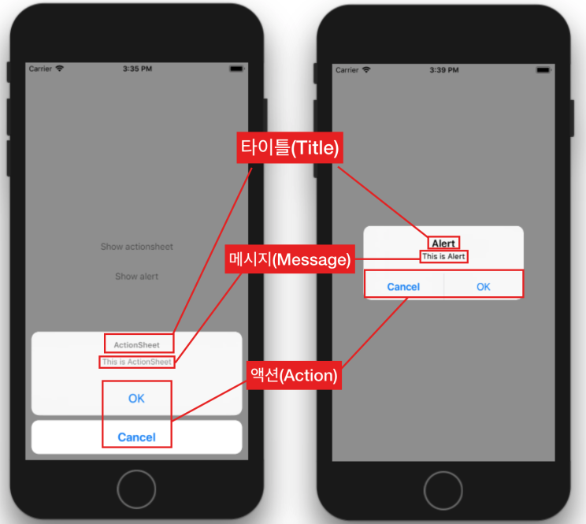
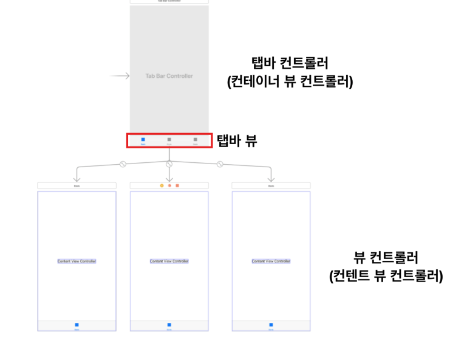
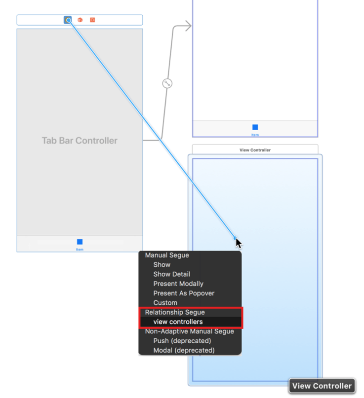
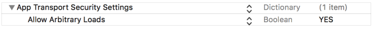
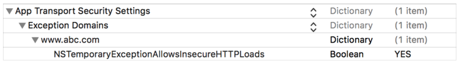
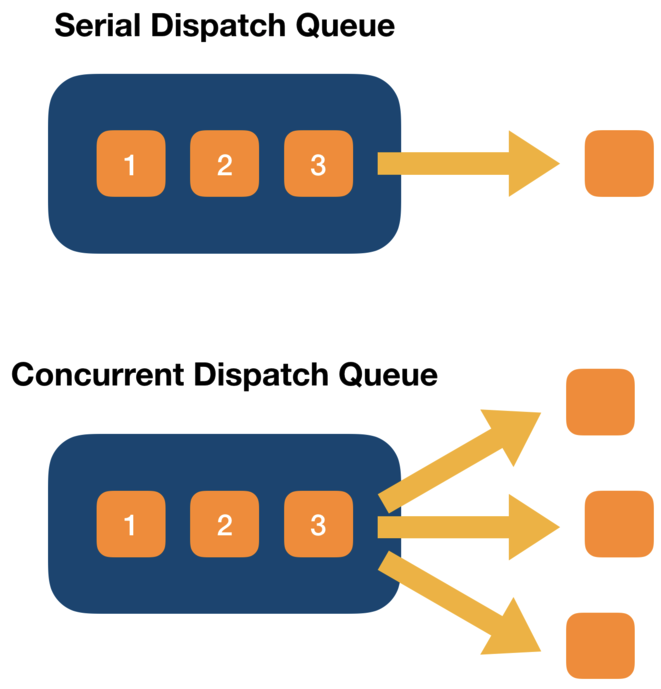
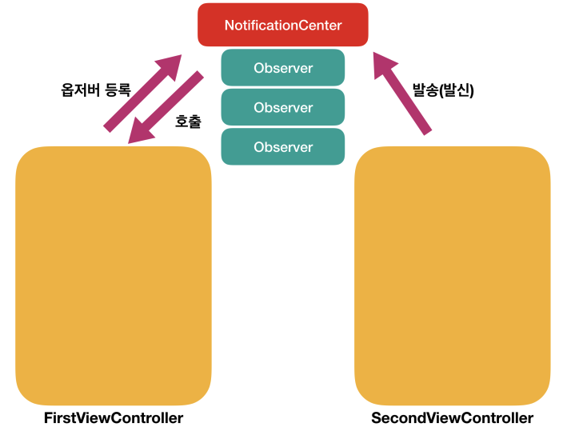

## 목차

- [얼럿과 액션시트](#얼럿과-액션시트)
- [탭바](#탭바)
- [네트워킹(API서버통신)](#네트워킹)
- [GCD](#GCD)
- [노티피케이션](#노티피케이션)


## 주차 핵심 목표

- API 서버 통신
  - URLSession 활용
  - 비동기 프로그래밍


## 얼럿과 액션시트




### UIAlertController 클래스

- UIAlertController 클래스는 사용자에게 표시할 얼럿 또는 액션시트의 구성에 관한 메서드와 프로퍼티를 포함하고 있습니다. 
- UIAlertController 클래스를 통해 얼럿 또는 액션시트를 구성한 후 UIViewController의 `present(_:animated:completion:)`메서드를 사용하여 사용자에게 얼럿 또는 액션시트를 모달로 보여줍니다.

**UIAlertController의 주요 메서드**

- `init(title:message:preferredStyle:) `: 얼럿 뷰 컨트롤러의 객체를 초기화합니다.
- `func addAction(UIAlertAction) `: 얼럿이나 액션시트에 액션을 추가합니다.
- `func addTextField(configurationHandler: ((UITextField) -> Void)? = nil) `: 얼럿을 통해 텍스트를 입력받고자 하는 경우 텍스트 필드를 추가합니다.

**UIAlertController의 주요 프로퍼티**

- `var title: String?`: 얼럿의 제목입니다.
- `var message: String?`: 얼럿에 대해 좀 더 자세히 설명하는 텍스트입니다.
- `var actions: [UIAlertAction]`: 사용자가 얼럿 또는 액션시트에 응답하여 실행할 수 있는 액션입니다.
- `var preferredStyle: UIAlertController.Style`: 얼럿 컨트롤러의 스타일입니다. 얼럿(alert)과 액션시트(actionSheet)가 있습니다.

### UIAlertAction 클래스

- 사용자가 얼럿 또는 액션시트에서 사용할 버튼과 버튼을 탭 했을 때 수행할 **액션(작업)**을 구성할 수 있습니다. 
- UIAlertAction 클래스를 사용하여 버튼을 구성한 후 UIAlertController 객체에 추가하여 사용합니다.

**UIAlertAction의 주요 프로퍼티**

- `var title: String?`: 액션 버튼의 타이틀입니다.
- `var isEnabled: Bool`: 액션이 현재 사용 가능한지를 나타냅니다.
- `var style: UIAlertAction.Style`: 액션 버튼의 적용될 스타일입니다.

**UIAlertAction.Style**

- default: 액션 버튼의 기본 스타일입니다.
- cancel: 액션 작업을 취소하거나 상태 유지를 위해 변경사항이 없을 경우 적용하는 스타일입니다.
- destructive: 취하게 될 액션이 데이터를 변경되거나 삭제하여 돌이킬 수 없는 상황이 될 수 있음을 나타낼 때 사용하는 스타일입니다.


### 코드

```swift
func showAlertController(style: UIAlertController.Style) {
        let alertController = UIAlertController(
            title: "title",
            message: "message",
            preferredStyle: style)
        
        let handler: (UIAlertAction) -> Void
        handler = { (action: UIAlertAction) in
            print("action pressed \(action.title ?? "")")
        }
        
        let okAction = UIAlertAction(
            title: "OK",
            style: UIAlertAction.Style.default,
            handler: handler)
        
        let cancleAction = UIAlertAction(
            title: "Cancel",
            style: UIAlertAction.Style.cancel,
            handler: handler)
        
        let someAction = UIAlertAction(
            title: "Some",
            style: UIAlertAction.Style.destructive,
            handler: handler)
        
        let anotherAction = UIAlertAction(
            title: "Another",
            style: UIAlertAction.Style.default,
            handler: handler)
        
        alertController.addAction(okAction)
        alertController.addAction(cancleAction)
        alertController.addAction(someAction)
        alertController.addAction(anotherAction)
        
        // 텍스트 필드는 action sheet에서는 사용이 불가능하다.
        // 오직 alert에서만 텍스트 필드를 사용할수 있다.
        alertController.addTextField { field in
            field.placeholder = "플레이스홀더"
            field.textColor = UIColor.red
        }
        
        self.present(alertController,
                     animated: true,
                     completion: {
                        print("Alert controller shown")
        })
    }
```

```swift
// alert에서 텍스트필드에 입력받은 값 사용하기
self.myLabel.text = alert.textFields?[0].text

// alert에 텍스트 필드를 여러개 추가할수 있다.
// 예를들어 alert에 텍스트 필드를 3개 추가했다면
// 첫번째는[0], 두번째는 [1], 세번째는 [2]..... 이런식으로 접근할 수 있다.
```


## 탭바

### 탭바란?

- 사용자가 탭바의 항목(Item)을 선택하면 해당 항목에 연결된 뷰 컨트롤러의 콘텐츠가 화면에 보이게 됩니다. 
- 주로 여러 메뉴를 구성할 때 많이 사용합니다. 
- 카테고리 사이의 전환을 위해 사용하거나 다양한 관점으로 같은 정보를 제공하는 데 사용합니다.
- 탭바는 화면에 보여지기 위한 뷰 요소이므로 제어를 하기 위해서는 컨트롤러가 필요합니다. 
- 프로그래머가 직접 탭바를 제어할 컨트롤러 클래스를 작성하여 사용할 수도 있지만, 
- 대부분의 경우 프레임워크에서 제공하는 탭바 컨트롤러(UITabBarController)를 사용하여 제어합니다. 
- 이렇게 탭바와 탭바 컨트롤러를 사용하여 인터페이스를 구성한 것을 탭바 인터페이스라고 부릅니다.


### 탭바의 구조

- 탭바 인터페이스는 탭바 컨트롤러가 생성한 **탭바 뷰(View)**와 탭바 컨트롤러가 관리하는 **콘텐츠 뷰 컨트롤러**로 구성되어 있습니다. 
- 탭바 컨트롤러는 연결된 콘텐츠 **뷰 컨트롤러의 컨테이너 뷰 컨트롤러**입니다.
- 각 콘텐츠 뷰 컨트롤러는 탭바에서 하나의 탭에 해당합니다. 
- 사용자가 탭바에서 탭을 선택할 때, 탭바 컨트롤러 객체가 해당 콘텐츠 뷰 컨트롤러의 뷰를 화면에 보여줍니다.




#### 탭바 컨트롤러와 뷰컨트롤러 연결하기




### 탭바 아이템이란?

- 탭바 뷰에서 각 탭은 이름과 이미지를 표시할 수 있고 뷰 컨트롤러는 이러한 용도로 `tabBar`프로퍼티를 관리합니다. 
- 탭바 컨트롤러가 콘텐츠 뷰 컨트롤러를 포함하면 해당 뷰 컨트롤러의 탭바 아이템이 탭바 컨트롤러의 탭바에 추가됩니다.
- 탭바 컨트롤러의 탭바 아이템이 6개 이상인 경우, 5번째 탭에 'More'이라는 아이템이 표시되고 사용자가 More 버튼을 누르면 나머지 탭 항목을 선택할 수 있는 인터페이스가 표시됩니다.


### 탭바 델리게이트 UITabBarControllerDelegate

- 사용자가 탭바 인터페이스와 상호작용할 때, 탭바 컨트롤러 객체는 이 **상호작용에 관한 알림(notification)을 델리게이트 인스턴스로 보냅니다.** 
- 사용자가 탭을 선택하지 못하게 하거나, 탭을 선택한 후 추가 작업을 수행하거나, 탭 관련 사항을 모니터링하고 사용자화 하기 위해서 델리게이트를 활용해보세요.


### UITabBarController 클래스

UITabBarController 클래스에는 탭바를 구성하고 각 탭에 해당하는 뷰 컨트롤러들을 관리하기 위한 메서드와 프로퍼티가 정의되어 있습니다.

- 탭바 컨트롤러의 탭을 구성하기 위해서는 뷰 컨트롤러를 탭바 컨트롤러의 `viewControllers` 프로퍼티에 할당합니다.
- 탭바 아이템은 해당 탭에 연결된 뷰 컨트롤러를 통해 구성합니다. 
- UITabBarItem 클래스의 인스턴스를 뷰 컨트롤러의 `tabBarItem` 프로퍼티에 할당합니다. 
- 만약에 UITabBarItem 클래스의 인스턴스를 뷰 컨트롤러에 따로 할당하지 않을 경우, 탭바에는 이미지 없이 뷰 컨트롤러의 `title` 프로퍼티에 해당하는 텍스트로만 탭바의 항목으로 표시합니다.


### 탭바 컨트롤러의 뷰

- UITabBarController 클래스는 UIViewController 클래스를 상속받기 때문에 탭바컨트롤러는 `view`프로퍼티를 통해 접근할 수 있는 자신만의 자체 뷰(view)를 가지고 있습니다. 
- 이 뷰는 탭바와 선택된 뷰 컨트롤러의 콘텐츠를 나타내는 뷰로 구성되어 있습니다.


### UITabBarControler 클래스의 주요 프로퍼티 및 메서드

- `var tabBar: UITabBar`: 탭바 컨트롤러와 연결된 탭바 뷰 입니다.
- `var viewControllers: [UIViewController]?`: 탭바 컨트롤러가 관리하는 뷰 컨트롤러의 배열입니다. 즉, 각각의 탭바 항목에 해당하는 뷰 컨트롤러의 목록입니다.
- `func setViewControllers([UIViewController]?, animated: Bool)`: 탭바 컨트롤러가 관리할 뷰 컨트롤러들을 설정합니다.
- `var selectedViewController: UIViewController?`: 현재 선택된 탭 항목과 연결된 뷰 컨트롤러입니다.
- `var selectedIndex: Int`: 현재 선택된 탭 항목의 인덱스(index)입니다.


## 네트워킹

- [URLSession](#URLSession)
- [URLSessionDataTask](#Task)
- [App Transport Security](#App-Transport-Security(ATS))
- [서버에 데이터 요청하기](#서버에-데이터-요청하기)


### URLSession

> 참고자료
>
> https://eunjin3786.tistory.com/120
>
> https://m.blog.naver.com/PostView.nhn?blogId=horajjan&logNo=220999141530&proxyReferer=https:%2F%2Fwww.google.com%2F
>
> 세션이란? 아래 사이트 완전 이해 쏙 되게 정리되어있다.
>
> https://juyoung-1008.tistory.com/2

- `URLSession`은 HTTP/HTTPS를 통해 콘텐츠(데이터)를 주고받는 API를 제공하는 클래스입니다. 
- 이 API는 인증 지원을 위한 많은 델리게이트 메서드를 제공하며, 애플리케이션이 실행 중이지 않거나 일시 중단된 동안 백그라운드 작업을 통해 콘텐츠를 다운로드하는 것을 수행하기도 합니다. 
- `URLSession` API를 사용하기 위해 애플리케이션은 세션을 생성합니다. 
- 해당 세션은 관련된 데이터 전송작업 그룹을 조정합니다. 
- 예를 들면 웹 브라우저를 사용 중인 경우 탭 당 하나의 세션을 만들 수 있습니다. 
- 각 세션 내에서 애플리케이션은 작업을 추가하고, 각 작업은 특정 URL에 대한 요청을 나타냅니다.


**Request**

서버로 요청을 보낼 때 어떤 (HTTP)메서드를 사용할 것인지, 캐싱 정책은 어떻게 할 것인지 등의 설정을 할 수 있습니다.

**Response**

URL 요청의 응답을 나타내는 객체입니다.


### 세션의 유형

`URLSession` API는 세가지 유형의 세션을 제공합니다. 이 타입은 `URLSession` 객체가 소유한 `configuration` 프로퍼티 객체에 의해 결정됩니다.

1. 기본 세션 (Default Session) : 기본 세션은 URL 다운로드를 위한 다른 파운데이션 메서드와 유사하게 동작합니다. 디스크에 저장하는 방식입니다.
2. 임시 세션 (Ephemeral Session) : 기본 세션과 유사하지만, 디스크에 어떤 데이터도 저장하지 않고, 메모리에 올려 세션과 연결합니다. 따라서 애플리케이션이 세션을 만료시키면 세션과 관련한 데이터가 사라집니다.
3. 백그라운드 세션 (Background Session) : 백그라운드 세션은 별도의 프로세스가 모든 데이터 전송을 처리한다는 점을 제외하고는 기본 세션과 유사합니다.


### 세션 만들기

- init(configuration:) : 지정된 세션 구성으로 세션을 만듭니다.

  ```swift
   init(configuration: URLSessionConfiguration)
  ```

- shared : 싱글턴 세션 객체를 반환합니다.

  ```swift
   class var shared: URLSession { get }
  ```

### 세션 구성

- configuration : 이 세션에 대한 구성 객체입니다.

  ```swift
  @NSCopying var configuration: URLSessionConfiguration { get }
  ```

- delegate : 이 세션의 델리게이트 입니다.

  ```swift
   var delegate: URLSessionDelegate? { get }
  ```


### Task

- `URLSessionTask`는 세션 작업 하나를 나타내는 추상 클래스입니다. 
- 하나의 세션 내에서 `URLSession` 클래스는 세 가지 작업 유형, 즉 데이터 작업(Data Task), 업로드 작업(Upload Task), 다운로드 작업(Download Task)을 지원합니다.

1. URLSessionDataTask
   - HTTP의 각종 메서드를 이용해 서버로부터 응답 데이터를 받아서 `Data` 객체를 가져오는 작업을 수행합니다.
2. URLsessionUploadTask
   - 애플리케이션에서 웹 서버로 `Data` 객체 또는 파일 데이터를 업로드하는 작업을 수행합니다. 주로 HTTP의 `POST` 혹은 `PUT` 메서드를 이용합니다.
3. URLSessionDownloadTask
   - 서버로부터 데이터를 다운로드 받아서 파일의 형태로 저장하는 작업을 수행합니다. 애플리케이션의 상태가 대기 중이거나 실행 중이 아니라면 백그라운드 상태에서도 다운로드가 가능합니다.

> 데이터 작업은 서버로부터 어떤 응답이라도 `Data` 객체의 형태로 전달받을 때 사용하며, 업로드 작업 및 다운로드 작업은 단순한 바이너리 파일의 전달에 목적을 둔다고 볼 수 있습니다.
> JSON, XML, HTML 데이터 등 단순한 데이터의 전송에는 주로 데이터 작업을 사용하며, 용량이 큰 파일의 경우 애플리케이션이 백그라운드 상태인 경우에도 전달할 수 있도록 업로드(다운로드) 작업을 주로 사용합니다.


**세션에 Data Task 추가하기**

- dataTask(with:) : URL에 데이터를 요청하는 데이터 작업 객체를 만듭니다.

  ```swift
  func dataTask(with url: URL) -> URLSessionDataTask
  ```

- dataTask(with:) : URLRequest 객체를 기반으로 URL에 데이터를 요청하는 데이터 작업 객체를 만듭니다.

  ```swift
  func dataTask(with request: URLRequest) -> URLSessionDataTask
  ```

- dataTask(with:completionHandler:) : URL에 데이터를 요청하고 요청에 대한 응답을 처리할 완료 핸들러(Completion Handler)를 갖는 데이터 작업 객체를 만듭니다.

  ```swift
  func dataTask(with url: URL, completionHandler: @escaping (Data?, URLResponse?, Error?) -> Void) -> URLSessionDataTask
  ```

- dataTask(with:completionHandler:) : URLRequest 객체를 기반으로 URL에 데이터를 요청하고 요청에 대한 응답을 처리할 완료 핸들러(Completion Handler)를 갖는 데이터 작업 객체를 만듭니다.

  ```swift
  func dataTask(with request: URLRequest, completionHandler: @escaping (Data?, URLResponse?, Error?) -> Void) -> URLSessionDataTask
  ```


**세션에 Download Task 추가하기**

- downloadTask(with:) : URL에 요청한 데이터를 다운로드 받아서 파일에 저장하는 다운로드 작업을 만듭니다.

  ```swift
   func downloadTask(with url: URL) -> URLSessionDownloadTask
  ```

- downloadTask(with:completionHandler:) : URL에 요청한 데이터를 다운로드 받아서 파일에 저장하고 저장 완료 후 완료 핸들러를 호출하는 다운로드 작업을 만듭니다.

  ```swift
  func downloadTask(with url: URL, completionHandler: @escaping (URL?, URLResponse?, Error?) -> Void) -> URLSessionDownloadTask
  ```

- downloadTask(with:) : URLRequest 객체를 기반으로 URL에 요청한 데이터를 다운로드 받아서 파일로 저장하는 다운로드 작업을 만듭니다.

  ```swift
  func downloadTask(with request: URLRequest) -> URLSessionDownloadTask
  ```

- downloadTask(with:completionHandler:) : URLRequest 객체를 기반으로 URL에 요청한 데이터를 다운로드 받아서 파일로 저장하고 완료 후 완료 핸들러를 호출하는 다운로드 작업을 만듭니다.

  ```swift
  func downloadTask(with request: URLRequest, completionHandler: @escaping (URL?, URLResponse?, Error?) -> Void) -> URLSessionDownloadTask
  ```


**세션에 Upload Task 추가하기**

- uploadTask(with:from:) : URLRequest 객체를 기반으로 URL에 데이터를 업로드하는 작업을 만듭니다.

  ```swift
   func uploadTask(with request: URLRequest, from bodyData: Data) -> URLSessionUploadTask
  ```

- uploadTask(with:from:completionHandler:) : URLRequest 객체를 기반으로 URL에 데이터를 업로드하고 업로드 완료 후 완료 핸들러를 호출하는 작업을 만듭니다.

  ```swift
  func uploadTask(with request: URLRequest, from bodyData: Data?, 
  completionHandler: @escaping (Data?, URLResponse?, Error?) -> Void) -> URLSessionUploadTask
  ```

- uploadTask(with:fromFile:) : URLRequest 객체를 기반으로 URL에 파일을 업로드하는 업로드 작업을 만듭니다.

  ```swift
  func uploadTask(with request: URLRequest, fromFile fileURL: URL) -> URLSessionUploadTask
  ```

- uploadTask(with:fromFile:completionHandler:) : URLRequest 객체를 기반으로 URL에 파일을 업로드하고 업로드 완료 후 완료 핸들러를 호출하는 업로드 작업을 만듭니다.

  ```swift
  func uploadTask(with request: URLRequest, fromFile fileURL: URL, 
  completionHandler: @escaping (Data?, URLResponse?, Error?) -> Void) -> URLSessionUploadTask
  ```


**작업(태스크) 상태 제어**

- cancel() : 작업을 취소합니다.

  ```swift
  func cancel()
  ```

- resume() : 일시중단된 경우 작업을 다시 시작합니다.

  ```swift
   func resume()
  ```

- suspend() : 작업을 일시적으로 중단합니다.

  ```swift
  func suspend()
  ```

- state : 작업의 상태를 나타냅니다.

  ```swift
   var state: URLSessionTask.State { get }
  ```

- priority : 작업처리 우선순위입니다. 0.0부터 1.0 사이입니다.

  ```swift
  var priority: Float { get set }
  ```


### App Transport Security(ATS)

- 애플리케이션과 웹 서비스 사이에 통신 시 보안 향상을 위한 기능
- 모든 인터넷 통신 시 안전한 프로토콜을 사용하도록 보장하는 것으로 사용자의 민감한 정보가 유출되는 것을 방지합니다.
- 애플리케이션은 반드시 ATS를 사용해야 한다.


### ATS 동작

- URLSession, CFURL 그리고 NSURLConnection API를 이용해 데이터를 주고받을 때 ATS 기능을 기본적으로 사용하게 됩니다.
- ATS가 활성화되어있을 때는 HTTP 통신을 할 수 없으며 애플에서 권장하는 아래 요구 사항을 충족하지 않은 네트워크는 연결에 실패할 수 있습니다.
  - 서버는 TLS(Transport Layer Security) 프로토콜 버전 1.2 이상을 지원해야 합니다.
  - 적어도 2048비트 이상의 RSA 키 또는 256비트 이상의 ECC(Elliptic-Curve) 키가 있는 SHA256을 인증서에 사용해야 합니다.
  - 암호 연결은 아래 허용된 암호 목록으로 제한합니다.
    - TLS_ECDHE_ECDSA_WITH_AES_256_GCM_SHA384
    - TLS_ECDHE_ECDSA_WITH_AES_128_GCM_SHA256
    - TLS_ECDHE_ECDSA_WITH_AES_256_CBC_SHA384
    - TLS_ECDHE_ECDSA_WITH_AES_256_CBC_SHA
    - TLS_ECDHE_ECDSA_WITH_AES_128_CBC_SHA256
    - TLS_ECDHE_ECDSA_WITH_AES_128_CBC_SHA
    - TLS_ECDHE_RSA_WITH_AES_256_GCM_SHA384
    - TLS_ECDHE_RSA_WITH_AES_128_GCM_SHA256
    - TLS_ECDHE_RSA_WITH_AES_256_CBC_SHA384
    - TLS_ECDHE_RSA_WITH_AES_128_CBC_SHA256
    - TLS_ECDHE_RSA_WITH_AES_128_CBC_SHA

### 용어 정리

**전송 계층 보안 (Transport Layer Security - TLS)**

암호 프로토콜입니다. 서버와 클라이언트 애플리케이션이 네트워크로 통신하는 과정에서 도청, 간섭, 위조를 방지하기 위해서 설계되었습니다.

**HTTPS (Hypertext Transfer Protocol Secure)**

TLS를 사용해 암호화된 연결을 하는 HTTP(Hypertext Transfer Protocol)를 HTTPS라고 합니다.

- TLS는 다양한 종류의 보안 통신을 하려는 프로토콜이고, HTTPS는 TLS 위에 HTTP 프로토콜을 얹어 보안된 HTTP 통신을 하는 프토로콜입니다.


**예외 사항**

- 애플리케이션이 ATS가 요구하는 사항을 충족하기 힘든 경우, ATS 기능을 비활성화할 수 있습니다. 아래는 ATS 기능을 사용하지 않을 수 있는 예외사항입니다.
  - AVFoundation 프레임워크를 통한 스트리밍 서비스
  - WebKit을 통한 콘텐츠 요청
  - 로컬 네트워크 연결
  - 그 외에는 서버가 최신 TLS 버전으로 업그레이드할 때까지 애플리케이션의 유지 보수를 위해 일시적으로 ATS 기능을 사용하지 않는 것이 가능하며, App Store 심사 시 정당한 이유를 설명하는 문서가 필요할 수도 있습니다.
- ATS 기능 비활성화 방법 : 해당 프로젝트의 info.plist 파일에서 설정합니다.
  - 모든 HTTP 통신 허용 : 암호화 하지 않은 통신이므로 불가피한 때 외에는 사용하지 않는 것이 좋습니다.

```markup
 <key> NSAppTransportSecurity </key> 
 <dict>
 	<key> NSAllowsArbitraryLoads </key> 
 	<true/> 
 </dict>
```



- ATS에서 제외할 특정 도메인 지정

```markup
<key>NSAppTransportSecurity</key>
 <dict>
     <key>NSExceptionDomains</key>
     <dict>
         <key>www.abc.com</key>
         <dict>
             <key>NSTemporaryExceptionAllowsInsecureHTTPLoads</key>
             <true/>
         </dict>
     </dict>
 </dict>
```




### 서버에 데이터 요청하기

```swift
import UIKit

class ViewController: UIViewController {
    
    @IBOutlet weak var tableView: UITableView!
    let cellIdentifier: String = "friendCell"
    var friend: [Friend] = []

    override func viewDidLoad() {
        super.viewDidLoad()
        tableView.dataSource = self
    }
    
    override func viewDidAppear(_ animated: Bool) {
        super.viewDidAppear(animated)
        
        guard let url: URL = URL(string: "https://randomuser.me/api/?results=20&inc=name,email,picture") else {return}
        
        let session: URLSession = URLSession(configuration: .default)
        
        // 데이터태스크를 만들때 URL로 요청 할것이고 뒤에 클로저는 서버에서 응답이 왔을때 호출될 클로저이다.
        // 네트워크 통신을 통해 데이터작업을 할때는 많은 양의 데이터가 있을수 있기 때문에
        // 아래의 클로저는 메인쓰레드에서 작동하지 않는다. 즉. 백그라운드에서 클로저가 실행이된다.
        // 테이블뷰를 리로드할때는 메인쓰레드에서 작업을 해주어야 하기 때문에 디스패치큐를 통해 메인스레드에서 작업을 해주어야한다.
        // 또한 아래 테이블뷰데이터소스에서 셀의 이미지를 받아오는 DATA()메서드가 동기메서드(코드)로 작성되었기 때문에
        // 테이블뷰를 스크롤할 때마다 이미지를 받아오는 시간 때문에 화면이 끊기는 현상(프리징)이 발생한다.
        
        // dataTask.resume()에서 실제로 데이터태스크를 실행하고 서버에 요청을 보낸다.
        // 즉, 아래의 클로저는 지금 당장 실행하는 코드가 아니고 요청에 대한 응답이 왔을때 실행할 코드이다.
        // 따라서 실제로 실행하는 코드는
        // (위에)session만들기 / dataTask만들기 / dataTask실행하기( dataTask.resume() )
        // 이렇게 3가지 동작이 viewDidAppear에서 실행되는 동작이다.
        let dataTask: URLSessionDataTask = session.dataTask(with: url) {
            (data: Data?, response: URLResponse?, error: Error?) in
            if let error = error {
                print(error.localizedDescription)
                return
            }
            
            guard let data = data else {return}
            
            do {
                let apiResponse: APIResponse = try JSONDecoder().decode(APIResponse.self, from: data)
                self.friend = apiResponse.result
                self.tableView.reloadData()
            } catch(let err) {
                print(err.localizedDescription)
            }
        }
        dataTask.resume()
    }

}

extension ViewController: UITableViewDataSource {
    func tableView(_ tableView: UITableView, numberOfRowsInSection section: Int) -> Int {
        return friend.count
    }
    
    func tableView(_ tableView: UITableView, cellForRowAt indexPath: IndexPath) -> UITableViewCell {
        let cell = tableView.dequeueReusableCell(withIdentifier: cellIdentifier, for: indexPath)
        
        let friend: Friend = self.friend[indexPath.row]
        
        cell.textLabel?.text = friend.name.full
        cell.detailTextLabel?.text = friend.email
        
      	// 셀의 이미지를 받아오는 DATA()메서드가 동기메서드(코드)로 작성되었기 때문에
        // 테이블뷰를 스크롤할 때마다 이미지를 받아오는 시간 때문에 화면이 끊기는 현상(프리징)이 발생한다.
        guard let imageURL: URL = URL(string: friend.picture.thumbnail) else { return cell }
        guard let imageData: Data = try? Data(contentsOf: imageURL) else { return cell }
        cell.imageView?.image = UIImage(data: imageData)
        
        return cell
    }
       
}

```

> 아래 GCD에서 스레드로 수정해본다.

## GCD

### Grand Central Dispatch (GCD)

- Grand Central Dispatch(GCD)는 멀티코어와 멀티 프로세싱 환경에서 최적화된 프로그래밍을 할 수 있도록 애플이 개발한 기술입니다. 
- 기본적으로 스레드 풀의 관리를 프로그래머가 아닌 운영체제에서 관리하기 때문에 프로그래머가 태스크(작업)을 비동기적으로 쉽게 사용할 수 있습니다. 
- 프로그래머가 실행할 태스크(작업)을 생성하고 `Dispatch Queue`에 추가하면 `GCD`는 태스크(작업)에 맞는 스레드를 자동으로 생성해서 실행하고 작업이 종료되면 해당 스레드를 제거합니다.

### 디스패치 대기열(Dispatch Queue)

- 디스패치 대기열(Dispatch Queue)은 작업을 연속적 혹은 동시에 진행하기는 하지만, 
- 언제나 먼저 들어오면 먼저 나가는 순서로 실행됩니다. 
- `Serial Dispatch Queue`는 한 번에 하나의 작업만을 실행하며, 해당 작업이 대기열에서 제외되고 새로운 작업이 시작되기 전까지 기다립니다. 
- 이와는 반대로 `Concurrent Dispatch Queue`는 이미 시작된 작업이 완료될 때까지 기다리지 않고 가능한 많은 작업을 진행합니다. 
- 디스패치 대기열(Dispatch Queue)은 `GCD` 기술 일부입니다.




### 디스패치 소스 (Dispatch Source)

- 디스패치 소스(Dispatch Source)는 특정 유형의 **시스템 이벤트**를 비동기적으로 처리하기 위한 C 기반 메커니즘입니다. 
- 특정 유형의 시스템 이벤트에 대해 정보를 캡슐화하고, 
- **해당 이벤트가 발생할 때마다 특정 클로저(블록) 객체 혹은 기능을 디스패치 대기열(Dispatch Queue)에 전달합니다.** 
- 디스패치 소스(Dispatch Source)는 `GCD` 기술 일부입니다.

 

### 연산 대기열 (Operation Queue)

- 연산 대기열(Operation Queue)은 `Concurrent Dispatch Queue`와 동일하게 동작하며, 
- `Operation Queue` 클래스에 의해 구현됩니다. 
- 디스패치 대기열은 항상 먼저 들어오면 먼저 나가는 순서(FIFO - First in First out)로 작업을 실행하지만, 
- 연산 대기열(Operation Queue)은 작업의 실행 순서를 결정할 때에 다른 요인들을 고려합니다. 
- 연산 대기열(Operation Queue)은 디스패치 대기열(Dispatch Queue)과 매우 유사한 클래스입니다.


### GCD와 연산 대기열 (Operation Queue) 차이점

- Operation Queue에서는 동시에 실행할 수 있는 연산(Operation)의 최대 수를 지정할 수 있습니다.
- Operation Queue에서는 KVO(Key Value Observing)을 사용할 수 있는 많은 프로퍼티들이 있습니다.
- Operation Queue에서는 연산(Operation)을 일시 중지, 다시 시작 및 취소를 할 수 있습니다.


### 언제 사용해야 할까요?

- **Operation Queue** : 비동기적으로 실행되어야 하는 작업을 객체 지향적인 방법으로 사용하는 데 적합합니다. KVO(key Value Observing)를 사용해 작업 진행 상황을 감시하는 방법이 필요할 때도 적합합니다.
- **GCD :** 작업이 복잡하지 않고 간단하게 처리하거나 특정 유형의 시스템 이벤트를 비동기적으로 처리할 때 적합합니다. 예를 들면 타이머, 프로세스 등의 관련 이벤트입니다.


---

### DispatchQueue

- `DispatchQueue`는 작업항목의 실행을 관리하는 클래스입니다. 
- 대기열(Queue)에 추가된 작업항목은 시스템이 관리하는 스레드 풀에서 처리하고 작업을 완료하면 스레드를 알아서 해제합니다. 
- `DispatchQueue`의 장점은 일반 스레드 코드보다 쉽고 효율적으로 코드를 작성할 수 있다는 점입니다. 
- 주로 iOS에서는 서버에서 데이터를 내려받는다든지 이미지, 동영상 등 멀티미디어 처리와 같이 CPU 사용량이 많은 처리를 별도의 스레드에서 처리한 뒤 메인 스레드로 결과를 전달하여 화면에 표시합니다. 
- 그리고 `DispatchQueue`를 생성 시 기본은 `Serial`입니다. `Concurrent` 유형으로 바꾸려면 별도로 명시만 해주면 됩니다.


### 대기열(Queue) 유형

**Serial**

대기열(Queue)에 등록한 순서대로 작업을 실행합니다. 하나의 작업을 실행하고 실행이 끝날 때까지 대기열(Queue)에 있는 다른 작업을 미루고 있다가 이전 작업이 끝나면 실행합니다.

**Concurrent**

실행 중인 작업이 끝나기를 기다리지 않고 대기열(Queue)에 있는 작업을 동시에 별도의 스레드를 사용하여 실행합니다. 즉, 병렬처리 방식입니다


### **주요 프로퍼티**

- main : 애플리케이션의 메인 스레드와 연결된 Serial DispatchQueue를 반환.

  ```swift
   class var main: DispatchQueue { get }
  ```

- label : 대기열(Queue)을 식별하기 위한 문자열 레이블.

  ```swift
   var label: String { get }
  ```

- qos : DispatchQoS 구조체의 타입의 프로퍼티. 대기열 작업을 효율적으로 수행할 수 있도록 여러 우선순위 옵션을 제공합니다.

  ```swift
   var qos: DispatchQoS { get }
  ```


### 주요 메서드

- sync(execute:) : DispatchQueue 에서 실행을 위해 클로저를 대기열(Queue)에 추가하고 해당 클로저가 완료될 때까지 대기합니다.

  ```swift
  func sync(execute block: () -> Void)
  ```

- async(execute:) : DispatchQueue 에서 비동기 실행을 위해 클로저를 추가하고 즉시 실행합니다.

  ```swift
   func async(execute workItem: DispatchWorkItem)
  ```

- asyncAfter(deadline:execute:) : 지정된 시간에 실행하기 위해 클로저를 `DispatchQueue`에 추가합니다. 그리고 지정된 시간이 지나면 바로 실행합니다.

  ```swift
   func asyncAfter(deadline: DispatchTime, execute: DispatchWorkItem)
  ```

- global(qos:) : 시스템의 글로벌 대기열(Queue)을 반환

  ```swift
  class func global(qos: DispatchQoS.QoSClass = default) -> DispatchQueue
  ```


### 디스패치큐를 활용한 비동기 프로그래밍

> 위의 서버에서 데이터요청하기에서 발생하는 문제를 비동기 프로그래밍으로 해결

```swift
import UIKit

class ViewController: UIViewController {
    
    @IBOutlet weak var tableView: UITableView!
    let cellIdentifier: String = "friendCell"
    var friend: [Friend] = []

    override func viewDidLoad() {
        super.viewDidLoad()
        tableView.dataSource = self
    }
    
    override func viewDidAppear(_ animated: Bool) {
        super.viewDidAppear(animated)
        
        guard let url: URL = URL(string: "https://randomuser.me/api/?results=20&inc=name,email,picture") else {return}
        
        let session: URLSession = URLSession(configuration: .default)
        
        // 데이터태스크를 만들때 URL로 요청 할것이고 뒤에 클로저는 서버에서 응답이 왔을때 호출될 클로저이다.
        // 네트워크 통신을 통해 데이터작업을 할때는 많은 양의 데이터가 있을수 있기 때문에
        // 아래의 클로저는 메인쓰레드에서 작동하지 않는다. 즉. 백그라운드에서 클로저가 실행이된다.
        // 테이블뷰를 리로드할때는 메인쓰레드에서 작업을 해주어야 하기 때문에 디스패치큐를 통해 메인스레드에서 작업을 해주어야한다.
        // 또한 아래 테이블뷰데이터소스에서 셀의 이미지를 받아오는 DATA()메서드가 동기메서드(코드)로 작성되었기 때문에
        // 테이블뷰를 스크롤할 때마다 이미지를 받아오는 시간 때문에 화면이 끊기는 현상(프리징)이 발생한다.
        
        // dataTask.resume()에서 실제로 데이터태스크를 실행하고 서버에 요청을 보낸다.
        // 즉, 아래의 클로저는 지금 당장 실행하는 코드가 아니고 요청에 대한 응답이 왔을때 실행할 코드이다.
        // 따라서 실제로 실행하는 코드는
        // (위에)session만들기 / dataTask만들기 / dataTask실행하기( dataTask.resume() )
        // 이렇게 3가지 동작이 viewDidAppear에서 실행되는 동작이다.
        let dataTask: URLSessionDataTask = session.dataTask(with: url) {
            (data: Data?, response: URLResponse?, error: Error?) in
            if let error = error {
                print(error.localizedDescription)
                return
            }
            
            guard let data = data else {return}
            
            do {
                let apiResponse: APIResponse = try JSONDecoder().decode(APIResponse.self, from: data)
                self.friend = apiResponse.results
                DispatchQueue.main.async {
                    self.tableView.reloadData()
                }
            } catch(let err) {
                print(err.localizedDescription)
            }
        }
        dataTask.resume()
    }

}

extension ViewController: UITableViewDataSource {
    func tableView(_ tableView: UITableView, numberOfRowsInSection section: Int) -> Int {
        return friend.count
    }
    
    func tableView(_ tableView: UITableView, cellForRowAt indexPath: IndexPath) -> UITableViewCell {
        let cell = tableView.dequeueReusableCell(withIdentifier: cellIdentifier, for: indexPath)
        
        let friend: Friend = self.friend[indexPath.row]
        
        cell.textLabel?.text = friend.name.full
        cell.detailTextLabel?.text = friend.email
        cell.imageView?.image = nil
        
        // 셀의 이미지를 받아오는 DATA()메서드가 동기메서드(코드)로 작성되었기 때문에
        // 테이블뷰를 스크롤할 때마다 이미지를 받아오는 시간 때문에 화면이 끊기는 현상(프리징)이 발생한다.
        // 이 문제를 해결하기 위해 디스패치큐의 글로벌 즉, 백그라운드 임의 공간에서 비동기(async)로 등록하여 실행한다.
        // 그리고 나서 이미지뷰에 이미지를 더하는 작업은 즉, 뷰와 관련된 작업은 메인쓰레드에서 해야하기 때문에
        // 메인쓰레드로 가지고 와서 작업은 이어간다.
        
        // guard let imageURL: URL = URL(string: friend.picture.thumbnail) else { return }
        // guard let imageData: Data = try? Data(contentsOf: imageURL) else { return }
        // 원래는 위의 코드와 같이 이미지url과 데이터를 가드렛하는 구문에 뒤가 { return cell }이었는데
        // 이미지를 다운받는 동안 사용자가 테이블 화면을 위아래로 스크롤을 할수도 있다.
        // 이때 셀의 인덱스가 바뀌게 된다. 즉, 다른 위치에 가 있는 셀이 되어있는 상황이 될수도 있다.
        // 다시 정리하자면 현재 인덱스의 셀이 이미지 세팅(다운로드)을 시작하고 작업하는도중
        // 작업이 끝나기 전에 사용자가 스크롤을 해버리면 인덱스가 바뀌어 버려 문제가 발생한다.
        // 따라서 이미지 세팅 작업을 시작할때와 끝날때의 셀의 인덱스를 구해서 일치할때 이미지 세팅작업을 완료해야한다.
        // 이를위해 메인쓰레드에서 아래와 같이 작업을 추가해주자.
        DispatchQueue.global().async {
            guard let imageURL: URL = URL(string: friend.picture.thumbnail) else { return }
            guard let imageData: Data = try? Data(contentsOf: imageURL) else { return }
            DispatchQueue.main.async {
                // 정의한 테이블뷰의 인덱스를 현재 cell 대하여 불러온다.
                if let index: IndexPath = tableView.indexPath(for: cell) {
                    // 만약 cell 대한 인덱스가 현재의 테이블뷰의 셀을 그리는 인덱스와 같을떄 이미지를 입힌다.
                    if index.row == indexPath.row {
                        cell.imageView?.image = UIImage(data: imageData)
                        // 아래 코드를 작성하면 처음에 셀의 이미지가 안불러와지는 것이 해결이 된다.
                        // 누군가 댓글로 제보해줌
                        cell.setNeedsLayout()
                        cell.layoutIfNeeded()
                    }
                }
            }
        }
        return cell
    }
    
}

```


## 노티피케이션

- iOS 환경에서 사용하는 **옵저버 패턴**을 사용하는 노티피케이션 센터와 노티피케이션




### Notification

노티피케이션 센터를 통해 등록된 노티피케이션에 정보를 전달하기 위한 구조체입니다.

**주요 프로퍼티**

- name : 알림을 식별하는 태그

  ```swift
   var name: Notification.Name
  ```

- object : 발송자가 옵저버에게 보내려고 하는 객체. 주로 발송자 객체를 전달하는 데 쓰임

  ```swift
   var object: Any
  ```

- userInfo : 노티피케이션과 관련된 값 또는 객체의 저장소

  ```swift
   var userInfo: [AnyHashable : Any]?
  ```

  예) 

  특정 행동으로 인해 작업이 시작되거나 완료되는 시점에 다른 인스턴스로 노티피케이션이 발생 시 필요한 데이터를 같이 넘겨 줄 수 있습니다. 간단한 예로 네트워킹을 이용하는 애플리케이션이라면 네트워킹이 시작 및 완료되는 시점, 음악 및 동영상 재생 등에도 재생이 끝나는 시점에 관련 정보를 넘겨 줄 수 있습니다.


### NotificationCenter

- 등록된 옵저버에게 동시에 노티피케이션을 전달하는 클래스입니다. 
- `NotificationCenter` 클래스는 노티피케이션을 발송하면 노티피케이션 센터에서 메세지를 전달한 옵저버의 처리할 때까지 대기합니다. 
- 즉, 흐름이 동기적(synchronous)으로 흘러갑니다. 
- 노티피케이션을 비동기적으로 사용하려면 `NotificationQueue`를 사용하면 됩니다.


**기본 노티피케이션 센터 얻기**

- default : 애플리케이션의 기본 노티피케이션 센터입니다.

  ```swift
   class var `default`: NotificationCenter { get }
  ```

**옵저버 추가 및 제거**

- addObserver(forName:object:queue:using:) : 노티피케이션을 노티피케이션 대기열(Queue)과 대기열(Queue)에 추가할 블록(스위프트의 클로저), 노티피케이션 이름을 노티피케이션 센터의 메서드를 가리키는 장소(디스패치 테이블, Dispatch Table)에 이름을 추가합니다. 여기서 object에 특정 객체를 명시하면 명시한 객체가 발송한 노티피케이션일 때에만 해당 이름의 노티피케이션을 수신합니다.

  ```swift
  func addObserver(forName name: NSNotification.Name?, 
                                         object obj: Any?, 
                                               queue: OperationQueue?, 
                                       using block: @escaping (Notification) -> Void) -> NSObjectProtocol
  ```

- addObserver(_:selector:name:object:) : 노티피케이션을 노티피케이션 센터의 메서드를 가리키는 장소에 이름을 추가합니다.

  ```swift
   func addObserver(_ observer: Any, 
                      selector aSelector: Selector, 
                             name aName: NSNotification.Name?, 
                         object anObject: Any?)
  ```

- removeObserver(_:name:object:) : 노티피케이션 센터의 메서드를 가리키는 장소에서 일치하는 이름을 제거합니다.

  ```swift
  func removeObserver(_ observer: Any, 
                                  name aName: NSNotification.Name?, 
                              object anObject: Any?)
  ```

- removeObserver(_:) : 노티피케이션 센터의 메서드를 가리키는 장소에서 모든 이름을 제거합니다.

  ```swift
   func removeObserver(_ observer: Any)
  ```

**노티피케이션 발송**

- post(_:) : 지정된 노티피케이션을 노티피케이션 센터에 발송합니다.

  ```swift
   func post(_ notification: Notification)
  ```

- post(name:object:userInfo:) : 지정된 이름, 보낸 객체, 보낼 정보로 노티피케이션을 만들어 노티피케이션 센터에 발송합니다.

  ```swift
   func post(name aName: NSNotification.Name,
                object anObject: Any?, 
   	      userInfo aUserInfo: [AnyHashable : Any]? = nil)
  ```

- post(name:object:) : 지정된 이름, 보낸 객체로 노티피케이션을 만들어 노티피케이션 센터에 발송합니다.

  ```swift
  func post(name aName: NSNotification.Name, object anObject: Any?)
  ```